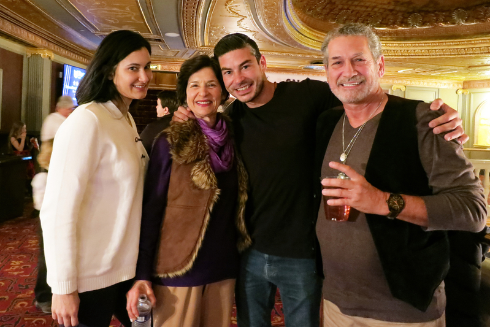

<table border="0" cellspacing="3" cellpadding="3">
<tbody>
<tr>
<td align="center"></td>
</tr>
<tr>
<td align="center">12月23日下午，美国康州沃特伯里派雷斯剧院挤满了前来观看神韵演出的观众。（林南宇／大纪元）</td>
</tr>
</tbody>
</table>
<h1 align=center>外州人搭机搭船赴康州 了愿观神韵表达感恩</b></h1>
【大纪元2017年12月24日讯】（大纪元记者林南宇、卫泳美国沃特伯里报导） 在圣诞夜即将来临之际，神韵演出将中国传统文化的深邃底蕴带给沃特伯里观众，宛如节日的盛典，留给人们无限的喜悦。

12月23日，在沃特伯里派雷斯剧院（Palace Theater），人们屏息观看，不想错过舞台上的每一个细节。掌声、笑声、惊叹声伴随着神韵世界艺术团精湛的演出，高潮迭起。

周六一天两场，不仅吸引了康州人前来观看，还吸引周边地区，甚至纽约州、佛州和加州的人专程来看，与家人共度好时光。

<b>专程从加州飞来看神韵 首席执行官感恩</b>

<table border="0" cellspacing="3" cellpadding="3">
<tbody>
<tr>
<td align="center"></td>
</tr>
<tr>
<td align="center">儿子Matthew Martinez（右二）专程从加州飞来康州、专程从佛州赶来的父亲Steven Martinez（右一）和住在康州的母亲（左二）和姐姐（左一）一起看神韵。（林南宇／大纪元）</td>
</tr>
</tbody>
</table>

Matthew Martinez是加州圣地亚哥一家公司的首席执行官。周六下午，从加州回到康州的他，与父母、姐姐一同观看了神韵演出。这是他的妈妈Ann送给家人的圣诞礼物，而父亲Steven Martinez也是专程从佛州飞来康州看神韵。

提到全家人一同相聚看神韵，母亲Ann说他们对神韵的向往已经有四年了。“我和女儿四年来一直在谈论来看演出。你永远不知道明天会发生什么，所以我决定要来看，而且最好我们现在就买票来看。”她说。

儿子Martinez说：“当我坐在那儿观看时，我觉得好开心，有这样一个机会观看一个与众不同的美丽演出，并和家人一起体验和庆祝，让我很感恩。欣喜无比！我那时候就想站起来，和艺术家们唱歌、跳舞，因为演出实在太完美了。”

Martinez表示神韵精美无比，令他感到雀跃激动，他一边模仿舞台上的舞蹈动作，一边说：“我想要跳舞。我在那就想站起来、跟着一起跳舞、唱歌。”

从佛罗里达飞来专程看神韵的父亲Steven说：“演出很独特。我听到男中音歌唱家的歌声，与众不同。我情不自禁闭上眼睛，不看舞台，而只是倾听。听起来很享受！”

<b>纽约人来康州追神韵：最完美的圣诞礼物</b>

<table border="0" cellspacing="3" cellpadding="3">
<tbody>
<tr>
<td align="center"></td>
</tr>
<tr>
<td align="center">2017年12月23日晚，纽约一家工程设备公司的资深经理Ken Sterry和太太Bernadette Sterry观赏了神韵在沃特伯里的第三场演出。（林南宇／大纪元）</td>
</tr>
</tbody>
</table>

12月23日晚间，纽约一位资深经理Ken Sterry驾车载着太太Bernadette Sterry从纽约赶到康州沃特伯里，为的是送给她一份特别的圣诞惊喜。看完演出的他感动地表示：“等了很多年，终于能带妻子来观赏演出，绝对令人叹为观止，是最完美的礼物！”

Sterry介绍说：“观赏神韵是Bernadette的梦想，来之前我并没有告诉她要去哪里。”

“我哭了，故事和演出所呈现的美都深深地打动了我。”太太Bernadette说着，眼眶又湿润了，“我觉得自己已经和舞台融为一体。”

得到一份如此完美的大礼，Bernadette不忘感谢自己的先生：“非常开心能获得这样的圣诞礼物，而且是以这样令人惊喜的方式收到她。”

还有一对夫妇22日晚专程从纽约长岛来康州看神韵。两人又搭渡船又驾车，完成了一次美妙的观神韵之旅，了却一桩心愿。

<b>一家四口忠实粉丝：每次看神韵都是“最美好时光”</b>

<table border="0" cellspacing="3" cellpadding="3">
<tbody>
<tr>
<td align="center"></td>
</tr>
<tr>
<td align="center">一家四口从右向左：儿子John Plavnicky，父亲John Plavnicky，母亲Rossane，女儿Christine，及友人于12月23日晚看神韵演出，享受这“触动人心的最美好的时光” （卫泳／大纪元）</td>
</tr>
</tbody>
</table>

康州沃特伯里有一家人认为，每一年看神韵都有新体会，每一年的神韵都令人难忘，每一次看神韵都是“最美好的时光”。

儿子John Plavnicky是一家经营股票公司的老板，他看神韵至少三年了。“神韵每年的演出都有新颖不同的内容，独特又引人入胜。”他说，这场演出对所有追寻精彩事物的人都将是一次奇妙的经历。“从演出中你能感受到热情、兴奋和冒险，演出带你经历不同的时代和事物，演出的编舞等各方面都是精美不凡的。”

母亲Rossane今年72岁了，仍然在自己的马场工作，喜欢简单的生活。“我们都是重精神性的人，因此我们感到与神韵紧密相联。”她说，她对神韵传递的天国世界连接的信息非常热爱，“对这样的信息我非常感动，演出开始我几乎哭了出来。”

父亲John退休前从事自己的建筑事业。“神韵演出非常棒，让人印象深刻。”他说，“每一次演出都有所不同，神韵对舞蹈的编排、以及协同演出中所有不同的元素，这些都引人入胜，令人难忘。”

女儿Christine是一名马术教练。“演出简直精彩绝伦，我们热爱神韵的方方面面，她让人惊叹。”她说，“所有的一切，演出提及的事情与人们息息相关；演出展现的神性、信仰等方面，是一种能量强大的信息，以音乐和舞蹈的形式优雅地呈现出来。演出传递了强有力的信息。”

全家四口人表示，他们都是神韵的最忠实粉丝，年年都要来看神韵，来享受这“触动人心的最美好的时光”。

责任编辑：夏纯清

<table border="0" cellspacing="3" cellpadding="3">
<tbody>
<tr>
<td align="center"></td>
</tr>
<tr>
<td align="center">2017年2月23日周六晚，美国神韵巡回艺术团在德州休斯顿琼斯演艺中心的第三场演出盛况。（戴兵／大纪元）</td>
</tr>
</tbody>
</table>
<h1 align=center>神韵休斯顿连3场大爆满 主流精英盛赞</b></h1>
【大纪元2017年12月24日讯】（大纪元美国休斯顿记者站报导）12月23日周六晚，神韵巡回艺术团在德州休斯顿琼斯演艺中心的第三场演出再度大爆满，售罄并加座。至此神韵在休斯顿的演出连续三场大爆满，三场门票都是提前售罄并加座，并且高价票提前一个多月前售罄。

神韵的美名在休斯顿广传，两日来吸引了众多主流社会的各界精英前来观赏。许多观众表示，神韵演出的讯息遍地开花，无处不在，已成为中上层人士社交圈的美谈，很多人以看过神韵为荣，并大力向亲友、同事推荐。有观众表示，看到到处都是神韵的广告，他们觉得这场演出是必看的，不容错过。

正值圣诞节前，剧院内欢声雷动，掌声鼎沸。很多观众表示，观看神韵是他们的节日庆典，并将成为他们一年一度的传统。他们感到神韵将带给他们美好的未来和人生的希望，神韵门票成为送给亲朋好友的最佳节日礼物。

中华五千年文化的精华，浓缩成为一场超越时空、启迪心灵之旅。史诗般的巨作开启通往新世界的大门。神韵演出展现的辉煌美丽的文明以及深邃的内涵与智慧令主流社会各界人士赞叹佩服。很多观众说，神韵无与伦比，独一无二。有观众表示：“是神指引我来看的。”还有的观众说：“神韵引领人们寻觅回归高境界的升华之路。”

<b>音乐总监：东西方乐器完美融合 我的心灵在复苏</b>

<table border="0" cellspacing="3" cellpadding="3">
<tbody>
<tr>
<td align=""center""></td>
</tr>
<tr>
<td align="center">音乐家Gene Keen携妻子观看神韵演出后说：“神韵展现了伟大的乐章。”（余欣然／大纪元）</td>
</tr>
</tbody>
</table>

“美如仙境！”曾担任迪斯尼、海洋世界等大型娱乐公司音乐总监的Gene Keen携妻子Cathy Keen首次欣赏神韵演出，他兴致高昂地分享自己对神韵的感受：“整台制作精妙绝伦，灯光、舞蹈及音乐都让人叹为观止。”

“尤其是音乐，与其他艺术元素配合得天衣无缝！”身为音乐家和制作人，Keen说自己来之前对神韵音乐非常好奇，“演出期间，我一直在关注乐池中传出的音乐，仔细聆听不同的乐器，它们是怎样搭配得如此完美？！”

“（乐团）的表现真是出类拔萃，展现了伟大的乐章。”他说，“东西方乐器的声部总是交织在一起，完全没有分离，没有冲撞感。”“通常西方的乐器会比较宏伟响亮，可能会淹没其他乐器的声音，而神韵音乐把握得恰到好处，既保留了西方音乐的恢弘大气，又能够突出东方乐器的灵巧婉约。两种音乐的交融非常美妙动听。”

Keen赞叹神韵成功突破了音乐界的高难领域，“衷心祝贺（神韵）！”

整场演出让夫妇二人惊喜连连，“我们一直在猜想，接下来他们会做什么。”

Keen说演出中还展现了神性和信仰层面的信息，让他感到“非常舒心”。他说，神韵内涵深邃，似乎包容了世间的一切，妙不可言。“我感觉自己的心灵在觉醒，在复苏，仿佛来到了一个全然不同的世界，一切都那么新颖奇特。自己就好像是这个世界的贵客一般。”

他说：“非常高兴，我已经等不及要看明年的演出了！”

<b>前芭蕾舞演员赞神韵极为美妙绚丽</b>

<table border="0" cellspacing="3" cellpadding="3">
<tbody>
<tr>
<td align=""center""></td>
</tr>
<tr>
<td align="center">前芭蕾舞蹈演员、有机护肤霜公司执行长Barbara Doughty。（新唐人电视台）</td>
</tr>
</tbody>
</table>

Barbara Doughty曾经是芭蕾舞蹈演员，现在是一家有机护肤霜公司的执行长。她盛赞神韵：“神韵演出具有古代史诗的特色，又不乏当代主题，极为美妙绚丽，比芭蕾舞胡桃夹子还好看。”

Doughty表示，“神韵演出华美，音乐和色彩都非常出色，特别是亮丽的粉红色手绢，她们轻巧地抛出，又接住，准确无误，令人赞叹。”她自认作为芭蕾舞演员的她都很难做出这么精准的动作，太了不起了！

Doughty高度赞赏男演员的精湛技艺，特别是高难度动作。她说：“从来没有看到哪个男演员能够像他们做得如此漂亮，实在令人折服。”

“我想向神韵演员们说：加油，你们卓越超群，继续将你们的天赋与世人分享，因为这也是给我们的礼物，我喜爱（神韵），她是艺术，高贵优雅。”

公司老板：神韵引领人们寻觅回归高境界
一家电脑软件顾问公司的老板Eric Eaton看完演出后表述了自己内心的强烈震撼，他说：“超凡绝美的演出，视觉的盛宴！”他连声惊叹，“演出给我们带来了非常温馨的信息，是引领人们寻觅回归高境界的升华之路。”

一同前来观看演出的Reagan Hill是一家人力资源公司老板，她也赞赏神韵演出表达的精神内涵。她说：“中国文化中的精神内涵就是我们真正喜欢的，绝对是一种精神上的触动。”“当独唱演员在唱歌的时候，天幕上展示的歌词极具能量，我非常喜欢。”

Hill表示，“演出真是美丽而又浪漫。”她说：“我以前不知道中国舞如此流畅，连女演员们站在那么小的平底鞋上起舞都是那么漂亮。你不知道这有多难，而她们看上去却如此举重若轻。”“真是美丽的演出，我们下次一定会再来。”

责任编辑：林蓁

<table border="0" cellspacing="3" cellpadding="3">
<tbody>
<tr>
<td align="center"></td>
</tr>
<tr>
<td align="center">2017年12月23日晚，工厂经理Andrica Gil（右）一家三口是当晚买到最后三张神韵票的幸运儿。（苏菲／大纪元）</td>
</tr>
</tbody>
</table>
<h1 align=center>公司经理等10年 幸运买到最后3张神韵票</b></h1>
【大纪元2017年12月24日讯】（大纪元记者苏菲美国休斯顿报导）工厂经理Andrica Gil一家三口12月23日晚如愿以偿地观赏了神韵巡回艺术团在休斯顿琼斯演艺中心（Jones Hall for the Performing Arts）的演出，他们是买到最后三张票的幸运儿。

“每当我驾车经过城镇，看见神韵美丽壮观的广告牌时，心中都升起向往，我想看神韵已经等了十年有余了。每一次我都对自己说：总有一天，我要将这个愿望变成现实。”Gil说。

“一年的时间又到了。这一年，我们终于有条件可以买票了。”Andrica Gil介绍自己由于各种原因经常出城，而今年条件具备、也为庆祝九岁女儿生日，终于可以观赏神韵演出了。“网上只有这3张门票了，只有这一天的机会，我买到了最后3 张票！然后我们收到了主办方派对的邀请，我们非常高兴。”

“绝对值得观看！”看过演出后的Gil连续用了三次“绝对”（absolutely, absolutely, absolutely）值得观看来表达他的心情。

神韵演出所展现的博大的精神内涵和璀璨多姿的文化底蕴都给Gil留下深刻印象。“这里有关乎自尊和尊严，慈悲和信仰的传统价值观”，Gil说，“中西合璧的音乐美妙动听，这是以前从未有过的体验，是非常非常美好和美丽的体验，真的令人陶醉。”

神韵演出中的高超舞蹈技巧和协调一致也令Gil难以忘怀，“他们非常同步，每个人、每个动作都完美无缺，他们是怎样自我控制的？整个舞蹈、每个细节动作都同步完美。每个人都知道自己和对方正在做什么。就像他们把注意力集中在一个的思维上，就像冥想状态一样，这就是他们如何处理好这一切的。”

<b>“神韵演员是连接天上人间的使者”</b>

“演出自始至终涵盖神性，尊重自然、尊重生命。”Gil也喜欢“神韵华美的服饰和独特的舞台天幕设计”。

Gil形容观赏神韵感到内心从未有过的“愉悦、快乐、祥和、平静和安宁”，他说：“就像内心的平静，它通过舞蹈，色彩和音乐注入，所以这是一个非常好的体验，这是一生必看的演出。”

Gil还有一个最大的感受是，他形容神韵演员是连接天上人间的使者，“至少他们已经从天上开悟了，他们带着和平的使命。”

责任编辑：林蓁

<table border="0" cellspacing="3" cellpadding="3">
<tbody>
<tr>
<td align="center"></td>
</tr>
<tr>
<td align="center">神韵北美艺术团在萨瓦纳首场爆满。图为Park母女俩。（新唐人电视台）</td>
</tr>
</tbody>
</table>
<h1 align=center>珠宝设计师母女：神韵服饰有自己的表现力</b></h1>
【大纪元2017年12月24日讯】（大纪元记者泽霖美国萨凡纳报导）12月23日（星期六）晚，神韵北美艺术团在乔州萨凡纳市的约翰尼‧默瑟剧院（Savannah Civic Center-Johnny Mercer Theatre）的第二场演出圆满落幕，默瑟剧院全场满场。观众中，一对拥有纽约一家珠宝设计公司并从事专业设计的母女俩对神韵有特别深的感受。

母亲Jenny Park说，“我以前换了几次工作，但是目前我是这一领域的设计师和业主。” 她尤其关注神韵的色彩和服饰，“演出流光溢彩蔚为壮观，特别是那服饰和音乐。”

女儿Ally Park担任自家工作室的经理。她装扮典雅的前来观看神韵，其发型和发饰颇有五十年代的味道，她认为这样来欣赏神韵，才是最恰当的。

<table border="0" cellspacing="3" cellpadding="3">
<tbody>
<tr>
<td align="center"></td>
</tr>
<tr>
<td align="center">女儿 Ally Park。（新唐人电视台）</td>
</tr>
</tbody>
</table>

<b>神韵服饰有自己的表现力</b>

Ally Park认为神韵演出抓住了观众的吸引力，“舞台上舞蹈演员的舞姿，她们舞蹈的整体效果以及每支舞蹈中伴奏的乐音，给我留下了很深的印象，真是美不胜收。而且整场演出好像与演出的主题也非常相符，演出牢牢地抓住了观众的吸引力，演员们也非常投入。”

母亲Jenny Park接着说：“而且我认为，神韵演出中的服饰也能够像演员一样有自己多样的表现力。她们是如此超凡脱俗，她们的表达力比人类的语言还强，也超过了演出中的音乐。那舞姿和服饰真是好得惊人，那色彩绚丽夺目，那种流动性是如此雅致。对我而言，带着一种中华文化的典雅韵味，这种韵味和舞姿在其他文化中是看不到的，因此能够在这里看到，你会觉得非常荣幸。”

Ally Park继续说，“对我而言， 当她们讲诉某个特殊神话故事和其他有趣的故事时，她们会捕捉到非常有趣的元素或层面，但也在节目中保持了一份精美的雅致和均衡，给人一种尊严和庄重之感，因此节目虽有幽默诙谐但是也保有一份庄重。”

母亲Jenny Park最后说：“神韵的演出，就是让我领略到了中华文化无与伦比的美好。 我在上半场中最喜欢的是那个学校中的男孩子的节目，还有那个美猴王的节目。演出中让我领略到中华文化与我们文化的不同，也意识到更高的神、创世主的存在。从演出中我理解了中华文化对于创世主的诠释，很启迪人心，真是殊胜辉煌， 令人心生向往。”

责任编辑：夏晶

<table border="0" cellspacing="3" cellpadding="3">
<tbody>
<tr>
<td align="center"></td>
</tr>
<tr>
<td align="center">神韵北美艺术团在萨瓦纳首场爆满。Salvado Brancato是一位牙科医师。（新唐人电视台）</td>
</tr>
</tbody>
</table>
<h1 align=center>牙科医师：中国越古老的文化越有韵味</b></h1>
【大纪元2017年12月24日讯】（大纪元记者泽霖美国萨凡纳报导）12月23日（星期六）晚，神韵北美艺术团在乔州萨凡纳市的约翰尼·默瑟剧院(Savannah Civic Center-Johnny Mercer Theatre)的第二场演出圆满落幕。Salvado Brancato是一位牙科医师，他和几位同是专业人士的社会主流人士一起前来观看神韵。

演出结束后，他们还逗留在大厅里，热烈的讨论和交流他们的观感，也非常兴奋的面对记者表达了他们的兴奋之情。“我觉得今天神韵的演出优雅迷人，看得人兴致盎然！”

“我感觉真的很遗憾，在我们成长过程中，我们没有学到太多的关于中国的知识，我们应该更多的了解中国。我发现中国越古老的文化越有意思和韵味，这场演出让我了解到了（传统）中国。”

Brancato医师通过神韵，发现了中国古老的传统和文化，“从今天的演出中，我体会到了中华文化的那些方面呢？这让我很难说，我对于中国人的风俗习惯知之甚少，除非从电影中看到的那一点。而且，我没有太读过关于中国人的书籍。但是我从神韵演出中意识到，中华文明是一个有悠久历史的文明，很有意思。我估计我们可以从中华文化中学到很多东西。”

Brancato医师觉得自己最受到神韵的启迪的，是对神、创世主、和人类共同来源的认识，“演出中最后的一个节目中，提到我们有共同的来源，那是我们的创世主。对我而言，那指的是耶稣，当然人们可以有人们自己的叫法。而神韵那个节目令我意识到，我们人类之间有着一种强烈的联系，这种联系将我们的今生今世、和来生来世，都联系起来了！”

责任编辑：夏晶

<table border="0" cellspacing="3" cellpadding="3">
<tbody>
<tr>
<td align="center"></td>
</tr>
<tr>
<td align="center">萨凡纳Johnny Mercer Theater</td>
</tr>
</tbody>
</table>

<h1 align=center>五团同步演出 乔治亚州州长发函祝贺神韵</b></h1>
【大纪元2017年12月24日讯】（大纪元记者泽霖美国萨瓦纳报导）2017年12月23日（星期六）下午1:30，美国神韵艺术团2018年世界巡演在乔治亚州萨瓦纳市的首场演出在爆满中圆满落幕，加座票也全部售出。近两千名观众兴致勃勃地观看了北美艺术团的演出，州长迪尔、副州长凯戈尔都发来了贺函。

<table border="0" cellspacing="3" cellpadding="3">
<tbody>
<tr>
<td align="center"></td>
</tr>
<tr>
<td align="center">神韵北美艺术团在萨瓦纳首要爆满。图为乔治亚州州长迪尔的贺函。（大纪元）</td>
</tr>
</tbody>
</table>
<table border="0" cellspacing="3" cellpadding="3">
<tbody>
<tr>
<td align="center"></td>
</tr>
<tr>
<td align="center">神韵北美艺术团在萨瓦纳首要爆满。图为乔治亚州副州长凯戈尔的贺函。（大纪元）</td>
</tr>
</tbody>
</table>

萨瓦纳（Savannah）是乔治亚州东部濒临大西洋的港市，是乔州第一个首府所在地，也是该州最古老的城市，人口有14万。这是神韵第二年莅临萨瓦纳，神韵全新的节目和精湛的音乐、舞蹈、服饰和天幕，让萨瓦纳各界居民欣喜万分。市民中心约翰尼·默瑟剧院（Savannah Civic Center-Johnny Mercer Theatre）的近两千名观众沉浸在中华传统文化的富丽辉煌之中。

12月22日，神韵的另外4个艺术团——纽约艺术团在佛蒙特州伯灵顿、世界艺术团在康州沃特伯里、巡回艺术团德州休斯顿、国际艺术团在密苏里州堪萨斯城同时展开本季的首演；今天，北美艺术团的首演也在乔治亚州的萨凡纳拉开帷幕，至此，神韵全部5个艺术团都精彩开启本季度的演出，五星连珠，照亮美国本土的东半部。

据萨瓦纳神韵演出的主办者说，神韵在当地2场演出的售票非常顺利，除了星期六中午的票全部售罄、加座爆满，晚场的票也大部分售出，笃定满场。一位在邻近的南卡州的女士，一掷4000多美元，买了40张神韵晚会的票，让她的同事和朋友们前来观赏神韵。

乔治亚州州长迪尔在贺函中说，“神韵带来了中国的传统文化，体现了真诚、善良和勇气。”他祝愿神韵的演出成功。副州长凯戈尔则在贺函中说，“欢迎神韵再度来到乔治亚州萨瓦纳市，神韵的上演是萨瓦纳的荣誉。”他并希望神韵以后再来乔治亚州。

责任编辑：苏明真
