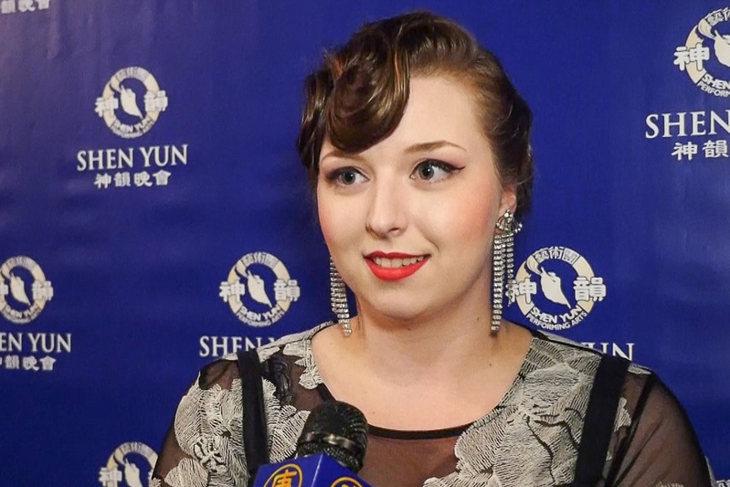
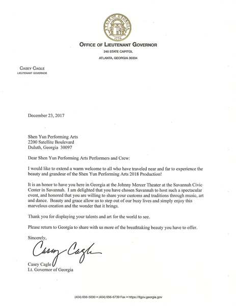

<table border="0" cellspacing="3" cellpadding="3">
<tbody>
<tr>
<td align="center"></td>
</tr>
<tr>
<td align="center">神韵北美艺术团在萨瓦纳首场爆满。图为Park母女俩。（新唐人电视台）</td>
</tr>
</tbody>
</table>
<h1 align=center>珠宝设计师母女：神韵服饰有自己的表现力</b></h1>
【大纪元2017年12月24日讯】（大纪元记者泽霖美国萨凡纳报导）12月23日（星期六）晚，神韵北美艺术团在乔州萨凡纳市的约翰尼‧默瑟剧院（Savannah Civic Center-Johnny Mercer Theatre）的第二场演出圆满落幕，默瑟剧院全场满场。观众中，一对拥有纽约一家珠宝设计公司并从事专业设计的母女俩对神韵有特别深的感受。

母亲Jenny Park说，“我以前换了几次工作，但是目前我是这一领域的设计师和业主。” 她尤其关注神韵的色彩和服饰，“演出流光溢彩蔚为壮观，特别是那服饰和音乐。”

女儿Ally Park担任自家工作室的经理。她装扮典雅的前来观看神韵，其发型和发饰颇有五十年代的味道，她认为这样来欣赏神韵，才是最恰当的。

<table border="0" cellspacing="3" cellpadding="3">
<tbody>
<tr>
<td align="center"></td>
</tr>
<tr>
<td align="center">女儿 Ally Park。（新唐人电视台）</td>
</tr>
</tbody>
</table>

<b>神韵服饰有自己的表现力</b>

Ally Park认为神韵演出抓住了观众的吸引力，“舞台上舞蹈演员的舞姿，她们舞蹈的整体效果以及每支舞蹈中伴奏的乐音，给我留下了很深的印象，真是美不胜收。而且整场演出好像与演出的主题也非常相符，演出牢牢地抓住了观众的吸引力，演员们也非常投入。”

母亲Jenny Park接着说：“而且我认为，神韵演出中的服饰也能够像演员一样有自己多样的表现力。她们是如此超凡脱俗，她们的表达力比人类的语言还强，也超过了演出中的音乐。那舞姿和服饰真是好得惊人，那色彩绚丽夺目，那种流动性是如此雅致。对我而言，带着一种中华文化的典雅韵味，这种韵味和舞姿在其他文化中是看不到的，因此能够在这里看到，你会觉得非常荣幸。”

Ally Park继续说，“对我而言， 当她们讲诉某个特殊神话故事和其他有趣的故事时，她们会捕捉到非常有趣的元素或层面，但也在节目中保持了一份精美的雅致和均衡，给人一种尊严和庄重之感，因此节目虽有幽默诙谐但是也保有一份庄重。”

母亲Jenny Park最后说：“神韵的演出，就是让我领略到了中华文化无与伦比的美好。 我在上半场中最喜欢的是那个学校中的男孩子的节目，还有那个美猴王的节目。演出中让我领略到中华文化与我们文化的不同，也意识到更高的神、创世主的存在。从演出中我理解了中华文化对于创世主的诠释，很启迪人心，真是殊胜辉煌， 令人心生向往。”

责任编辑：夏晶

<table border="0" cellspacing="3" cellpadding="3">
<tbody>
<tr>
<td align="center"></td>
</tr>
<tr>
<td align="center">神韵北美艺术团在萨瓦纳首场爆满。Salvado Brancato是一位牙科医师。（新唐人电视台）</td>
</tr>
</tbody>
</table>
<h1 align=center>牙科医师：中国越古老的文化越有韵味</b></h1>
【大纪元2017年12月24日讯】（大纪元记者泽霖美国萨凡纳报导）12月23日（星期六）晚，神韵北美艺术团在乔州萨凡纳市的约翰尼·默瑟剧院(Savannah Civic Center-Johnny Mercer Theatre)的第二场演出圆满落幕。Salvado Brancato是一位牙科医师，他和几位同是专业人士的社会主流人士一起前来观看神韵。

演出结束后，他们还逗留在大厅里，热烈的讨论和交流他们的观感，也非常兴奋的面对记者表达了他们的兴奋之情。“我觉得今天神韵的演出优雅迷人，看得人兴致盎然！”

“我感觉真的很遗憾，在我们成长过程中，我们没有学到太多的关于中国的知识，我们应该更多的了解中国。我发现中国越古老的文化越有意思和韵味，这场演出让我了解到了（传统）中国。”

Brancato医师通过神韵，发现了中国古老的传统和文化，“从今天的演出中，我体会到了中华文化的那些方面呢？这让我很难说，我对于中国人的风俗习惯知之甚少，除非从电影中看到的那一点。而且，我没有太读过关于中国人的书籍。但是我从神韵演出中意识到，中华文明是一个有悠久历史的文明，很有意思。我估计我们可以从中华文化中学到很多东西。”

Brancato医师觉得自己最受到神韵的启迪的，是对神、创世主、和人类共同来源的认识，“演出中最后的一个节目中，提到我们有共同的来源，那是我们的创世主。对我而言，那指的是耶稣，当然人们可以有人们自己的叫法。而神韵那个节目令我意识到，我们人类之间有着一种强烈的联系，这种联系将我们的今生今世、和来生来世，都联系起来了！”

责任编辑：夏晶

<table border="0" cellspacing="3" cellpadding="3">
<tbody>
<tr>
<td align="center"></td>
</tr>
<tr>
<td align="center">萨凡纳Johnny Mercer Theater</td>
</tr>
</tbody>
</table>

<h1 align=center>五团同步演出 乔治亚州州长发函祝贺神韵</b></h1>
【大纪元2017年12月24日讯】（大纪元记者泽霖美国萨瓦纳报导）2017年12月23日（星期六）下午1:30，美国神韵艺术团2018年世界巡演在乔治亚州萨瓦纳市的首场演出在爆满中圆满落幕，加座票也全部售出。近两千名观众兴致勃勃地观看了北美艺术团的演出，州长迪尔、副州长凯戈尔都发来了贺函。

<table border="0" cellspacing="3" cellpadding="3">
<tbody>
<tr>
<td align="center"></td>
</tr>
<tr>
<td align="center">神韵北美艺术团在萨瓦纳首要爆满。图为乔治亚州州长迪尔的贺函。（大纪元）</td>
</tr>
</tbody>
</table>
<table border="0" cellspacing="3" cellpadding="3">
<tbody>
<tr>
<td align="center"></td>
</tr>
<tr>
<td align="center">神韵北美艺术团在萨瓦纳首要爆满。图为乔治亚州副州长凯戈尔的贺函。（大纪元）</td>
</tr>
</tbody>
</table>

萨瓦纳（Savannah）是乔治亚州东部濒临大西洋的港市，是乔州第一个首府所在地，也是该州最古老的城市，人口有14万。这是神韵第二年莅临萨瓦纳，神韵全新的节目和精湛的音乐、舞蹈、服饰和天幕，让萨瓦纳各界居民欣喜万分。市民中心约翰尼·默瑟剧院（Savannah Civic Center-Johnny Mercer Theatre）的近两千名观众沉浸在中华传统文化的富丽辉煌之中。

12月22日，神韵的另外4个艺术团——纽约艺术团在佛蒙特州伯灵顿、世界艺术团在康州沃特伯里、巡回艺术团德州休斯顿、国际艺术团在密苏里州堪萨斯城同时展开本季的首演；今天，北美艺术团的首演也在乔治亚州的萨凡纳拉开帷幕，至此，神韵全部5个艺术团都精彩开启本季度的演出，五星连珠，照亮美国本土的东半部。

据萨瓦纳神韵演出的主办者说，神韵在当地2场演出的售票非常顺利，除了星期六中午的票全部售罄、加座爆满，晚场的票也大部分售出，笃定满场。一位在邻近的南卡州的女士，一掷4000多美元，买了40张神韵晚会的票，让她的同事和朋友们前来观赏神韵。

乔治亚州州长迪尔在贺函中说，“神韵带来了中国的传统文化，体现了真诚、善良和勇气。”他祝愿神韵的演出成功。副州长凯戈尔则在贺函中说，“欢迎神韵再度来到乔治亚州萨瓦纳市，神韵的上演是萨瓦纳的荣誉。”他并希望神韵以后再来乔治亚州。

责任编辑：苏明真
