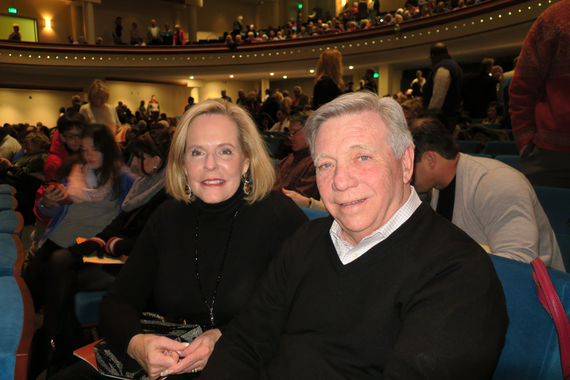
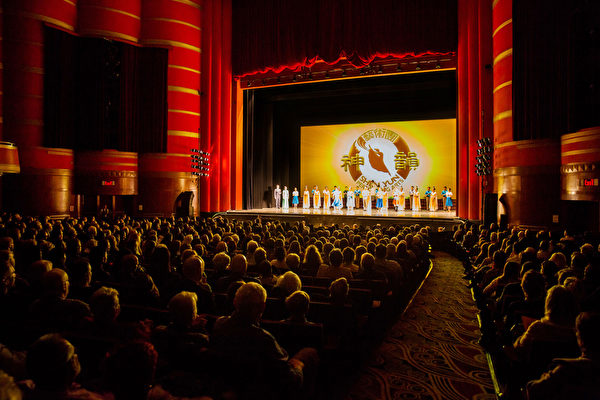
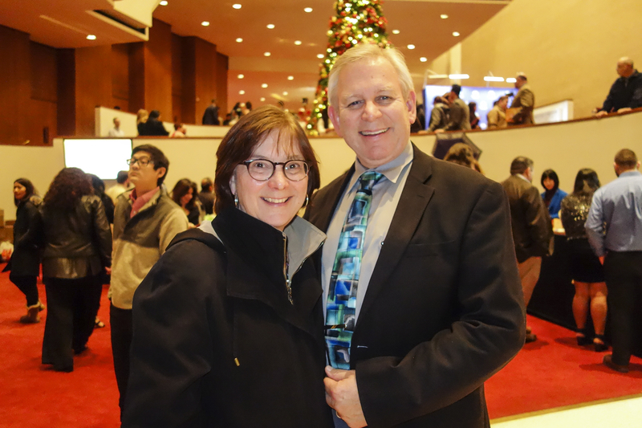
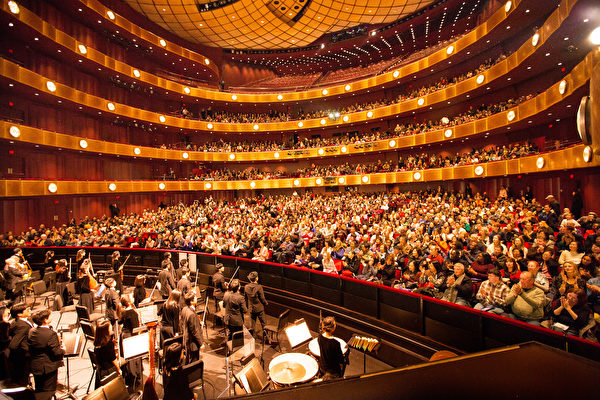
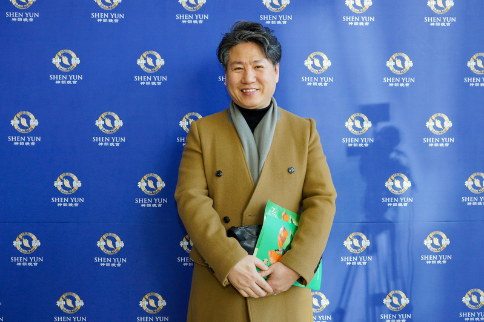

<table border="0" cellspacing="3" cellpadding="3">
<tbody>
<tr>
<td align="center"></td>
</tr>
<tr>
<td align="center">加拿大农业部顾问Violette Jacques女士观看演出后连连赞叹，表示观看神韵充满了惊喜。（戴思慧／大纪元）</td>
</tr>
</tbody>
</table>
<h1 align=center><b>加农业部顾问：神韵壮观宏大 令人叹为观止</b></h1>
【大纪元2017年12月31日讯】（大纪元记者戴思慧加拿大渥太华报导）12月30日晚，美国神韵纽约艺术团巡演加拿大首都渥太华国家艺术中心的最后一场演出，在观众热烈的掌声中降下帷幕。加拿大农业部顾问Violette Jacques女士在观看演出后连连赞叹：“这台演出包含了大量的心血。既有交响乐团，又有舞蹈演员，还有背景天幕和美丽的服饰，我会向亲友大力推荐来看神韵。”

Jacques说：“我喜欢各种艺术，包括舞蹈。能看到传统舞蹈非常有意义。就像主持人介绍的，这种舞蹈有几千年的历史。”她还大赞神韵的舞蹈家非常出色，“他们身手矫健灵活，可以做很多高难动作。”

Jacques表示观看神韵充满了惊喜：“我喜欢舞台和天幕的互动，那不只是个静态的背景，而是可以与天幕互动，人物从中自由出入，制作得简直太好了。我实在太喜欢了！”

“神韵的演出壮观宏大，令人叹为观止。音乐也非常美妙，与舞蹈互相完美配合。所有的元素都结合得非常好。”她发出由衷的赞叹。

对于神韵展现的传统文化精神内涵，Jacques说：“我可以体会到中国古老文化的神性，这个文化源远流长，所以有许多精神内涵的积淀。”

她说：“色彩缤纷绚丽，舞蹈节奏快，制作精美，让你觉得他们的表演又美妙又轻松，非常令人惊叹。”

Jacques女士还表示，古老的文化经常有值得新兴文化学习的地方，“加拿大是个年轻的国家，没有长远的历史。观看神韵可以让我们了解到中国古老的传统文化，这一点非常有意义。”

责任编辑：颜永明

<table border="0" cellspacing="3" cellpadding="3">
<tbody>
<tr>
<td align="center"></td>
</tr>
<tr>
<td align="center">都市规划专家Kevin Kennedy与任职于波士顿儿童医院的妻子Kerri Kennedy相偕来看神韵的演出。（新唐人电视台）</td>
</tr>
</tbody>
</table>
<h1 align=center><b>波士顿主流赞神韵“像天赐恩典似的优雅”</b></h1>
【大纪元2018年01月01日讯】（大纪元美国波士顿记者站报导）神韵世界艺术团2018年巡演在波士顿著名的博赫王安剧院（Boch Center Wang Theatre）再度掀起了主流菁英观赏的热潮。从27日（周三）首场爆满演出，连续至周六下午爆满又加座的人潮，神韵演出现场俨然成了大波士顿地区主流人士荟萃之地。

神韵演出期间波士顿虽然气温低至华氏14度(摄氏零下10度)，依旧挡不住主流菁英的观赏热潮。大幕拉起的瞬间，剧场内观众的惊叹随处可闻。演员们优雅的舞蹈与现场交响乐团精准的配合，交织出一幅幅心灵互动的画面，在这座历史名城演绎了一幕幕人间神话。

<b>神韵就是美丽的化身</b>

都市规划专家Kevin Kennedy与任职于波士顿儿童医院的妻子Kerri Kennedy相偕来看神韵的演出。

身为临床伦理师的Kerri Kennedy觉得神韵不可思议，她非常喜欢节目中演绎的中国历史，认为这些历史元素与节目简介，为演出增加了许多神奇的效果，也让观众收获满满。同时，她对神韵如此美丽的演出却无法在自己的家乡中国上演，感到惋惜。

Kevin Kennedy表示，中华文化天人合一的内涵是节目背后的重要元素，神韵将这些内涵清晰传递给观众，这在美国难得一见。“神韵就是美丽的化身，高难度动作像天赐恩典似的优雅，真令人惊奇！”
<table border="0" cellspacing="3" cellpadding="3">
<tbody>
<tr>
<td align="center"></td>
</tr>
<tr>
<td align="center">教会舞团领班Bobbi Andrine女士（左）认为“神韵是天赐的神奇祝福！”（新唐人电视台）</td>
</tr>
</tbody>
</table>

Bobbi Andrine是一名退休的护士。她在周六（12月30日）下午与朋友、眼科技师Brianna Jean Johnson冒雪来到剧场观赏神韵的第四场演出。

Andrine女士感叹说：“非常相信我们来对了，神韵是通往天堂的大门！”Johnson女士则用“令人屏气凝神”来形容她的感动。

她俩在去年就想来看神韵，却苦于日程安排未能成行，今年终于如愿以偿。

Andrine女士是教会舞团的领班（Dance Ministry Leader），Johnson女士则是该舞团团员。神韵华丽的服饰随着舞蹈而飘逸，令她们相当入迷。

“我喜欢水袖，那样灵巧的水袖所舞动的能量包围着我们！”Johnson女士说，“真的很神奇，这是我从没见过的，能看到就是一种神奇！”

Andrine女士说：“神韵在世界上巡演，而现在就在我们的眼前，更让我确信所有的一切都在创世主的掌握之中，不管是中国还是麻塞诸塞州。”面对中共对信仰的镇压，她表示，虽然令人痛心，但不用担心，要保持着对神的信任与赞美，情况会在创世主的掌握下改观的。

“我们今天所见就是我们与神的沟通，我们被众多神奇的力量给融炼著，”Johnson女士激动地两度表示，“神与我的灵魂对话，真的如神话般的神奇!”
<table border="0" cellspacing="3" cellpadding="3">
<tbody>
<tr>
<td align="center"></td>
</tr>
<tr>
<td align="center">历史学家Robert McDougall与心理治疗师专业毕业的夫人Diane McDougall第二次前来观赏神韵。（新唐人电视台）</td>
</tr>
</tbody>
</table>

<b>看神韵是最令人兴奋的事</b>

历史学家Robert McDougall与心理治疗师专业出身的夫人Diane McDougall周六下午亦赶上了爆满的热潮。去年第一次观演之后，夫妻俩就成了神韵的超级粉丝。对神韵，妻子加重语气的说了两次：“我们非常喜欢！我们非常喜欢！”丈夫在一旁则说：“看神韵，永不厌倦！”

“美丽之舞，奇幻又优雅，集运动与艺术于一身。”身为心理治疗师的Diane McDougall说，“从（天幕上的）天堂到舞台的变化实在不可思议！”

身为基督徒的她表示，从第一次看神韵后就非常之兴奋，因为她与丈夫从神韵中找到了信仰更深一层的意义，也发现了其信仰与中华传统文化之间的共同性。她对神韵将如此美好而重要的内涵在全世界传播深表欣慰。

“准备好你的心情，来看一场相当神奇的演出！”Robert McDougall向所有的人推荐神韵。他热心的提醒大家别忘了阅读节目上的说明，那对观看演出颇有助益。

责任编辑：杨亦慧

<table border="0" cellspacing="3" cellpadding="3">
<tbody>
<tr>
<td align="center"></td>
</tr>
<tr>
<td align="center">前歌手Patty Kosowicz女士（右）。（李辰／大纪元）</td>
</tr>
</tbody>
</table>
<h1 align=center><b>前歌手：惊艳神韵之美</b></h1>
【大纪元2017年12月31日讯】（大纪元记者李辰美国波士顿报导）前歌手Patty Kosowicz女士曾参加百老汇演出，12月30日下午她和家人驱车从缅因州到麻州来观看神韵世界艺术团在波士顿博赫王安剧院的演出。她表示，神韵之美，令人震惊。

Kosowicz女士赞叹：“神韵演出绝对令人惊叹，美好，非常与众不同！”“舞蹈和音乐之间配合极好，色彩、服装美得炫目。”

她一连用了好几个“美丽”和“惊艳”，来形容她对演出的感受。

“演出之美令人惊艳、令人惊艳。”她说，“舞蹈美，色彩美，编舞美，动态天幕美，舞蹈演员和动态天幕的结合美。”

她对歌唱家的演唱也赞不绝口，“歌唱演员实在是不可思议，那个男中音，天啊，太杰出了！他的音色质量（非常好）。”

妹妹Heidi Amsden则与演出所呈现的精神内涵共鸣，她说，从神韵舞台上，看到“忍耐、美德、 一丝不苟的表演和思辨、内心的美丽和力量、对她们所信仰的荣耀感”。

Amsden表示，神韵演员虽然不能在中国表演，但在国际舞台上勇敢地表达她们所想要表达的，对此她深感敬佩。

“相比之下，对我个人来说，演出让我感到生活在这个自由的国家，是多么的弥足珍贵。”她说。

责任编辑：夏晶

<table border="0" cellspacing="3" cellpadding="3">
<tbody>
<tr>
<td align="center"></td>
</tr>
<tr>
<td align="center">2017年12月31日下午，美国神韵北美艺术团在北卡罗来纳州夏洛特市（Charlotte）的贝尔克剧院（Belk Theatre）上演了最后一场演出。图为夏洛特市区街景。（谢漫雪／大纪元）</td>
</tr>
</tbody>
</table>
<h1 align=center><b>“世界共同的文化”神韵夏洛特三场爆满加座</b></h1>
【大纪元2018年01月01日讯】（大纪元北卡夏洛特记者站报导）2017年12月31日下午，美国神韵北美艺术团在北卡罗来纳州夏洛特市（Charlotte）的贝尔克剧院（Belk Theatre）上演了最后一场演出，现场观众反响热烈。神韵演员精湛的舞蹈技艺呈现，绚丽丰富的服饰和现场的交响音乐让观众掌声阵阵，结束时人们纷纷起立鼓掌和神韵告别。

这次神韵在夏洛特的三场演出票房都很出色，全部都是爆满加座。很多观众也特别喜爱购买神韵的纪念品，主办方准备的神韵的画册在12月30日就售罄，不少31日来的观众为买不到神韵画册而遗憾，只好拿神韵的poster回家作为纪念。新年即将到来，很多观众都已经开始期盼明年再来看神韵。

<b>金融公司前首席执行官（CEO）:天幕让人叹为观止</b>

<table border="0" cellspacing="3" cellpadding="3">
<tbody>
<tr>
<td align="center"></td>
</tr>
<tr>
<td align="center">金融公司前资深首席执行官Jim King和Chris Travel 女士一起观看了神韵北美艺术团在北卡夏洛特的演出。（谢漫雪／大纪元）</td>
</tr>
</tbody>
</table>

Jim King先生是金融公司前资深首席执行官，也曾在大律师事务所担任首席运营官（CEO）。他和Chris Travel 女士一起观看了神韵北美艺术团在12月31日下午的演出。两人观看过很多不同的演出，但都觉得神韵的演出“非常独特”。King说，“这和我们的文化非常不同，很吸引我，可以让（我们）更好的了解中国的文化和各个朝代。”

King表示：“这和我们一般看到的节目不同。这是有关中国的传统。服装很美，编舞一流，非常出色。”“ 是神话般的传奇。简直太精彩了！深深陶醉其中！” Tavel说。

两人尤其喜爱神韵的动态天幕。天幕与舞台演出的互动让两人均感到不可思议。King表示，神韵的天幕“让人叹为观止”。Tavel女士接口说：“时间的衔接恰到好处让我惊叹。当他们跳下去时，你知道一定要在准确的时间和地点，否则就会闹笑话。他们必须练习很多次，才能像这样时机把握的如此精准。”

King 补充说：“（天幕）跟随着特定场景而变换，非常独特。这样的制作很难见到。” “我们一般看的节目虽然也有天幕背景，但是没有像（神韵）这样的和舞台人物的互动。” Tavel说。

他们也都很喜欢神韵的音乐，并注意到了神韵音乐的与众不同。King说：“我注意到了神韵有自己的现场乐团伴奏。” “我喜欢（神韵）音乐，乐团使用了很多和我们不同的乐器（传统的中国乐器）”Tavel说。

谈到神韵所表现的价值内涵，Tavel女士强调：“这是和我们不同的文化，可以让（我们）更好的了解中国的文化和各个朝代。演出表现出了和我们相似的价值观。当然我们这没有信仰迫害的问题，因为这里有言论自由。”

在采访的最后，King先生说希望人们不要犹豫，神韵的演出“一定要亲自来看，买票来看！”

<b>古董商：这是整个世界共同的文化</b>

<table border="0" cellspacing="3" cellpadding="3">
<tbody>
<tr>
<td align="center"></td>
</tr>
<tr>
<td align="center">古董商Antoinette Pierce在2017年最后一天来到贝尔克剧院观看神韵在夏洛特的最后一场演出。 （新唐人电视台）</td>
</tr>
</tbody>
</table>

“演出看得我如痴如醉， 这是整个世界共同的文化。”Antoinette Figuers Pierce 看完神韵演出后不住的赞叹中国古典舞。她说道：“我们的芭蕾舞来自于她（中国古典舞）， 她是我们芭蕾舞的始祖──这种中国古典舞。那色彩是我们国家现在所使用的色彩， 那舞姿是如此温婉柔美、行云流水般流畅， 这是我们应该学习的舞蹈方式。”

Antoinette Figuers Pierce 对神韵舞蹈的喜爱几乎让人以为她是从事舞蹈工作的，而实际上她是北卡夏洛特当地的一位古董商。她在2017年最后一天来到贝尔克剧院观看神韵在夏洛特的最后一场演出。

Pierce 感佩地表示，演出过程中她深深沉醉于演出的每个细节，她说：“整场演出中我完全无法从她们身上转移视线， 舞台上的一切瞬间即变， 那色彩、那舞姿，你能够发觉他们指尖，手臂的每一个细小的细节，她们舞蹈中所有的一切， 每一个细节都是重要的， 而且演出一直都非常注重细节。”

谈到演出的精神内涵，Pierce 说：“我一直对中国人很好奇， 我从来没有料到中国人和基督徒一样崇高圣洁， 因此当我从演出中看到中国也有崇高的、一种美国人鲜有人知的神性理念时， 我非常惊讶。我们听说过这个团体（法轮大法），但是没有想到他们的信仰如此神圣。 我现在非常想做的是学习中国（文化）， 这是我看完演出后的一种渴望， 我想更多地了解你们（中华）文化， 中国人， 中国历史，因为这种历史对我们所有对人都很重要。 非常感谢你们， 这是一场精美绝伦的演出。 ”

<b>Home Depot 区域执行长：绝对是震撼人心的表演</b>

<table border="0" cellspacing="3" cellpadding="3">
<tbody>
<tr>
<td align="center"></td>
</tr>
<tr>
<td align="center">Home Depot 区域执行长Stacy Oetke女士（右二）和家人在12月31日观看神韵艺术团在夏洛特的演出。（晨曦／大纪元）</td>
</tr>
</tbody>
</table>

“（神韵）绝对是震撼人心的表演。舞蹈的整齐划一堪称神奇，令人惊叹！”Home Depot 区域执行长Stacy Oetke和家人在观看了12月31日下午神韵北美艺术团在夏洛特贝尔克剧院（Belk Theater）的演出后连连赞叹。

神韵表现的正的信息也让Oetke 感受颇深，她说：“我从节目中得到善良的信息，（神韵）让人变得更加温柔与善良，与你的朋友紧密相联。当下的世界善良正在消逝，（神韵）让世界的人都更加互相善待。”

Stacy Oetke的先生Victor Oetke曾经是一名阿联酋航空公司机长，他表示被神韵故事感动的留下了泪水，“我发现一些节目对情感的表达非常深邃，尤其是在关于爱的故事中，我们都被深深打动。感动到流下了眼泪，（神韵）是蔚为壮观的大手笔制作。” 他说，“ (神韵) 给大家带来希望。”

Oetke也非常喜欢神韵歌唱家的演唱，他说，“女高音歌唱家好的难以置信，很棒！”他们极力推荐神韵，“（神韵）是一定要来看的演出，你一定要来看（神韵）。

责任编辑：夏晶

<table border="0" cellspacing="3" cellpadding="3">
<tbody>
<tr>
<td align="center"></td>
</tr>
<tr>
<td align="center">Jeff Rauzi先生认为神韵演出环绕于一个非常伟大的主题。(新唐人)</td>
</tr>
</tbody>
</table>
<h1 align=center><b>咨询公司老板：神韵演出主题非常神圣崇高伟大</b></h1>
【大纪元2018年01月01日讯】(大纪元者泽霖美国夏洛特报导) 12月31日下午，神韵北美艺术团在夏洛特市中心的贝尔克剧院（Belk Theater at Blumenthal Performing Arts Center）做了这次巡回到此的最后一场演出。在年底最后一天演出，展现传统中华五千年文明的神韵为大家开拓了视野与心胸，给观众们带来了最好的新年礼物。

Jeff Rauzi先生是咨询公司老板，虽然原来对中国传统文化涉猎不多，但是从神韵演出中他深深的体会到了这古国文明的精髓。

他表示：“我陶醉于演出的每一分钟之中，演出从始至终都非常美好，整场演出，那色彩、那舞姿以及舞蹈与乐团的时间都掌控的无懈可击，我知道为这场演出他们一定做了大量的练习与准备工作，不仅仅是从音乐层面还有舞蹈层面，而且音乐和舞蹈相得益彰，真是好得令人难以置信，令你在整场演出中始终全神贯注的注视着舞台。”

神韵演出不仅带给观众们视觉与听觉的最高享受，并且伴随着宏大的精神内涵。对此Jeff Rauzi感受到神韵演出与众不同之处，“我认为演出中关于‘大法’的题材将演出提高到非常神圣崇高的地位，演出中所有的一切都起到了这种效果；演出有一个非常伟大的主题，一个我认为非常好的、很有气度的主题。”

“我认为观看过这场演出后，地球上会有很多人去找寻他、研究他，演出让很多人想了解‘大法’是什么，我认为这种影响非常不同凡响。”

他强调：“我认为演出在传递价值观，演出确实传递了价值观，而且这是一场非常健康富有生气的演出。我不认为演出中的演员有任何目的，但是演出中确实有‘大法’的存在，我认为人们应该意识到了这个主题。”

最后Jeff Rauzi对神韵北美艺术团的所有团员发出由衷的敬佩，“我认为演员一次次、一天天给这场演出注入的能量非常了不起，特别是有时候他们一天会有两场演出，更何况当人日复一日地重复同一件事情时会有精疲力尽之感。”

“因此我认为，演员必须非常投入，非常专注，需要演员热爱这场演出，喜爱他们的工作。我认为演出能够做到这一点非常令人感佩， 而且我认为演员们也的确显示出了他们对这场演出的喜爱。”

责任编辑：夏晶

<table border="0" cellspacing="3" cellpadding="3">
<tbody>
<tr>
<td align="center"></td>
</tr>
<tr>
<td align="center">Gregory Eason(左)和儿子Gregory Eason Jr.一同观赏神韵，均赞美演出的辉煌壮丽。（杨汉民／大纪元）</td>
</tr>
</tbody>
</table>
<h1 align=center><b>老板：神韵音乐能量强而又具启发性</b></h1>
【大纪元2018年01月01日讯】（大纪元者杨汉民美国夏洛特报导） 12月31日下午，神韵北美艺术团在夏洛特市中心的贝尔克剧院（Belk Theater at Blumenthal Performing Arts Center）做了这次巡回到此的最后一场演出，给观众们带来了最好的新年礼物。

私人企业主Gregory Eason和儿子Gregory Eason Jr.欣赏了神韵之后愉悦之情洋溢于表，Gregory Eason赞不绝口的说：“演员展现出的华丽壮观，真是无与伦比，令人惊异之处几乎要让人屏住呼吸，绝对的美。”他继续表示：“演员互相合作无间，而且色彩缤纷，我感到我好像已经见到了千万种色彩的变幻，无比的辉煌，太壮观了。”

神韵演出中旷世的作曲，加上神韵交响乐独步世界的现场演奏也给观众们带来心灵上的震撼，Gregory Eason如此形容：“神韵音乐能量强而又具启发性！”

神韵演员飘逸华美而色彩艳丽的服饰也是观众常提到的特点，Gregory Eason说：“他们的服饰非常精确的诠释每个节目要展现的朝代，或是不同的地域。”

<table border="0" cellspacing="3" cellpadding="3">
<tbody>
<tr>
<td align="center"></td>
</tr>
<tr>
<td align="center">Sia Loomis女士是苗族后裔，她和先生Stephen Loomis都觉得神韵将中国少数族裔文化诠释得很好。（杨汉民／大纪元）</td>
</tr>
</tbody>
</table>

Stephen Loomis先生服务于德国戴姆勒商用卡车的位于夏洛特市郊的北美总部，他的太太Sia Loomis也从事于汽车产业。Sia Loomis是来自寮国的苗族后裔，她说神韵的苗族舞蹈表现的是中国境内的苗族文化，与她的家族略有不同，但是她还是感受到神韵舞蹈明确的捕捉了苗族文化的精髓。

他们夫妻俩都赞叹于神韵的美感以及音乐的内涵，Stephen Loomis特别欣赏穿插于其中的诙谐与幽默，而不是过于严肃的演出。他们表示来年一定会再来看神韵。

责任编辑：夏晶

<table border="0" cellspacing="3" cellpadding="3">
<tbody>
<tr>
<td align="center"></td>
</tr>
<tr>
<td align="center">Unique Voyages旅行公司总裁Michael Lopez先生和朋友Mercedes Albert女士一起观看了12月31日在北卡夏洛特的神韵晚会。（谢漫雪／大纪元）</td>
</tr>
</tbody>
</table>
<h1 align=center><b>旅行公司总裁感恩神韵 “整个人生会变更好”</b></h1>
【大纪元2018年01月01日讯】（大纪元记者谢漫雪美国夏洛特报导）“神韵为我打开了一个全新的世界！” Unique Voyages旅行公司总裁Michael Lopez观赏完12月31日的神韵晚会后，激动地说道。

神韵北美艺术团于12月31日在北卡夏洛特贝尔克剧院（Belk Theater at Blumenthal Performing Arts Center）上演了当地最后一场演出。Lopez先生观看后表示，神韵演出带给他的和平的讯息，让他感到心中充满希望，相信自己的人生从此会变的更好。

“我感到十分十分的荣幸，”演出结束后，Lopez先生专门找到工作人员表达心中的感激之情。“我学到很多很多，不止是表演本身，她的讯息也非常感人。”

他用“和平、以及深受教益”来形容他理解的讯息。他并说，自己内心的感受是他人所无法想像的，“在我的心中，我感到焕然一新，感觉像复苏了（renewal）一样。相信我，能与神韵一起迎接新一年，我是多么高兴啊！”

Lopez先生抑制不住内心的激动：“她真的真的是充实了我的内心，充实了我的内在，我的整个人生都会变得更好。”

同来的Mercedes Albert女士也表示，从演出中感受到“信念与希望”，“我觉得对所有观看神韵的人来说，这都是一个美好的讯息。”

身为旅行公司总裁的Lopez先生表示，他将把神韵的消息分享给客户和朋友，“演出真是太值了，相比之下票价真的什么都不算，每一分都值得。相比神韵的精神，金钱太微不足道了。”

“这是开始新一年的美好方式，” Lopez先生说，“绝对是新年的新开端，新的一年定将是美好的。”

责任编辑：石玲

<table border="0" cellspacing="3" cellpadding="3">
<tbody>
<tr>
<td align="center"></td>
</tr>
<tr>
<td align="center">舞台监督Avery Martin和母亲Elizabeth Martin一起观看了神韵北美艺术团2017年12月30日晚在美国夏洛特市的演出。（谢漫雪／大纪元）</td>
</tr>
</tbody>
</table>
<h1 align=center><b>舞台监督观神韵获益 赞美舞台效果很棒</b></h1>
【大纪元2017年12月31日讯】（大纪元记者谢漫雪美国夏洛特报导）“我非常感激他们如何能够从观众的角度来展现他们的演出”，舞台监督Avery Martin和母亲Elizabeth Martin一起观看了神韵北美艺术团12月30日晚在美国北卡罗来纳州夏洛特市贝尔克剧院（Belk Theater）的演出。

神韵的舞台效果让他非常感激和佩服，“因为我在舞台上工作，所以我非常感激他们如何能够从观众的角度来展现他们的演出，而且从剧院中的每一个位置来看，在视觉上仍然都能够吸引人，而且依然是非常好的制作。”

他又说：“我学习了好几年的少林功夫，所以能在演出中看到武术动作以及各种不同的风格，真让我很高兴，从演出中我能够学到很多，我真的很感激。”

舞台制作的艰难和背后的付出，作为舞台监督，Martin深有体会。他说，“在踏上舞台之前，他们就做了很多的准备。他们能够用投影机来展示非常有影响力的背景，这点令人印象非常深刻。这个背景没有影响舞台的效果，而又恰如其分地起到场景设置的作用。”

母亲Elizabeth Martin看完演出后也非常激动，她说，“我觉得这是一个神话般的制作，很显然就是这样的一个作品。一切都做得非常到位，所有的细节都有顾及到，没有漏掉任何一点。”

Martin也非常赞赏神韵乐团，他表示乐团让他印象非常深刻，“乐团非常杰出”。“这不仅是（中国）传统乐器，而且是以交响乐团的形式相组合而成，所以（神韵）所拥有的技能非常专业，而且能够非常容易地向任何观众展示，不仅仅是向美国人或中国人，绝对是非常棒的国际性演出。”

Elizabeth点头道：“是国际性的演出。音乐是世界性的语言，神韵的音乐非常出色成功。（歌词）翻译也非常到位。”

演出也让她感受到神性上的共鸣，“是关于善良和行善 ”，“做正确的事情，做好事，善待他人，这样才能去天堂，（神韵）演出中也有这样的内涵。”

责任编辑：林蓁

<table border="0" cellspacing="3" cellpadding="3">
<tbody>
<tr>
<td align="center"></td>
</tr>
<tr>
<td align="center">前德州大学里奥格兰德谷分校副校长、基金会顾问Roland Arriola于12月29日晚观看了神韵演出。（新唐人电视台）</td>
</tr>
</tbody>
</table>
<h1 align=center><b>基金会顾问：神韵是我们应该多看的演出</b></h1>
【大纪元2017年12月30日讯】（大纪元美国麦克艾伦记者站报导）“穿越数千年，追溯了中国的传统经典”，前德州大学里奥格兰德谷分校副校长、基金会顾问Roland Arriola在观看神韵后，对中国古典舞喜爱非常，认为神韵呈现了中国古典舞的“纯正之美”！

12月29日晚，神韵巡回艺术团在麦克艾伦表演艺术中心（McAllen Performing Arts Center）的加场演出呈现了爆满的盛况。曾经是德州大学里奥格兰德谷分校副校长的Roland Arriola，现已退休，在一家基金会从事顾问工作。他与妻子以及孙女一起观看了神韵的临时加场演出。

“我见证了一场令人惊叹的演出。”Arriola称赞道：“神韵演出与众不同，是我们应该多看的演出！”

他说：“我的夫人激动得颤抖。”“ 她太喜爱那些舞蹈演员们了，如此优雅迷人！”

Roland Arriola曾在波士顿的哈佛大学完成硕士、博士学位，也在纽约居住过。在东西海岸观看过多种演出的他，认为自己从神韵演出中“学到很多”。他举例说：“中国有很多不同的民族，我以前并未意识到这一点。”

“中国在很多人心目中非常神秘，完全是一个谜。”他说：“典型的美国人对真正的中华文明知之甚少，他们对中国的印象，局限于从一些老电影等东西中看到的。”他认为神韵有着很大的正面作用，展现了“中华文化的博大精深，历史悠久。”

看过演出后，他惊叹于中国人的才华及对世界的贡献。“中国人是一群才华横溢的人，他们有这么多的美好，对世界做出如此多的贡献。”他说：“（通过神韵）我们对他们的文化不过惊鸿一瞥，却也已幸运非常。”

责任编辑：李缘

<table border="0" cellspacing="3" cellpadding="3">
<tbody>
<tr>
<td align="center"></td>
</tr>
<tr>
<td align="center">德州警官学校资深教官、紫心勋章获得者Rolando Perez先生于12月29日晚在麦克艾伦观看了神韵演出。（新唐人电视台）</td>
</tr>
</tbody>
</table>
<h1 align=center><b>紫心勋章获得者：演出多姿多采 启迪人心</b></h1>
【大纪元2017年12月30日讯】（大纪元美国麦克艾伦记者站报导）“这场演出如神话般美好。”德州警官学校资深教官、紫心勋章获得者Rolando Perez先生在观看了神韵巡回艺术团于12月29日晚在德州麦克艾伦的首场演出后赞叹道。

Perez表示，他们自从看过神韵演出的广告片之后就一直在盼著神韵的到来。在麦克艾伦表演艺术中心（McAllen Performing Arts Center），他说，他从演出中学到了很多东西。“演出超出了我的预期，真是一种令人赞叹的体验。” “她是如此多姿多采，启迪人心。”

舞台上的二胡演奏家气定神凝地坐在那里，弓弦起处，沁人心脾的乐声响起，那乐声时而幽咽低沉、如泣如诉；时而明快开朗、欢快活泼，Perez说，二胡独奏节目给他留下了很深的印象。“演出中那两根弦的乐器独奏最令我吃惊，那乐音好得惊人，仅仅是聆听，就在人的心里激起了非常强烈的共鸣。”

神韵艺术团演出的舞蹈包括中国古典舞和民族民间舞，其中中国古典舞有数千年的历史，蕴含着中华历朝历代的深邃智慧；民族民间舞则是中国不同地域的民族舞蹈，富含各民族独特的传统特征和风格。Perez表示他们很少能够欣赏到如此丰富多样的艺术表演，能够在麦克艾伦看到神韵演出，他感到非常荣幸。

Perez还表示，他已经迫不及待地想在今年2月份再睹神韵风采了。他说：“我知道（神韵）2月份还会回来，我们也还会回来观看演出，并带更多的人来看。”

责任编辑：宇宁

<table border="0" cellspacing="3" cellpadding="3">
<tbody>
<tr>
<td align="center"></td>
</tr>
<tr>
<td align="center">12月29日晚, 神韵巡回艺术团在德州麦克艾伦表演艺术中心进行了一场加场演出。（林南宇／大纪元）</td>
</tr>
</tbody>
</table>
<h1 align=center><b>德州加场爆满 参议员：神韵将所有人联系一起</b></h1>
【大纪元2017年12月30日讯】（大纪元记者林南宇美国麦克艾伦报导）继在德州休斯顿缔造连七场演出爆满的票房佳绩后，神韵巡回艺术团于12月29日晚在麦克艾伦表演艺术中心（McAllen Performing Arts Center）持续全场爆满的盛况。当晚观众热情洋溢，场内气氛热烈。

麦克艾伦市位于德克萨斯州最南端的里奥格兰德谷（Rio Grande Valley），靠近墨西哥边境。麦克艾伦订于2月9日至10日上演三场神韵演出，但应需求，德州神韵主办方在一个月前临时增加了今晚的这场演出，为当地居民带来了新年前的艺术盛典。

<b>资深州参议员：演出将所有人联系在一起</b>

<table border="0" cellspacing="3" cellpadding="3">
<tbody>
<tr>
<td align="center"></td>
</tr>
<tr>
<td align="center">美国德州的资深州参议员Juan Hinojosa先生于12月29日晚在麦克艾伦观看了神韵演出。（新唐人电视台）</td>
</tr>
</tbody>
</table>

资深德州参议员Juan Hinojosa先生在观看完演出之后说，神韵演出“将我们所有的人联系在一起。”

“我喜爱演出中的音乐和舞蹈，这确实是一场优雅迷人的演出。”Hinojosa说。

Hinojosa议员很有感触地说：“她是中华历史的一部分。对于熟悉历史并知道中国在历史上的角色的南德州人来说，观赏艺术家们的演出、舞蹈艺术、文化，以及生命与历史，真的把我们所有人都联系在一起，这是迷人的。”

他表示演出中所展示的这一切，让他意识到，“不管我们在哪个国家，我们的国家有怎样的历史，我们有怎样的背景，人类之间总是以人性、自由和家庭相连，这就是我们在历史上一直所争取的。然而这场演出不仅仅表达了这种理念，还展现了文化、爱，为获得尊严和尊重的抗争。演出通过艺术、舞蹈、以及情感来展示这些主题，对我而言，这真是一场美不胜收的演出。”

Juan Hinojosa先生自2002年获选成为州参议员，至今已连任15年。他也曾担任过州众议员，长达16年之久。

<b>公司资深合伙人：向神韵艺术团祝贺</b>

<table border="0" cellspacing="3" cellpadding="3">
<tbody>
<tr>
<td align="center"></td>
</tr>
<tr>
<td align="center">麦克艾伦Reliance执行集团的资深合伙人Zaida Villareal于12月29日晚观看了神韵演出后，向神韵艺术团表示祝贺。（林南宇／大纪元）</td>
</tr>
</tbody>
</table>

“这真是一场蔚为壮观的演出，展示的是我所敬慕的中华文化。”Zaida Villareal女士说。

Zaida Villareal是麦克艾伦Reliance执行集团的资深合伙人，她也是北美知名地产中介公司Keller Willams的Commecial部门主管。她表示，观看这场演出令她对中华文化肃然起敬，她觉得神韵艺术团能够莅临麦克艾伦，是令人开心、值得庆幸的。

“我非常喜爱这场演出，因为演出的整体配合非常默契，那服饰、裙装……演出的整体效果真是美不胜收，更何况每个舞姿以及时间拿捏的精准性，都令人叹服。”她说：“我向他们祝贺！”

神韵演出用一个个跌宕起伏的小舞剧展示中华文化的传统价值观，看得Villareal 女士如痴如醉。她表示，她的家庭并没有中国背景，但她一直莫名地喜爱中华文化，连她自己都觉得奇怪，她收集中国艺术品，并让她的子女去学中文，以此为努力目标。而今晚这场演出让她明白：“这文化太美好了！”

<b>能量疗愈师： 神韵舞蹈音乐是神的恩赐</b>

<table border="0" cellspacing="3" cellpadding="3">
<tbody>
<tr>
<td align="center"></td>
</tr>
<tr>
<td align="center">能量疗愈师Michelle Jorgensen于12月29日晚观赏了神韵演出后说，她“仿佛去了天堂”。（林南宇／大纪元）</td>
</tr>
</tbody>
</table>

“仿佛去了天堂！”能量疗愈师Michelle Jorgensen周五晚观赏了神韵演出感动地说，“就感觉自己的精神与心灵随着舞蹈、音乐、歌声升华，美妙无比！”

Jorgensen是名能量疗愈师，主要从事些精油、针灸及能量疗法，因此她对能量相当敏感。当晚演出强大的能量使她感到“身心灵的升华飞跃”。

谈到看演出的体验，Jorgensen坦言：“（艺术家）所做的，我自己不能做，但当他们在演出时，我感觉自己也参与其中，就像打坐般奇妙，妙不可言！我非常喜爱！”

神韵演绎了中华五千年的神传文化，让Jorgensen感觉自己与神相连。她对晚会传递的富有神性的信息有所共鸣，“我喜爱（神韵）的歌曲、歌词所传达的信息。歌词说的都是真的，是对的。”

身为疗愈师，她说，要治疗别人，自己在精神上就得有所升华，疗愈是很灵性的，能帮助人疗愈是神的恩赐，而“神韵的舞蹈、歌声、音乐就是上天赐予的礼物，可帮助人疗愈！”

责任编辑：黎新

<h1 align=center><b>华人老板： 神韵活用现代科技弘扬中华文化</b></h1>
【大纪元2017年12月28日讯】（大纪元记者吴香莲美国休斯顿报导）休斯顿华人老板李先生于当地时间12月27日晚陪着母亲观看了神韵巡回艺术院在休斯顿琼斯演艺中心（Houston–Jones Hall）的第七场演出，他表示，发现神韵演出使用先进的电脑科技展现古老的中华文化，弘扬了中华文化。他还发现神韵在休斯顿颇受欢迎。

“这场演出非常好，而且很有创意，特别是那背景天幕。”李先生说。

神韵艺术团的背景天幕不但有常规的灯光和图片背景，还结合了舞台上的人物服饰、演员的舞姿和队形、舞剧的故事情节、舞台上的灯光效果以及音响效果，天幕背景不但补充了舞台、布景的时空局限、还扩大了舞台和故事情节的深度，成为演出中不可或缺的一部分。

他认为，神韵展现的中华传统文化非常传统，而演出的动态天幕妙用了现代的电脑科技，“把新的（科技）和旧的（传统文化）融合起来，令中华文化得到了很好的弘扬”。

这是李先生第二次来看神韵，他说，前几年有来看过，当时就觉得这演出非常优秀，这次再来，节目有所不同。“我觉得令人赏心悦目，所以才会过几年再来看一次。”他解释自己一看再看的原因。

神韵在休斯顿声广为人知，李先生发现，“人们从很远的地方都赶来观看演出。”

责任编辑：李缘

<table border="0" cellspacing="3" cellpadding="3">
<tbody>
<tr>
<td align="center"></td>
</tr>
<tr>
<td align="center">12月31日美颜（Image Care）公司的老板Karrin Mazzola和先生Bob Mazzola以及女儿一家三口在波士顿观看了神韵演出。（麦蕾／大纪元）</td>
</tr>
</tbody>
</table>
<h1 align=center><b>公司老板夫妇：神韵传达出美好信息</b></h1>
【大纪元2018年01月01日讯】（大纪元记者麦蕾美国波士顿报导）12月31日下午，神韵世界艺术团在波士顿博赫王安剧院（Boch Center Wang Theatre）的第六场演出上演，纯善纯美的中国古老艺术让观众如醉如痴。

波士顿剑桥地区美颜（Image Care）公司的老板Karrin Mazzola和先生Bob Mazzola以及女儿一家三口一同观看演出。精美绝伦的服饰，与众不同的二胡，技巧高超的舞蹈，出神入化的天幕和积极正面的内涵都给他们留下了深刻的印象。

Karrin称全家人在观看演出后都受益匪浅：“神韵演出真了不起！色彩如此缤纷，舞台上的故事美丽而伟大，我们从中学到很多。”

Bob Mazzola赞赏艺术家们传达出提倡信仰自由的信息。他说：“这是一个很好的信息。让人们能够找回信仰，对不对？人们希望能够有信仰的自由。这点我赞同，美国人有信仰的自由，所有人都应该有这个权利。”

他希望将神韵推荐给亲友：“想请人们来观赏中国的真正文化，以及（思考）目前在哪些方面仍然需要努力。” “演出呈现的是非常美的中国艺术，我非常陶醉。”

Bob Mazzola认为神韵呈现了中国传统艺术风格，“我们喜欢神韵天幕，简直是美极了！天幕和舞台互动交融，配合得非常好。天幕背景设计呈现了极具中国特色的风光。”

他们领养的中国女儿喜欢中国古典舞的翻腾和跳跃，她在练艺术体操，观看演出时在斟酌哪些动作她也可以做到，她发现有很多技术动作难度很高 。她表示长袖舞是她的至爱，“所有的服饰都色彩明亮，令人心旷神怡”。

责任编辑：石玲

<table border="0" cellspacing="3" cellpadding="3">
<tbody>
<tr>
<td align="center"></td>
</tr>
<tr>
<td align="center">Lisa Carr和11位亲戚朋友一同观看了12月30日下午，神韵国际艺术团在圣荷西表演艺术中心的第三场演出。（于丽丽/大纪元）</td>
</tr>
</tbody>
</table>
<h1 align=center><b>公司老板：我们需要更多神韵这样的演出</b></h1>
【大纪元2017年12月31日讯】（大纪元记者于丽丽美国圣荷西报导）2017年12月30日下午2点，神韵国际艺术团在圣荷西表演艺术中心的第三场演出，继续爆满。当地主流观众，呼朋唤友结伴而来。

Lisa Carr是一家室内设计公司的老板。12月30日下午，她和亲友共11人一同欣赏了神韵国际艺术团在圣荷西表演艺术中心的第三场演出。她赞叹道：“服装太美了，舞蹈演员们优雅而健美。惊人啊！这是一个美不胜收的演出。我们非常开心。明年必会再来看。”

她说神韵舞台的背景最令她印象深刻，“美丽的风景。通过对舞蹈和艺术的观赏和理解，我学到了许多中国的文化和历史。”

“我感到平和和美。演出给我带来了丰富的情感，希望在剧院里的每一个人也都能感受到。”

Carr介绍说，他们和亲戚朋友共11人来观看演出，将会推荐给更多的人：“我会告诉大家，这是一个举家外出、欢度假日、学习另一种文化的绝好方式，我们需要更多（神韵）这样的演出。 太好了！”

<table border="0" cellspacing="3" cellpadding="3">
<tbody>
<tr>
<td align="center"></td>
</tr>
<tr>
<td align="center">自家公司就在圣荷西城中心的Elise Gallaher和几位朋友结伴观看神韵国际艺术团在圣荷西表演艺术中心的第三场演出。（于丽丽/大纪元）</td>
</tr>
</tbody>
</table>
自家公司就在圣荷西城中心的Elise Gallaher和几位朋友结伴观看神韵国际艺术团在圣荷西表演艺术中心的第三场演出。（于丽丽/大纪元）
Elise Gallaher是一位企业主，看到在公路上的神韵广告，就动了心想要来看。她查看了互联网上的介绍，认为这是一场绝对应该来看的演出。

12月30日下午和几位朋友一起观看了神韵国际艺术团在圣荷西表演艺术中心的第三场演出后，她说：“比我能想像的还要好。我下回要带孩子们来看。让他们也能观赏和学习。我相信他们一定会喜欢的。”

她接着说：“我真的很喜欢这场演出及其背后的历史故事，很多我们所不了解的中国文化。在这美丽的艺术和舞蹈之间，主持人讲述了清晰的故事线索。”她表示非常高兴神韵演出来到圣荷西。

责任编辑：王愉悦

<table border="0" cellspacing="3" cellpadding="3">
<tbody>
<tr>
<td align="center"></td>
</tr>
<tr>
<td align="center">12月30日，加拿大退休高级官员，被誉为“台湾之光”张克彦博士携夫人欣赏了神韵纽约艺术团的顶级演出之后，赞叹神韵对传统中华文化的展现淋漓尽致。（新唐人）</td>
</tr>
</tbody>
</table>
<h1 align=center><b>“台湾之光”：神韵淋漓尽致展现中华文化</b></h1>
【大纪元2018年01月01日讯】（大纪元加拿大渥太华记者站报导）一幕幕大戏，演绎中华五千年神传文化的精华。中华正统文化的精粹奇迹般地复活在舞台上。不仅让西方感叹，也让海外的华人找到民族的根脉。

12月30日，加拿大联邦政府退休高级官员，退休前曾任多个加拿大联邦部的局长等职务，被誉为“台湾之光”的张克彦博士携夫人欣赏了神韵纽约艺术团在加拿大渥太华国家艺术中心（NAC）的顶级演出之后，赞叹神韵对传统中华文化的展现淋漓尽致，并赞扬神韵在恢复神传文化方面的贡献。

张先生说：“神韵通过一些舞剧，展现中华文化、历史和少数民族（风貌）等，从汉唐到当今中国展现得淋漓尽致。许多耳熟能详的故事，如《西游记》，都用精湛的演技展现出来了。”

曾任加拿大文化承传部局长的张博士对文化对民族的意义有特别的领会，他表示，文化是一个民族的灵魂，作为一个民族不能失去文化，否则就失去了根基。神韵的演出正在恢复失传的传统文化。

他恭喜神韵用如此精彩的演出在这方面的贡献，“但是很可惜，这样精彩的演出无法在中国大陆表演。希望有一天，像世界其它地区一样，神韵能在中国上演。”他说。

“在中国，宗教信仰是传统文化的很重要的一个部分，历史上，在宗教方面是海纳百川的，不管是佛教，还是传统的道教都是容纳的，但是，在当前中国在宗教方面，（中共）没有办法容纳，这是一件很遗憾的事情。”

他说，神韵在文化方面所做的贡献非常了不起。在没有任何政府和财团的支持下，资金来源全是靠门票，能做的如此成功，真的非常了不起。

责任编辑：岳东卿

<table border="0" cellspacing="3" cellpadding="3">
<tbody>
<tr>
<td align="center"></td>
</tr>
<tr>
<td align="center">12月30日晚，企业主Perry先生一家7口一同到渥太华国家艺术中心观看神韵晚会，他表示非常喜欢神韵超凡的艺术性。（戴思慧 / 大纪元）</td>
</tr>
</tbody>
</table>
<h1 align=center><b>企业主一家7口观演出 感动于神韵之美</b></h1>
【大纪元2017年12月31日讯】（大纪元记者戴思慧加拿大渥太华报导）12月30日晚，企业主Mark Perry一家7口一起观看了美国神韵纽约艺术团在加拿大首都渥太华国家艺术中心（National Arts Centre）进行的第四场演出。Perry先生说：“神韵演出太好了，我们非常喜欢她超凡的艺术性和令人捧腹的趣味性。我们从中了解到一些（中国）历史，演出服装精致华美，音乐动人悦耳，还有主持人介绍乐器的部分妙趣横生。”

Perry先生表示喜欢看中国电影，也去过中国，他很高兴当晚能更多地了解中国传统文化。

在来看神韵之前，Perry先生已经听说神韵非常美，整台节目是恢宏巨制，看了演出后，他觉得真是实至名归，尤其神韵的舞剧编排令他感到非常新颖、生动有趣，特别是古代书院的那个节目。

对于神韵所展现的中国传统价值，Perry表示，那些价值和西方的传统价值有许多共通之处。

Perry先生是和妻子、3个孩子以及祖父母，一家7口一起来看神韵的。他说：“我们想向孩子们展示不同的做事方式。我本人是工程师，我总是告诉他们，人们认为是新的东西，实际上非常古老。我们西方国家认为是几百年历史的，其实可以追溯到几千年前。许多事物实际上来源于中国传统文化。”

Perry最后表示，绝对会向朋友们推荐神韵。“我要告诉朋友们，看神韵对孩子们是一种教育，神韵演出也非常美丽缤纷，”他强调说：“我会告诉大家，她适合所有人观看。大家会发现，不管一个人是什么背景，他都会在演出中发现激励自己的内容，发现令人惊艳的美丽，发现会心一笑的场景。”

责任编辑：颜永明

<table border="0" cellspacing="3" cellpadding="3">
<tbody>
<tr>
<td align="center"></td>
</tr>
<tr>
<td align="center">神韵国际艺术团2017年12月在圣荷西的四场演出在硅谷造成轰动，观众说神韵是赐给我们的礼物。图为充满节日气氛的圣荷西表演艺术中心外景。（周容／大纪元）</td>
</tr>
</tbody>
</table>
<h1 align=center><b>神韵圣荷西连4场爆满 观众感受神的慈悲</b></h1>
【大纪元2017年12月31日讯】（大纪元记者周容美国圣荷西报导）12月30日星期六，神韵国际艺术团在圣荷西表演艺术中心上演了2018年巡演季的第三场和第四场演出，三天来，神韵在圣荷西的四场演出，场场加座爆满，座无虚席。据剧院方表示，该剧院很少出现这样的盛况，尽管票价高，座位却全部售罄。

最后一场演出结束时，观众纷纷起立，用经久不息的掌声感谢神韵艺术团演员们的精彩演出，场面十分感人。他们纷纷表示，神韵纯善纯美，是最顶级的艺术，神韵让我们与神相连，神韵是赐给我们的礼物。在这新的一年的钟声即将敲响之际，观看神韵令人对未来充满希望。

<b>艺术家：神韵是赐给我们的礼物！</b>

<table border="0" cellspacing="3" cellpadding="3">
<tbody>
<tr>
<td align="center"></td>
</tr>
<tr>
<td align="center">艺术家、作家以及AT&T前首席执行官Diana St James和先生George St James表示，神韵的精神内涵如此洪大，撞击着他们的心灵。（于丽丽／大纪元）</td>
</tr>
</tbody>
</table>

“神韵让我们与神相连。”艺术家、作家以及前首席执行官Diana St James说，“神韵通过纯美、优美的艺术、舞蹈和音乐，让我们与神相连，神韵能提升人的精神境界。”

Diana和先生一起观赏神韵，庆祝他们的结婚纪念日。“神韵让我们的内在重新变得焕然一新。”Diana说：“我们的生活充满精神内涵。今天我们在神韵演出中，在此庆祝神性和纯美。”

“看神韵时，我们感到神韵的精神内涵如此洪大，撞击着我们的心灵。让我们完全沐浴在神的慈悲中。”她表示，她的生活富有神性，当他们遇到神性的内涵时，会唤醒他们的神性，会引起共鸣。

首次观看神韵演出的Diana表示，“神韵是赐给我们的礼物！”她期待着神韵明年再来。

她的先生George St James是软件工程师，他表示，神韵演员们的舞蹈脚步如行云流水，动作整齐划一，典雅美丽。

“音乐与舞蹈完美地结合成一体，才是最美的，神韵演员们和音乐家的关系一定是这样的，才能表演的浑然如一，观众们就会体会出其中之美。”

<b>地产开发商：神韵艺术家的美好来自于他们的信仰</b>

<table border="0" cellspacing="3" cellpadding="3">
<tbody>
<tr>
<td align="center"></td>
</tr>
<tr>
<td align="center">地产开发商Doug Holley和Olivia Holley夫妇。（周容／大纪元）</td>
</tr>
</tbody>
</table>

“神韵的舞蹈惊人，仿佛神话一般，美不胜收。”12月30日下午，地产开发商Doug Holley和Olivia Holley夫妇在第三场神韵演出后赞叹道。

Holley说：“神韵展现了神传文化的精华，神韵的艺术家们体现了对神的信仰。这种信仰指引着他们对艺术的追求，他们通过艺术、音乐和文化将美好传递给观众。我能感受到神韵艺术家的美好来自于他们的信仰。”

Holley说：“神韵让我领略到中国古典舞的历史和中国悠久的文化，很遗憾，神韵目前还不能在中国大陆演出。对此我很震惊，因为我认为神韵应该在中国大陆演出。同时，我们又是如此幸运，能够在美国欣赏到神韵。”

Holley认为，“中共政府宣传无神论，镇压对神的信仰。这对于那里的民众而言，是很可怕的事情；而中国数千年的历史都是信奉神的，是神传文化，这是中国人的瑰宝。”

他的太太Olivia也通过观看神韵受益匪浅，她说：“有趣的是，看完神韵我才知道，原来体操和杂技都是源自于中国古典舞。我很欣赏神韵艺术家的天赋和舞蹈的编排，令人惊叹！”

Olivia小时候曾经学过芭蕾，因此她对舞蹈很感兴趣。她说：“神韵的舞蹈家们太优秀了，令我印象深刻。每个动作都行如流水，而且难度很高，吸引着我全身心观看。”

尤其是筷子舞给Olivia留下了深刻印象。她说：“我太喜欢这个舞蹈了，这个舞蹈的音乐棒极了，完美的融合到舞蹈中，让舞蹈极具感染力。神韵艺术团乐团的现场演奏，结合东西方乐器，演奏得美极了！”

Holley认为，神韵带给观众美的感受的同时，还带给人希望。他说：“神韵传递著美好的精神，演出也给观众传递了很多讯息。”

Olivia说：“在我们有生之年，一直是中共执政的中国，我们不了解中共执政前的中国历史，今天神韵让我了解到中国悠久的历史是怎样的，我们感觉内心被唤醒一般。”

Holley说：“看完神韵我更加尊重中国的文化，因此神韵纠正了我从前对中国文化的一些认识，帮助我更加清醒地认识到什么是真正的中国传统文化。”

Olivia说：“我们回去一定告诉朋友们，神韵是绝对不能错过的演出。”Holley说：“我会告诉他们，这是一场跨越数千年文化的历史盛宴，是一场非常值得期待的演出。”

<b>歌手兼艺术家：感人的音乐让我落泪</b>

<table border="0" cellspacing="3" cellpadding="3">
<tbody>
<tr>
<td align="center"></td>
</tr>
<tr>
<td align="center">歌手兼艺术家Maryann Silda对能来看神韵演出充满感恩之情。（于丽丽／大纪元）</td>
</tr>
</tbody>
</table>

Maryann Silda是一位歌手兼艺术家，看了第三场神韵演出后，她表示：“我认为演出热情奔放，美得令人心醉。”

她被神韵展示的中国传统文化所感动：“我觉得中国的传统美不胜收。演出不能在中国上演令我伤感，真希望神韵能到中国上演。神韵展示了中国的美丽传统，美好、优雅、强壮、强大。我非常高兴来看神韵了，我深感自豪，我也充满了感恩。”

这是Silda第一次观看神韵。她说自己的父亲是一位历史学家，非常热爱中国。大概是受了父亲的影响，Silda对中国文化也情有独钟。

她说：“看神韵是欣赏中国之美及其悠久历史的好机会。神韵展现的舞蹈技巧令人惊叹。”“精彩的故事用舞蹈来展现，太惊人了。”

神韵的音乐更是让Silda感动得落泪：“神韵音乐非常感人、非常动听，让我感动得情不自禁地落泪。女高音的歌声也非常美。”

“我看到了什么是真正的慈悲和感恩。”“舞蹈中所倾注的敬业精神，娴熟的技巧，训练有素，给人印象深刻。”

<b>大学校长：神韵舞剧引人入胜</b>

<table border="0" cellspacing="3" cellpadding="3">
<tbody>
<tr>
<td align="center"></td>
</tr>
<tr>
<td align="center">加州社区大学Hartnell College校长Willard LeWallen及太太Michele。（杨少玉／大纪元）</td>
</tr>
</tbody>
</table>

Willard LeWallen是加州社区大学Hartnell College的校长，太太Michele LeWallen也是教育工作者。看过神韵后，他感动地说：“演出太奇妙了，盛装华丽，对我来说，最令人印象深刻的是故事。他们能够通过舞蹈、动作和音乐来讲述这些故事，这些故事强大又美妙。”

太太Michele也表示：“我喜欢这个演出，喜欢舞蹈的表达、解读和故事。”并表示特别喜欢苗族舞蹈。

Lewallen说：“爱和希望的故事是真正强大的，一些幽默情节也很棒。”

他们认为各种年龄的人和学生都可以从演出中受益。

“色彩和服装如神话般惊人。神韵乐团精彩绝伦，音乐令人振奋，时而令人伤感，给你全方位的感情描述。”Lewallen说：“天幕别具特色，妙趣横生。最近我也看了一个有视频的演出，但是这场演出在演员们和天幕之间有如此多的互动，太有趣了。”

Michele说：“我们明确看到了演出中神性的元素。”

夫妇俩说表示，绝对会向朋友们推荐神韵演出。

Lewallen说：“我想我们明年会回来。我认为这对于美国的学生来说是一个很好的机会，得以见识其他文化，以及他们是如何讲故事如何表演的。对我来说，这些故事是永恒的，即使再过一千年，仍然是重要的。”

在结束了圣荷西的4场演出后，神韵国际艺术团将于新年1月1日起的7天内，在旧金山歌剧院上演8场演出。#

责任编辑：周行

<table border="0" cellspacing="3" cellpadding="3">
<tbody>
<tr>
<td align="center"></td>
</tr>
<tr>
<td align="center">波士顿博赫王安剧院内景，图为入场等待观赏神韵的观众。（戴兵／大纪元）</td>
</tr>
</tbody>
</table>
<h1 align=center><b>神韵波士顿再爆满加座 演艺界赞滋补心灵</b></h1>
【大纪元2017年12月31日讯】（大纪元记者李辰美国波士顿报导）12月30日下午，美国神韵世界艺术团在波士顿博赫王安剧院（Boch Center Wang Theatre）的第四场演出爆满加座。开演前，剧场外等待进场的观众一度排队近10米远。

演出令艺术界人士震撼，他们表示，神韵舞蹈家技艺超群；神韵艺术滋补心灵，从中获得灵感；整场演出跨越种族文化，适合不同年龄、不同背景的观众。

<b>演员：滋补心灵的演出</b>

“神韵如此美丽，这是滋补心灵的演出。”演员Jake Gonnella先生说，“神韵融合了舞蹈、剧场、演技、喜剧和历史史诗的所有元素，成为一种完整的艺术形式，不是吗？”

<table border="0" cellspacing="3" cellpadding="3">
<tbody>
<tr>
<td align="center"></td>
</tr>
<tr>
<td align="center">演员Jake Gonnella先生（中）。（李辰／大纪元）</td>
</tr>
</tbody>
</table>

Gonnella认为，神韵的艺术表现力是惊人的，“在2017年的现在，能用这么美丽的方式在剧场里演出，用如此现代又丰富的方式将古代的艺术介绍给现代的观众，这真是太好了。”

虽然座位离舞台有些远，但他依然深受震撼，“我真的被神韵艺术给震撼了，就算是你坐得比较后面，依然真切地感受到现场乐团演奏音乐的力量、舞蹈演员们在舞台上的表现力、所有的色彩以及一切。”

“开场的节目中，我们看到了创世主从天而下，给世上的人带来许多礼物，特别是给中国那块土地上的人民，我认为这绝对是真的。”

他说，神韵给他带来艺术创作灵感，“艺术的核心是要展现神”，“当我们用任何语言都无法赞美那些圣洁的美丽时，剧场、艺术与舞蹈正好能弥补这样的遗憾。”

“我们都来自于圣洁的天堂。我们真能真实感受到我们与天堂、与创世主、还有这美好的一切连系在一起。”

前舞蹈演员：神韵舞蹈家技艺高超 演出跨越了年龄和文化
“神韵舞蹈家们格外优雅，舞蹈动作看起来毫不费力。”神韵舞蹈家高超的舞蹈技巧令前舞蹈演员Kerri Kennedy女士印象深刻，“中国古典舞十分精妙，我很喜欢舞蹈家们高度统一的动作。她们看起来就像飘起来一样，很美，很独特。”

<table border="0" cellspacing="3" cellpadding="3">
<tbody>
<tr>
<td align="center"></td>
</tr>
<tr>
<td align="center">前舞蹈演员Kerri Kennedy女士。（新唐人电视台）</td>
</tr>
</tbody>
</table>

神韵舞剧令Kennedy感动，“我很喜欢有关夫妻分离的那个节目，在丈夫归来的那一刻，天地都因而复苏。尤其是妻子的表演，他们重逢后她的舞蹈，我确实感受到了她的悲伤，这让我非常感动。”

“很荣幸能够观赏这个表演。当我坐在那里看表演的时候，我就想起一个个想带来一起观看神韵演出的人，包括我的孩子，就算是我那八岁的儿子也会被这个表演吸引。这个表演太美了，跨越了年龄、辈分和文化。”

责任编辑：林蓁

<table border="0" cellspacing="3" cellpadding="3">
<tbody>
<tr>
<td align="center"></td>
</tr>
<tr>
<td align="center">2017年12月29日晚，神经医学家Dario Narro先生携夫人与两个孩子一起观看了神韵巡回艺术团在德州麦克艾伦市麦克艾伦表演艺术中心演出。他表示，神韵演出美不胜收，是五星级的制作。（苏菲／大纪元）</td>
</tr>
</tbody>
</table>
<h1 align=center><b>神经医学家：神韵是五星级制作</b></h1>
【大纪元2017年12月30日讯】（大纪元记者苏菲美国德州麦克艾伦报导）2017年12月29日晚，神韵巡回艺术团来到美国德克萨斯州麦克艾伦市的麦克艾伦表演艺术中心（McAllen Performing Arts Center ），这座2016年新落成、可容纳近2000名观众的豪华剧院座无虚席，热情的观众通过神韵舞蹈和音乐，尽享中国五千年传统文化之美，台下掌声阵阵，笑声连连。

Dario Narro先生是一位神经医学家，当天他和妻子Tammy Narro与两个孩子一起观看了演出。他表示，神韵演出美不胜收，是五星级的制作。

Dario Narro先生说，他们在报纸上看到神韵演出的信息，觉得这是一个适合全家观看的演出，于是毫不犹豫地购票前来。

Tammy Narro女士表示，对于麦克艾伦居民来说，如果要看芭蕾表演或文化类的演出，或管弦乐队演出，必须去到大一些的城市才能看到，她非常感谢神韵来到位于美墨边境的南德州城市麦克艾伦市，给这里的民众带来一场如此丰富多彩，富有教育意义和文化内涵的演出， “这对我们来说，是一次珍贵的机会。”

“演出流光溢彩，优雅精致，非常美，艺术性极高。” Dario Narro先生觉得， “今晚的演出让我震撼，神韵舞蹈家步伐精准，每个人都那么优秀，所有人在一起，好似一个人一样。我看到了不同的编舞风格和使用不同道具的舞蹈，个个都同样精彩！神韵绝对是五星级的，最优秀的演出！”

Dario Narro先生称赞神韵音乐非常了不起， “我注意到神韵演奏的音乐都是原创的，现场的乐团也很棒，歌曲和钢琴伴奏都是一流水准，我们非常享受！”

德州麦克艾伦2018年度的神韵世界巡演，原定于2月9、10号两天3场的演出，因为购票踊跃、高价票位几乎售罄，应主办方要求 在1月29日特别加演一场。消息公告不到40天，加场票售罄。

Narro全家表示：“神韵2月份在此地的演出我们全家还会再来。”

责任编辑：夏晶

<table border="0" cellspacing="3" cellpadding="3">
<tbody>
<tr>
<td align="center"></td>
</tr>
<tr>
<td align="center">201年12月30日晚，电视制作人John Foutz和太太一同还看了神韵北美艺术团在夏洛特的首场演出。（谢漫雪／大纪元）</td>
</tr>
</tbody>
</table>
<h1 align=center><b>电视制作人看神韵 感叹“我们需回归传统”</b></h1>
【大纪元2017年12月31日讯】（大纪元记者谢漫雪美国夏洛特报导）“她既传统又富有现实意义”，观赏了12月30日神韵北美艺术团在北卡夏洛特贝尔克剧院（Belk Theater at Blumenthal Performing Arts Center）的演出后，电视制作人John Foutz先生感动于神韵回归传统的理念。

“歌唱家的曲目提到，我们需要记住我们的历史，现在的社会已经有些偏离（传统），我们需要找回我们来自何处，这是非常美好的。” Foutz说。

太太Michelle Foutz赞神韵的演出让人“难以忘怀”，她也说，“中国舞的传统美让她深深敬仰”，“现在有太多的（传统）文化已经失落了，人人都被笔记本电脑、iPhone等所吸引。”“而看到神韵这样的演出，（让我感到）有些东西是无法被取代的。”

Foutz表示赞同，“ 正如她刚才所说，在文化上，（神韵演出）非常有启发性，这是非常重要的。 歌唱节目告诉我们要回到我们的根源，要记住我们来自哪里，而不是被现在的技术包装。但你知道，我认为我们被眼前的东西分心。”

Michelle也提到，现实是西方人对中国的了解还很有限，“我们并不了解，（在中国）人们的信仰和方方面面都受到这么多的限制，（神韵）让我们看到了这些现实。”

Foutz夫妇二人都感到，神韵演出富有教育意义。“我们要是（今天）带孩子来看就好了，”Michelle说。Foutz也有一样的想法，“特别是有几个节目演出时我也在想——我们的三个女儿肯定会喜欢的。”

神韵演出以高科技动态天幕延展时空，也令身为电视制作人的Foutz啧啧称奇，“舞台上的演出和天幕的切换，或是（演员）飞进天幕，或是在天幕飞翔，抑或突然出现在舞台，让人惊叹。我非常喜欢节目的编舞，我知道他们一定练习了很久，才能如此的精准。”

最后Foutz夫妇表示会把神韵推荐给朋友，Foutz赞叹神韵演出“超乎言语”，“你需要来这里亲自体验”。Michelle也说：“这是一生一定要看一次的演出！”

责任编辑：石玲

<h1 align=center><b>大陆华人：神韵精彩震撼 要买最好的票看</b></h1>
【大纪元2017年12月30日讯】（大纪元记者梁耀加拿大渥太华报导）12月29日晚，美国神韵纽约艺术团在加拿大首都渥太华国际艺术中心（National Arts Centre）的第二场演出再次爆满，在人头攒动的剧场里有不少华人观众，看到神韵在世界各地弘扬中国的传统文化，让他们备感自豪。

华人范先生刚从中国大陆来到加拿大一年，他赞叹神韵演出很精彩，让人很感动。他表示神韵各个方面都超凡脱俗，“就感觉有那股神韵在里面，其他的演出完全不可同日而语。”

神韵演出以舞蹈和音乐的形式，展现了中国五千年的神传文化，范先生表示，看到演出里“包含了很多个朝代，很多个民族的文化，包含了很多东西在里面。”他补充说：“神韵表现出一种传统的美感。”

范先生对神韵的舞剧印象深刻，特别是取材于《西游记》的舞剧，和反映法轮大法修炼者反迫害的舞剧，尤其后者让他很受感动。他说这些舞剧都体现了神传文化的内涵。

范先生说，他在中国大陆看过神韵光盘，当时就觉得非常好，今天是首次来现场观看神韵，身临其境让他“感觉更加震撼”。

他表示，为了看神韵这个世界最好的秀，他买了最好的票，坐在最好的位置。“还专门新买了一套西服，”他笑着补充说。

范先生很喜欢神韵的舞蹈和音乐。他说，神韵舞蹈演员的舞姿很舒展，中西合璧的音乐很独特。

范先生最后表示，作为海外华人，他希望神韵演出规模的继续发展，而且相信这是必然的。

责任编辑：颜永明

<table border="0" cellspacing="3" cellpadding="3">
<tbody>
<tr>
<td align="center"></td>
</tr>
<tr>
<td align="center">12月28日，芭蕾舞团艺术总监Melissa James（左）惊叹于神韵舞蹈家们的神技，认为神韵给她带来了希望。（林家维／大纪元）</td>
</tr>
</tbody>
</table>
<h1 align=center><b>芭蕾舞团艺术总监：神韵舞蹈技巧是神技</b></h1>
【大纪元2017年12月29日讯】（大纪元记者林家维美国圣荷西报导）12月28日，神韵国际艺术团在硅谷最大城市圣荷西（San Jose）表演艺术中心2018的首场演出大爆满。湾区的芭蕾舞团艺术总监Melissa James感到神韵给她带来了希望。

“我被神韵深深地打动了。我很少会被舞蹈所打动，但我现在却真正地被神韵感动了！”Melissa James说：“通常当我观赏舞蹈的时候，不由自主地会将舞蹈分解开来看，当你的职业与艺术相关的时候，通常会这么做。”

“我被感动着、感染著，”Melissa James表示，观赏神韵的时候，她全身心地投入到演出中去了，“我是如此沉浸其中，被神韵之美、以及神韵表达的内涵深深打动，因为神韵给了我们希望！”她说。

“神韵的音乐、舞蹈技巧令我震撼不已！”她说，“神韵的舞蹈技巧、我的天哪，真是神技”。她表示，完全可以感受到舞蹈家们对舞蹈的热爱，“音乐家们也是不可思议地杰出，整场演出是如此精美、如此专业，真是太出色了！”

Melissa James是在好友、芭蕾服装设计师Jan Lance的极力推崇之下，今年一起来观赏神韵。

第二次观赏神韵的Jan Lance，对神韵艺术、以及神韵所要表达的精神内涵有着更深的理解。Jan Lance说：“我体会到，在精神层面我们都知道有一个永恒的真理，我们都知道人是有灵性的生命，尽管有些人埋藏得深一些难以显露，神韵帮助我们能够更清晰地意识到这一点。”

Melissa James则在观赏神韵之际，体会到一种生命的渴望，她说：“我感到，普遍地所有人都向往善良，希望精神层面能够重新回到生命、回到艺术、回到家庭中去。而当今这些都是最缺乏的，神性的缺失让我们机械般地活着。”

“神韵向观众倾注的色彩、艺术、愉悦、美好以及悲剧故事，向我们展现了人所能达到的最美好的境界──作为有灵性生命所能达到的最高、最美好境界。”

Melissa James激动不已地说：“正如神韵节目中展现的，能够让我们回到天国，在经历过神韵的美妙愉悦的体验之后，能够去达到这种境界。”

Jan Lance说：“神韵每一个节目犹如一块灵性的拼图，将所有节目放在一起，你将会体验到生命的升华。”

Melissa James尤其欣赏神韵的民族、民间舞蹈，她说：“不同于芭蕾舞强调个人和领舞，中国民族、民间舞应用了非常多翻转的动作，而且多是群舞，非常多的互动。”

Melissa James说：“中华民族、民间舞所展现的舞蹈技巧是我所见到的最出色的，而苗族舞蹈之俏皮非常独特，是我从所未见。”

Jan Lance赞叹：“正因为神韵舞蹈家、音乐家们的神技，才能令我们能够体验到神韵节目背后的内涵，因为其间没有任何阻碍，才能够让我们沉浸其中。”

两位女士都认为，神韵艺术之美无法用语言描述。

“我觉得无论是舞蹈、还是音乐均具有强烈的文化特色，对于我来说，在神韵制作中，这种特色体现在神韵之美、体现在舞蹈家们的协作，以及普世的价值、人类能够提升，令人动容。”Melissa James说。

“我觉得无法用语言描述神韵，你得来亲自聆听，亲自观赏，亲自去体会，得到现场来体会，没有别的选择！”

责任编辑：周行

<table border="0" cellspacing="3" cellpadding="3">
<tbody>
<tr>
<td align="center"></td>
</tr>
<tr>
<td align="center">律师行合伙人Rita Asangarani今年已经是第九年观看神韵了，12月28日看过神韵后，她仍兴奋不已。（新唐人电视台</td>
</tr>
</tbody>
</table>
<h1 align=center><b>律师行合伙人九年观神韵：大开眼界</b></h1>
【大纪元2017年12月29日讯】（大纪元加拿大渥太华记者站报导）加拿大首都渥太华律师行合伙人Rita Asangarani从大学时代起就开始观赏神韵演出。12月28日晚，她观看了美国神韵纽约艺术团在加拿大渥太华国家艺术中心（NAC）2018的首场演出。

今年已经是Asangarani第九年观神韵了，她仍兴奋不已。

Asangarani表示，喜欢神韵艺术的美，服饰的精美设计，舞蹈中的高难度动作，音乐也如行云流水。

Asangarani被美妙的舞蹈和舞蹈表现出来的神性，古老的传统和信仰所折服。她说：“神韵演出展现了不同的角色──天人，受到神灵护佑的世人。神韵讲述了一个美丽而神奇的故事。我非常喜欢。”

Asangarani第一次观看神韵是在她的学生时代，现在她已经成为了神韵的粉丝。她说：“神韵是一个完美的名字，你可以看到美丽的舞蹈，并将与神的联系带到舞蹈中，还有这些古老的传统和信仰故事，将舞蹈和高难度的技巧结合起来，神韵是一个完美的名字。”

“每年我都带不同的人来看神韵，父母、祖父母、兄弟姐妹，还有朋友。这是一个令人大开眼界的经历。”Asangarani说，“我会告诉他们：来看看，我会跟你一起，这绝对是一个大开眼界的体验。”

责任编辑：颜永明

<table border="0" cellspacing="3" cellpadding="3">
<tbody>
<tr>
<td align="center"></td>
</tr>
<tr>
<td align="center">Arlene Archer（右二）一家五口12月28日晚观看神韵演出后在剧院大厅合影留念。（于丽丽／大纪元）</td>
</tr>
</tbody>
</table>
<h1 align=center><b>主流家庭全家观神韵 意犹未尽流连忘返</b></h1>
【大纪元2017年12月29日讯】（大纪元记者于丽丽圣荷西报导）12月28日晚，神韵国际艺术团来到美国西部高科技重镇硅谷圣荷西的表演艺术中心（San Jose Center for Performing Art），为当地民众带来本年度巡演的首场演出。满场的新老观众携家带口，呼朋唤友，三五成群一起前来观看演出。

神韵精彩的演出，让观众流连忘返。演出结束，观众意犹未尽，纷纷在剧院内与亲朋好友合影留念。

<b>我都说不出话来了</b>

物业经理Arlene Archer一家五口在大厅合影留念。她表示演出太精彩了：“美丽和优雅！”她表示，神韵赢得了全家人的喜爱，让他们记忆深刻。

站在跟前的婆婆迫不及待的说：“那手臂舞动的动作，太美了，无法形容。我也爱神韵的音乐，特别是那个二胡，我也想要学习。”

在一旁跃跃欲试的老爸Dennis Archer接过来幽默的说，“我本来是很能说话的，看了神韵，让我都说不出话来了。”话音一落，全家人开怀大笑。“是呀，是呀，我们全家人都非常高兴观看这个演出。”Arlene表示说。

<b>韵妈妈的好主意</b>

拥有私家企业的墨裔老板Emanuel一家四口在妈妈的倡议下，12月28日晚观看了神韵在硅谷的首场演出。他表示，这是妈妈的好主意，神韵演出名副其实，富有神性，美不胜收。所带来的信息更是值得人们深思。

神韵歌唱家的歌声深深打动了他的内心，他说：“我们来自不同的文化，可是我们的心是在一起的，就像歌中唱的。”

演出节目的内涵让Emanuel也颇有感触，他表示，现代人的生活有很多的变异，在毁坏着人类，“应该是我们每一个人的责任，去改变现状。”

Emanuel的家人表示，这是一个非常美的演出，样样都喜欢，令人欣赏备至。

责任编辑：周行

<table border="0" cellspacing="3" cellpadding="3">
<tbody>
<tr>
<td align="center"></td>
</tr>
<tr>
<td align="center">2018年12月28日，神韵世界艺术团在波士顿博赫王安剧院的第二场演出，全场爆满加座。（戴兵／大纪元）</td>
</tr>
</tbody>
</table>
<h1 align=center><b>士顿周四爆满加座 科技精英感动</b></h1>
【大纪元2017年12月29日讯】（大纪元记者李辰、麦蕾美国波士顿报导）12月28日，神韵世界艺术团在波士顿博赫王安剧院（Boch Center Wang Theatre）的第二场演出爆满加座。演出结束时，不少观众感动落泪，久久不愿离开。

有科技界精英赞叹神韵艺术造诣极高，演员的技巧超乎想像；也有人说，神韵太了不起了，他将把神韵永远铭记在心。

波士顿人才精英荟萃，是美国高等教育、医疗保健及投资基金的中心，也是全美人口受教育程度最高的城市之一，这里有50多所大学和学院，包括哈佛大学和麻省理工学院。

<b>首席科学家：将神韵永远铭记在心</b>

“演出结束时，（我周围）每个人都站起来鼓掌，一些人在流泪。前面的观众转过身时，我看到了他眼中的泪水。”波士顿一家生物医药公司的首席科学家（Chief Scientific officer）Vadim Alexandrow先生感慨地说：“神韵实在太了不起了，有些节目我会永远铭记在心。”

<table border="0" cellspacing="3" cellpadding="3">
<tbody>
<tr>
<td align="center"></td>
</tr>
<tr>
<td align="center">波士顿一家生物医药公司的首席科学家（Chief Scientific officer）Vadim Alexandrow先生（左）。（李辰／大纪元）</td>
</tr>
</tbody>
</table>

他认为，神韵艺术造诣极高，“我看过很棒的演出，但从没有看过任何的表演像今天演出这样的精美绝妙。”

“整场演出完美无瑕，从始至终。神韵演出已经超过了一般人能表演的能力。”Alexandrow说，“每一幕都卓越非凡。有些剧目很妙，当孙悟空大战妖怪时，宛如在神仙故事中。（演出令观众感觉）这不是模拟世界，而是身临其境。”

Alexandrow还说他注意到：“整场观众十分振奋，觉得演出出类拔萃。”

“演出有些像来自于神、来自于高层生命、来自于创世主，观众感觉到这一点。”他说。

<b>科学家赞神韵演员的团队精神</b>

<table border="0" cellspacing="3" cellpadding="3">
<tbody>
<tr>
<td align="center"></td>
</tr>
<tr>
<td align="center">David W. Carraher先生（麦蕾／大纪元）</td>
</tr>
</tbody>
</table>

David W. Carraher先生是马萨诸塞州剑桥的TERC高级科学家，精通数学专业，曾担任美国和巴西众多科学、技术和数学项目的研究员、顾问和总监。 目前担任美国国家科学基金会（NSF）“研究与实践之桥梁”项目的首席负责人。他也是塔夫茨大学Fulcrum研究所的前研究主任。

Carraher表示，他发现神韵演员不仅技巧高超，而且具备高度合作的团队精神。

“我对此产生共鸣”，Carraher说，“在西方，舞蹈演员经常是展现各自的追求、灵感和无奈。而在神韵舞台上，我看到的是合作、协调，大家共同努力，这是一种完全不同的人与人之间的合作方式。”

Carraher还表示，神韵演员必须拥有一流的水准以达到演出的要求。他说：“神韵舞台展现了许多舞蹈艺术形式，有些技术动作我有心理准备，但是更多的我从未见过。神韵舞蹈对演员的要求非常高。”

责任编辑：林蓁

<table border="0" cellspacing="3" cellpadding="3">
<tbody>
<tr>
<td align="center"></td>
</tr>
<tr>
<td align="center">12月26日，神韵巡回艺术团在休斯顿琼斯演艺中心（Houston–Jones Hall）连续举行了两场演出。图为26日下午，该剧院前挤满了入场的观众。（林南宇／大纪元）</td>
</tr>
</tbody>
</table>
<h1 align=center>神韵休斯顿连五场爆满 主流观众赞传统回归</b></h1>
【大纪元2017年12月27日讯】（大纪元记者余欣然美国休斯顿报导）圣诞节翌日是西方的“节礼日”（Boxing Day）。这一天，在美国休斯顿观看了神韵演出的人们纷纷表示，他们收到了一份圣诞大礼。

12月26日，神韵巡回艺术团在休斯顿琼斯演艺中心（Houston–Jones Hall）连续举行了两场演出，两场演出均为爆满，至此神韵在休斯顿连续五场爆满。 剧院内掌声如潮。晚场时，台上台下温馨互动，全场观众起立鼓掌致意，演员们两次谢幕。

有观众说，在舞台上看到了有着中国五千年历史的传统文化与艺术，真是大开眼界。还有观众说，看到传统价值贯穿在整场演出之中，重温传统文化，在当今的电子时代尤为重要。

<b>公司副总裁：看到了传统回归</b>

<table border="0" cellspacing="3" cellpadding="3">
<tbody>
<tr>
<td align="center"></td>
</tr>
<tr>
<td align="center">26日下午，休斯顿一家工程和环境顾问公司副总裁Mark Matranga，携夫人Lonnie Peña和女儿Alexis Peña及母亲Rome Berg观看了演出。（余欣然／大纪元）</td>
</tr>
</tbody>
</table>

看神韵是Mark Matranga一家的圣诞礼物。夫人Lonnie Peña久慕神韵大名，几年来一直在盼著观看，今天终于如愿以偿。

Matranga先生是休斯顿一家工程和环境顾问公司副总裁。他表示，演出中所有的节目都给他留下了深刻的印象，演出中的动态天幕与舞台上现场演员互动时间拿捏之准，令他称奇。

Matranga说，这场演出的艺术性令人叹为观止，不同凡响。而且不仅仅如此，“演出中还展示了不同的文化，不同风格的舞蹈， 并带着观众从始至终穿越了中华历史的不同时期。”

神韵旨在复兴中华五千年文化，演出用一个个扣人心弦的小舞剧展示中华文化中忠、孝、敬神、忠贞、勇敢、宽容、忍耐、以德报怨、坚韧不屈等传统价值观， 对此Matranga深有感触。

Matranga说：“了解自己从哪里来，了解传统是很重要的， 因为无论如何你都可以从过去学到东西。 我经常告诉我的下属， 你们犯的很多错误在于你们没有跟长辈学习，你们必须跟长辈学习， 因为就像古语‘笔杆子总比刀剑更有威力’在现代也有意义一样， 因为你绝对不能够不读一份文件就签署它。其实我们的社会也一样， 你去看看我们的传统， 看看我们的成长方式， 我们尊重长辈的方式， 你会发现很多这种传统现在都遗失了。”

母亲Berg则表示，当人们经历变革的时候，有时会对过去的价值观产生抵触，但是当他们意识到有自己的家庭在背后支持和陪伴时， 往往能够保持住自己的本色， 做真正的自己。她说：“这个题材非常暖心。”“ 我真想再看一遍。”

<b>美海军陆战队上校：看到中国古人生活方式</b>

<table border="0" cellspacing="3" cellpadding="3">
<tbody>
<tr>
<td align="center"></td>
</tr>
<tr>
<td align="center">26日下午，美国海军陆战队上校Hank Denton在休斯顿第一次观赏神韵。（余欣然／大纪元）</td>
</tr>
</tbody>
</table>

Hank Denton是美国海军陆战队的一位上校。他说，“神韵演出是杰出的，激动人心！”

“这是专业的制作，非常富于艺术性。” Denton赞叹道：“舞蹈家通过动作来展现历史和文化，既雍容华美又气度不凡。我尤其喜爱他们飘逸的动作，那么流畅，他们的动作完全是同步一致的。”

“我喜爱演出中的每一个节目，特别是天幕和演员的互动，他们如飞鸟跃入背景之中，我感到很新奇，这种讲故事的方式非常奇妙，借此我能很容易地理解故事情节。” Denton说。

对于神韵对中国传统文化的呈现，Hank Denton表示，神韵演出展示了相当久远的中国历史，“中国文化有五千年的历史了，神韵向我们展示了什么是真正的中国古人的生活方式，让我一窥古老中国文化和艺术，真是大开眼界！”

<b>公司总裁：传统中华文化来自于神</b>

<table border="0" cellspacing="3" cellpadding="3">
<tbody>
<tr>
<td align="center"></td>
</tr>
<tr>
<td align="center">公司总裁Henry Wall和夫人Carol Wall于12月26日晚在休斯顿观看了神韵演出。（余欣然／大纪元）</td>
</tr>
</tbody>
</table>

神韵演出表现了中华五千年神传文化的博大精深，其信仰与精神内容令Henry Wall深为感触。 Wall先生是休斯顿一家公司的总裁。

“传统中华文化来自神这一点，很有启发性。世上有一位创世主存在，他希望解救人类，希望带他们回天国。”Wall说。

Wall还表示，神韵演出让他看到谦逊有礼、心地善良的华人所带有的传统文化价值观，特别在当今的电子时代，重温传统文化更显得非常重要。

他说：“从演出中我看到了传统价值，我也看到要做好事，演出中贯穿着这个主题。我是黄金法则所说的：‘己所不欲，勿施于人’的支持者，所以我非常赞赏人之神性。”

责任编辑：李缘

<table border="0" cellspacing="3" cellpadding="3">
<tbody>
<tr>
<td align="center"></td>
</tr>
<tr>
<td align="center">堪萨斯城芭蕾舞团演员 Samantha Huebner女士盛赞神韵演出精彩绝伦，是她一生中到目前为止看到的最佳演出。（新唐人电视台）</td>
</tr>
</tbody>
</table>
<h1 align=center>神韵圣安东尼奥首日两场爆满 艺术家盛赞</b></h1>
【大纪元2017年12月27日讯】（大纪元美国圣安东尼奥记者站报导）2017年12月26-27日正值圣诞假期，享有盛誉的美国神韵巡回艺术团和神韵北美艺术团分别在德州的休斯顿和圣安东尼奥两所城市同时上演两天四场演出。12月26日，神韵北美艺术团在圣安东尼奥特宾表演艺术中心（San Antonio Tobin Center for the Performing Arts）的两场演出均呈现大爆满盛况。

神韵横贯古今，展现古老传统文化；蔚为壮观，凝聚高雅艺术元素。包罗万象、色彩缤纷的壮丽演出给现场观众留下了深刻印象。他们纷纷表示：绝对一流，不虚此行。

圣安东尼奥是美国著名历史名城之一，这里有许多德州乃至美国历史上的重要古迹，也有淳朴的民风和浓郁的文化气息。当天下午的演出吸引了当地的达官显贵、商人和艺术界人士。

芭蕾舞演员：神韵精彩绝伦 最佳演出 叹为观止
“神韵演出奇妙迷人，扣人心弦。我绝对喜爱。”“我认为这是我一生中到目前为止看到的最好的演出，精彩绝伦！”芭蕾舞演员Samantha Huebner女士谈到演出的观感时喜不自胜。

Samantha Huebner今年21岁，从18 岁起就是密苏里州堪萨斯市芭蕾舞团的职业舞蹈演员。她介绍说在许多年前就看到神韵广告了，但一直没有机会观看。这是她第一次休假，能来观看这场演出。

“我从一个职业舞蹈演员的角度来看这场演出，那是很有意思的。我自己从来都是在舞台上表演，看不到观众，只能看到我和同事们一起跳舞。” 她感动地表示，“我看神韵舞蹈演员们也在做同样的事情。我看到他们用眼睛来查看是否站好了队，查看头巾、舞步是否一致。打鼓的那个男子舞蹈引人入胜，他们协同的高度一致。他们的技艺与演出感人至深，特别是你简直看不到他们的舞步之细微之处出有任何错误。他们高度的、精准的协同让人叹为观止。”

“精彩纷呈，美不胜收。作为一个职业舞蹈演员来说，我觉得神韵演员们异乎寻常地好。他们的演出给我留下了不可磨灭的深刻印象。”

她说：“可以想像演员们付出了多少辛勤与汗水，他们在跳舞的时候看起来似乎不费吹灰之力，就好像谁都可以那样做似的。如果我有机会的话，我会试着去向他们学习，照他们的样子跳舞。”

“看到舞蹈演员们全身心投入演出，这总是令人欢欣鼓舞。”Samantha Huebner表示，她专门带了一个小双筒望远镜，以便能看到更细微的地方，“比如演员们的舞鞋──古代中国的鞋。我看到了有的鞋非常小，穿着那样的舞鞋跳舞是很难的。我自己从未穿过那样的鞋。”

她表示非常钦佩神韵的女舞蹈演员，“我所说的古代的鞋，指的是高跟的鞋。我理解不了她们是如何同时完成旋转与跳跃的。我不敢想像，这真的特别棒！这是这种鞋的美妙之处。我知道穿上那样的鞋走路都难，更不用说跳舞了。她们的那些旋转，我的天哪！简直是太好了。而且，充满趣味。”

“我可以看出，她们付出了巨大的努力，她们喜爱她们所做的，她们的面容显示出了这一点。从望远镜里可以看到她们在微笑，她们很陶醉自己所做的，这是她们的一切。看到这些，真的让我很着迷，很有感触。这意味这里面凝结着她们多大的辛勤与付出啊！”

“演员们是在一个群体里，这不是关于某个个人，需要大家巨大的付出，如果有什么不如意的地方，那对每个人都会是巨大的挫伤。我喜爱她们的演出。我希望能有机会亲口去告诉她们每一个人，她们是多么地卓越不凡，因为我知道像她们那样做到如此高度协同、如此完美、如此轻松、如此美妙，这是多么的难。”

她说：“这是我第一次体验中国古典舞。我对之毫无了解，我不知道其中的技巧，我不知道其中的基本功。但我似乎看到了看到了他们所做的蔓藤花纹类型的旋转，看到了他们的舞步、姿态、站位。”“我看到了相似的一点是，我们的心态与目标是一致的，我们要达到完美。”“他们站在一条笔直的线上整齐划一，同样的身姿、同样的造型。这些真是扣人心弦，美不胜收。我知道要做到这样是多么难，而他们做到了。”

<b>水彩画家：完美无瑕的制作与呈现</b>

<table border="0" cellspacing="3" cellpadding="3">
<tbody>
<tr>
<td align="center"></td>
</tr>
<tr>
<td align="center">水彩画家及摄影师Cherry Morrill与12岁的外孙女一起观看神韵演出后欣喜不已。（苏菲／大纪元）</td>
</tr>
</tbody>
</table>

“精彩非凡，美不胜收！”水彩画家及摄影师Cherry Morrill女士观看了演出后盛赞。“我觉得这场演出是一场视觉的享受，对耳目如此，对身体的每一个感官也都如此。太美了！”

作为水彩画家，Cherry Morrill认为神韵演出流光溢彩、赏心悦目，“色彩非常美，就像一幅幅美丽的水彩画，色彩的运用很到位，很美，具有流动性。”

“我觉得那些舞蹈演员们出类拔萃，训练有素。” 她说：“文化的内涵很有启发意义。整台制作与呈现完美无瑕。”

体验神韵艺术元素的完美互动，领略神韵舞蹈故事传达的深邃内涵，Cherry Morrill表示，“神韵给观众们呈现了中国的历史文化，还表现了传统文化在共产主义执政下遭到毁坏的事实。我很欣赏这样的智慧和勇气，对此我心存感激，因为现在并不是很多人懂得这一点。”

Cherry Morrill是歌舞剧院常客，她对神韵的音乐、歌曲也赞赏有加。“我专注聆听，神韵音乐非常美，女高音歌唱家的歌声简直令人难以置信。她才华横溢，我非常欣赏她的歌声。”

Cherry Morrill表示：“要向亲朋好友们推荐，我要告诉他们，不要错过这场演出。你需要去看这演出，精彩纷呈。”#

责任编辑：李元

<table border="0" cellspacing="3" cellpadding="3">
<tbody>
<tr>
<td align="center"></td>
</tr>
<tr>
<td align="center">作家Kris Repino（中）和丈夫Tom Repino（左二）及儿子Jacob Repino（左一）、女儿Jenna Repino（右一）对神韵演出赞佩不已。（乐原／大纪元）</td>
</tr>
</tbody>
</table>
<h1 align=center>作家：盼自身能以神韵艺术家为典范</b></h1>
【大纪元2017年12月27日讯】（大纪元记者乐原美国圣安东尼奥报导）2017年12月26日下午，神韵北美艺术团在美国德州圣安东尼奥市特宾表演艺术中心（Tobin Center for Performing Arts）的第一场演出爆满。作家Kris Repino女士赞叹，演出展现的精神信仰“确确实实打动了我，激发了我的信念。”

Kris Repino女士表示，她致力于为儿童创作精神内涵方面的作品。神韵演出所传递出的精神内涵与她的背景产生了强烈的共鸣。“我非常感谢神韵艺术家们走出来，分享他们的精神信仰。因为只有当我们都能这么做时，我们才会知道真相。”她说。

她表示，要做到坚持信念，而不是盲目跟从目前的社会潮流而行，这是不容易的。“演出激发了我的信仰和自己的信念，使我不但能够欣赏这场演出，而且希望自己能以神韵艺术家们为典范，能走出来，和他们以同样的方式而努力。”

Kris Repino的丈夫Tom Repino先生是一家信息科技行业公司的经理。他也连声赞叹，“演出太好了，丰富多彩，不仅有舞蹈，还有音乐和歌唱，演出帮助我们了解了更多的中国文化。”“不同类型的舞蹈节目中包含了那么多的文化内涵，真是非常引人入胜。”

Tom Repino表示，观看神韵演出将会是他难忘的经历。“演出让我更喜爱和欣赏中国古典舞。”

与他们同来的母亲及儿子、女儿在一旁也对演出表示惊奇和震撼。儿子Jacob Repino正在学习音乐。他说，“演出太好了，我喜欢神韵乐团西洋和中国乐器的融合，尤其是二胡。” “二胡非常抒情，真的就像是人发出的声音，真的是很独特，我非常喜欢。它仅仅只有两根弦，却可以产生那么多音色，音域非常宽，就像歌唱一样，非常抒情。”

女儿Jenna Repino是名12年级的中学生。她说，“演出非常棒，我喜欢那些乐器和舞蹈，这是一个非常奇妙的经历，我从来没有看过这样的演出。”

责任编辑：李元

<table border="0" cellspacing="3" cellpadding="3">
<tbody>
<tr>
<td align="center"></td>
</tr>
<tr>
<td align="center">作曲家兼职业钢琴演奏家Pierre Guerin惊叹于神韵音乐家们每年创作全新的音乐作品，他表示这是很大的挑战，他要向神韵音乐家们致敬。（甄秀欣／大纪元）</td>
</tr>
</tbody>
</table>
<h1 align=center>东西音乐完美合璧 钢琴家向神韵音乐家致敬</b></h1>
【大纪元2017年12月29日讯】（大纪元记者甄秀欣加拿大渥太华报导）12月28日晚，美国神韵纽约艺术团在加拿大首都渥太华的国家艺术中心（NAC）拉开了神韵2018巡演加拿大的序幕。观看了演出的音乐家Pierre Guerin先生赞叹神韵在东西方乐器合奏上取得超凡的完美效果，表示要向神韵艺术家们表达敬佩。

“我很喜欢（神韵演出）音乐，我们很少能见到整场演出都是由现场乐团演奏，现在大多数都是播放录音的。对此我非常高兴。”Guerin说

Guerin是作曲家兼钢琴演奏家，从上世纪80年末开始活跃在加拿大的音乐舞台上，出过多张唱片专辑。

对于神韵音乐东西方乐器合璧的演奏，Guerin表示这是一件难度非常大的事情，而神韵艺术家们演奏则达到了超凡的效果。他说：“（神韵音乐）在东西方乐器的合璧演奏上真是做得非常完美，这通常是很难成功的。有些时候中国传统乐器和西方乐器是很难匹配的，这对指挥来说，要花费很多心思把他们组合成谐和的音乐。”

“另外还有音阶的差异，我不知道他们（神韵音乐家）如何解决这个问题的，能合奏出如此完美谐和的音乐。”Guerin说。

从事音乐创作多年的Guerin表示，自己在创作上最困难的部分，就是耗费的时间，有时完成一部作品要经历数年时间，当他得知神韵所有音乐都是原创的，而且神韵音乐家们每年都要创作全新的音乐作品时，他表示十分敬佩，“这是个很大的挑战，他们能做到这一点，我向他们致敬。”

Guerin表示，当晚他和孩子们一起看演出，大家都被舞台上艺术家们的精湛表演给震住了，“今晚的演出对我们来说是一段了不起的时光。”

责任编辑：颜永明

<table border="0" cellspacing="3" cellpadding="3">
<tbody>
<tr>
<td align="center"></td>
</tr>
<tr>
<td align="center">神韵世界艺术团于12月22日在美国康州沃特伯里市派雷斯剧院（Palace Theater）上演了2018演季的首场演出。（林南宇／大纪元）</td>
</tr>
</tbody>
</table>
<h1 align=center>神韵沃特伯里首场 艺术界感动佩服</b></h1>
【大纪元2017年12月23日讯】（大纪元记者林南宇综合报导）2017年12月22日晚，美国康州沃特伯里市雨雪交加，而位于市中心的派雷斯剧院（Palace Theater）内却洋溢着春天般的温暖。美国神韵世界艺术团在此开启了2018演季的首场演出。

在圣诞节的脚步临近之际，这座被称为“黄铜之都”的人们欣喜地去观看神韵演出来庆祝节日。神韵通过超越于语言的音乐和舞蹈、蔚为大观的演出，让观众们领略了天国的壮丽、古代英雄的传奇和当代的史诗，令当晚的艺术界人士感佩叹服、心驰神往，剧场内观众掌声如潮。

<b>演员：演出绝对是完美的</b>

<table border="0" cellspacing="3" cellpadding="3">
<tbody>
<tr>
<td align="center"></td>
</tr>
<tr>
<td align="center">2017年12月22日，演员Jennifer Nadeau（左）和公司CEO Mare Wallington（右）观赏了神韵世界艺术团在美国康州沃特伯里的首场演出。（林南宇／大纪元）</td>
</tr>
</tbody>
</table>

演员Jennifer Nadeau和友人、一家教练公司CEO Mare Wallington观赏了当晚的演出，她们被纯善纯美的演出深深折服。

Nadeau对演出展现的中华博大精深的文化也心生敬佩，“从演出中学习历史、文化、舞蹈就是一个美妙的经历。”她说，“我很尊重中国文化和她的传统。”

喜爱表演艺术的Nadeau，赞赏神韵演员们顶级的演出技巧和艺术表现力。她说：“演出绝对是完美的，令人惊叹。演员们动作如此精准，服装是如此的美丽。”

她特别佩服神韵舞台上的团队精神，她说：“那些年轻的舞蹈演员，他们那么自律，肯定付出了很多。这一点很触动我。”

Wallington说：“演出非常迷人，对我来说是如此超然的体验，坐在那儿，我觉得就像一个孩子。第一次经历这种演出，文化、歌词灌入我心里，也铭刻在我心里。”

“演员们的动作非常精准，令人赞叹，我对他们的每一个人和他们的精神境界都充满敬意，因为那是演出的一部分。”Wallington说，“我当时感受到他们在演出时的热情，这如此美丽，他们在演绎他们的文化和时代，表现地非常传神、壮观。”

神韵之美及其所展现的文化内涵，启迪人心，引发心灵共鸣，Wallington的感受是：“我好像存在于另一层面上，很美妙，一种来自高层的震动。观赏演出，不仅令人觉得精神焕发，同时我也被深深地迷住了。演出令人兴奋，久享盛名。非常值得来观赏！”

Nadeau最后说：“我喜欢神韵，我会再来、再来、再次来。”

<b>设计师最爱神韵天幕：必须亲眼看到</b>

<table border="0" cellspacing="3" cellpadding="3">
<tbody>
<tr>
<td align="center"></td>
</tr>
<tr>
<td align="center">2017年12月22日晚，康州一家媒体的艺术总监Molly Cottingham携女儿观看了神韵世界艺术团本季在康州沃特伯里市的首场演出。（林南宇／大纪元）</td>
</tr>
</tbody>
</table>

“服饰、舞蹈、身韵还有故事，美到无法形容，真是蔚为大观！ 还有动态天幕。”一家媒体的艺术总监Molly Cottingham喜悦赞叹。

Cottingham说：“我们真喜欢这场演出，舞蹈动作真令人难以置信。”而身为资深平面设计师，她表示自己印象最深刻的还是神韵舞台背景的高科技动态天幕：“他们（演员们）怎么能从舞台上跳进去？真不敢相信。有时候是静态的画面，有时是动态的。这是我觉得特别有意思的地方。”

Cottingham目前担任媒体创意服务艺术总监，生活中的她则是一位音乐剧爱好者，常去百老汇追剧。但她认为，神韵的动态天幕“是在百老汇看不到的东西”，“非常富有原创性”。

“神韵演出完全独树一帜！”她说，“我从没看过这样的演出，简直太美妙了！如梦如幻。我女儿也特别喜欢。”

Cottingham感恩她们有机会看到神韵，她说：“真的大开眼界。能看到（艺术家们）施展这样的才华，我们好幸运。”

Cottingham想对那些还没看过神韵演出的人说，“这是如此独一无二的演出，你必须亲眼看到，才能真正地欣赏她、才能去形容她的美。”

<b>音乐人：神韵传递爱与美 将人与神相连</b>

<table border="0" cellspacing="3" cellpadding="3">
<tbody>
<tr>
<td align="center"></td>
</tr>
<tr>
<td align="center">2017年12月22日晚，音乐人Heather Sekauskas（左）与母亲观看了神韵世界艺术团在美国康州沃特伯里的首场演出。（林南宇／大纪元）</td>
</tr>
</tbody>
</table>

音乐人Heather Sekauskas观看康州沃特伯里的首场演出，流泪了，她表示：“神韵传达出了将穹苍连为一体的爱与美的精神，今晚我真的感受到了。”

当派雷斯剧院（Palace Theater）的大幕拉开，神韵世界艺术团开场舞蹈中溢彩流光的彩虹飘带，一下子就把Sekauskas吸引住了。

“彩虹是神对人的承诺。”笃信神的她表示，“当人们偏离神的教诲、心灵背离了神，神决定毁灭地球，就像《旧约》中诺亚方舟的故事那样。而当洪水退去，祂释出彩虹，承诺大地再不会被洪水淹没。”

Sekauskas相信，天地间有位造物主，万物出自神的创造。“我们身边的一切都受到祂的美丽与荣耀的感召，从演出中我深深领略到了这样的意涵。”

“如此恢弘，东西方音乐交相辉映，两种文化的乐器完美融合，对我来说真是撼动心灵的经验！” 她不住地赞叹：“（神韵）艺术表现质量之高令人震惊，节目太动人了，直抵内心。”

她还坦承，神韵音乐和歌唱家的歌声让自己落泪了，“特别是男中音歌唱家透过歌声传递的讯息”。

对Sekauskas来说，不同文化的教导或有差异，但“神性的美好超越了文化的界限”，“舞蹈、艺术表现，精美的服饰，彩虹的色彩，都让我感到与失落的古代文明有深刻的共鸣”。

整场演出，让Sekauskas感受到“与神融而为一的深切渴望，以及神的慈悲”。她语气肯定地表示：“天堂就在前方等待。我们对神的体悟可以如此真切，祂并非遥不可及。我们可以与祂相连。”

责任编辑： 苏明真、夏纯清

<table border="0" cellspacing="3" cellpadding="3">
<tbody>
<tr>
<td align="center"></td>
</tr>
<tr>
<td align="center">神韵艺术团2018年世界巡演之际，加拿大国会议员发来贺信。（大纪元合成图）</td>
</tr>
</tbody>
</table>
<h1 align=center>巡演在即 加议员祝贺：神韵是全球珍宝（二）</b></h1>
【大纪元2017年12月22日讯】（大纪元记者滕冬育多伦多报道）享誉全球的神韵艺术团2018年度世界巡回演出已于2017年12月22日在美国休斯顿、沃特伯里、伯灵顿、堪萨斯城等多个城市同时拉开帷幕，再次将全新的演出呈现给全世界观众。

12月28日，神韵艺术团将拉开2018年在加拿大巡演的大幕。之前，加拿大神韵主办方不断收到来自联邦参议员和国会议员的贺信。在信中，他们表示，听闻神韵再次莅临加拿大欣喜不已，祝愿神韵再获成功。

他们表示，神韵不仅给加拿大的文化多元化做出贡献，同时展现艺术的纯正完美，为此，他们要给这场演出，献上全心全意的支持。他们赞叹道，神韵展示的价值观正是加拿大人珍视的；神韵展现出的人性最高层准则，超越层层界限，打动全世界数以百万计的生命，将所有人连在一起。

<b>国会议员：自豪于加拿大8个城市能躬逢神韵盛况</b>

自由党国会议员厄斯金．史密斯（Nathaniel Erskine-Smith）在贺信中表示，“很高兴自己能有幸向观赏神韵的多伦多民众表达问候。”

贺信中写道：“感谢加拿大法轮大法学会带来这一世界级的演出，展示出艺术家们无以伦比的才华，成为我们国家多元文化的一部分。”

史密斯写道，“总部位于纽约的神韵艺术团，通过传统的中国舞蹈艺术将五千年的古老文化与信念，包括善、勇气和希望等理念再现于舞台之上。”他示意多伦多民众，看神韵是“与亲朋好友分享这一平和信念的好机会”。

贺信中说，在过去10多年中，神韵每年来加拿大演出，“神韵已让数百万现场观众倾倒。在神韵2018年巡回季，我们非常自豪能有机会在加拿大8个城市躬逢艺术家们的才华”。

史密在贺信的最后表示，这场风靡全球的盛大演出需要巨大的努力和付出，“我要衷心感谢参与到这一盛事中的演员、组织者和所有的义工们！”

_Shenyun Greetings 2018

<b>国会议员：神韵充满希望 启迪观众</b>

联邦保守党国会议员潘特·凯里(Pat Kelly)在贺信中称，在神韵艺术团开启2018年全球巡演之际，“我要向加拿大法轮大法学会表达我真挚的祝贺，欢迎神韵艺术团！”

贺信中写道：“源于岁月悠远的中国传统文化，这场传统的中国舞蹈和音乐演出展现出善、勇气和希望的主题，向永恒的美德和人类的尊严致敬。（神韵）艺术家们传达的充满希望和正的信息将启迪观众。”

“我要向加拿大法轮大法学会和神韵艺术团表达感谢，谢谢他们通过传统演出的形式，对加拿大文化多元性做出的贡献。”

MP-PatKelly-ShenYun-Greetings

<b>国会议员：神韵是中国舞蹈和音乐的出色再现</b>

联邦保守党国会议员庄文浩（Michael David Chong）在贺信中写道：“请接受我对2018年神韵艺术团世界巡演加拿大旅程的最真挚祝福！”“神韵演出是中国舞蹈和音乐的出色再现，是中国文化的经典范例。”

“我相信（2018巡演）将会不断成功，继续用精美的演出打动观众。”

“再一次，恭祝2018巡演季事事如意。”

MP-MichaelChong-Shen Yun Greetings

<b>国会议员：神韵弘扬中国传统 我献上全心全意的支持！</b>

联邦自由党国会议员约翰·艾尔戴格（John Aldag）在贺信中称，欢迎神韵艺术团将这场壮观盛大的演出带到加拿大。

“中国传统文化一直是加拿大多元文化社会不可或缺的部分，在（神韵到加拿大）弘扬和分享中国传统之际，我要献上我全心全意的支持！”

艾尔戴格议员表示，神韵将这么美的艺术带给加拿大人，让加拿大民众有机会观赏这场令人振奋的演出，作为国会议员，他充满感激，“在神韵即将开启的2018年巡演之际，我要祝贺你们（神韵）的辛苦付出和所有的成就！”

贺信中称，过去多年，神韵让无数的加拿大民众惊叹不已，也在加拿大多个城市创下一票难求的盛况，他相信2018年的巡演也会一如既往的成功。

“我祝愿所有的艺术家事事如意，为他们的所有努力付出和成就表示祝贺！”

MP-JohnAldag-Greetings to Shen Yun

<b>国会议员：久仰神韵大名 神韵将在加拿大展现艺术的纯正完美</b>

MP-JimEglinski-Greetings to Shen Yun

联邦保守党国会议员吉姆·埃林斯基（Jim Eglinski）在给神韵主办方的贺信中称，久闻神韵艺术团大名！神韵艺术团将在加拿大的8个城市演出，“（神韵）将为加拿大的文化多元化做出贡献，同时展现艺术的纯正完美！”

“我要欢迎所有的（神韵）艺术家，并希望他们在我们伟大的国家度享受快乐时光。”

联邦保守党国会议员瑞秋·哈德（Rachael Harder）在给神韵主办方的贺信中写道，神韵演出展现出了中国传统文化的伟大，演出中体现出的价值观，如善、勇气和希望让观众倍感鼓舞和振奋。

已经多次观看过神韵的自由党国会议员博瑞.瑞兹纽科斯基（Borys Wrzesnewskyj）在给法轮大法学会的祝贺邮件中写道，多元文化是加拿大人共有的价值观，能有机会欣赏到植根于几千年中国传统文化的神韵艺术演出，加拿大人欢喜不已。

2018巡演加拿大各城市演出日期一览： 
2017年12月28–30日渥太华， 安大略 
2018年1月3–7日多伦多，安大略 
2018年1月11–14日蒙特利尔，魁北克 
2018年1月16–17日魁北克， 魁北克  
2018年1月19–23日密西沙加，安大略 
2018年1月25-26日汉密尔顿，安大略 
2018年1月27–28日基奇纳－滑铁卢，安大略 
2018年3月23–25日温哥华，卑诗省 

<table border="0" cellspacing="3" cellpadding="3">
<tbody>
<tr>
<td align="center"></td>
</tr>
<tr>
<td align="center">加拿大总理特鲁多为神韵2018年巡演发来贺信。（官网）</td>
</tr>
</tbody>
</table>
<h1 align=center>巡演在即 加议员祝贺：神韵是全球珍宝（一）</b></h1>
【大纪元2017年12月19日讯】（大纪元记者滕冬育多伦多报导）享誉全球的神韵艺术团2018年度世界巡回演出已于2017年12月22日在美国休斯顿、沃特伯里、伯灵顿、堪萨斯城等多个城市同时拉开帷幕，再次将全新的演出呈现给全世界观众。

12月28日，神韵艺术团将拉开2018年在加拿大巡演的大幕。之前，加拿大神韵主办方不断收到来自联邦参议员和国会议员的贺信。在信中，他们表示，听闻神韵再次莅临加拿大欣喜不已，祝愿神韵再获成功。

他们表示，神韵不仅给加拿大的多元文化做出贡献，同时展现艺术的纯正完美，为此，他们要给这场演出，献上全心全意的支持。他们赞叹道，神韵展示的价值观正是加拿大人珍视的；神韵展现出的人性最高层准则，超越层层界限，打动全世界数以百万计的生命，将所有人连在一起。

<b>前移民部长：神韵展现着人性的最高层准则 是全球的珍宝</b>

曾任联邦移民部长、自由党国会议员多年的朱迪．思格若（Judy Sgro）每年都为神韵巡演发出贺信。在今年的贺信中，思格若议员写道：“谨代表总理贾斯廷．特鲁多（Justin Trudeau）和自由党全国党团会议，请接受我对这场成功的国际盛事加拿大旅程的最美好祝愿。”

思格若在贺信中表示，神韵扑捉到了中国传统文化的美与灵感，而中国传统文化恰恰是加拿大多元文化社会不可或缺的部分，“我们欢迎这场鼓舞人心的演出，（神韵）不仅弘扬了艺术演出，也展示出了古老的中国”。

贺信中写道，神韵演出为加拿大文化的多元性贡献巨大，“神韵展现出的价值观和理念也正是加拿大人所珍视的。你们的努力工作，敬业付出和用心才换得加拿大处处一票难求”。

“我尤其要为神韵喝彩的是，作为一个全球的珍宝，神韵通过传统的中国舞蹈和音乐展现着人性的最高层准则，捕获了每一位观众的心！”

思格若最后写道：“神韵艺术团演出体现出丰富的文化传统，并将此与全世界分享，超越边界。”

MP-JudySgro-Shen Yun-Greetings

<b>前联邦部长：神韵打动全世界数以百万计的生命</b>

每年为神韵发出贺信的前联邦部长、资深国会议员、国会法轮功之友主席彼得・肯特（Peter Kent）在今年的贺信中写道：“我非常荣幸能有机会向加拿大法轮大法学会表达问候，并欢迎2018年来加拿大巡演的神韵艺术团艺术家们！”

贺信中说：“加拿大人将惊见展现传统中国艺术、振奋人心之作。用舞蹈和音乐这种创新的方式来展现文化信仰、历史和多元文化，我相信所有的人都会为之心折首肯。”

肯特议员在贺信中写道：“能够恭祝今晚所有的艺术家们和加拿大法轮大法学会让我倍感荣幸。祝贺你们对艺术的投入及对平和、真和善信仰的奉献，这打动了全世界数以百万计的生命。”

MP-PeterKent Greeting – ShenYun-Falun Dafa

<b>参议员：神韵的价值观加拿大人倍感珍视</b>

联邦参议员吴蓝海（Ngo Thanh Hai）在给神韵的贺信中写道，在神韵艺术团开启加拿大巡演之际，“我要向加拿大法轮大法学会表达我最热情的问候！”

“神韵演出是优美且激动人心的世界级演出，演出中展现加拿大文化多样性及艺术的完美。神韵演出通过中国传统舞蹈和音乐尽现善、勇气和希望的普世价值观。”

贺信中说，神韵演出不仅仅在庆贺中国的传统，同时体现出的价值观是加拿大人也倍感珍视的。

“我非常高兴能有机会对这场完美非凡的年度艺术盛事，表达我的支持！”

Senator-ThanhHaiNgo-Greeting – Shen Yun 2018

<b>参议员：恭祝神韵未来不断成功！</b>

联邦参议员马里洛斯．麦克菲德兰（Marilou McPhedran）在给神韵的贺信中说，她非常高兴能有机会写贺信为神韵2018年全球巡演鼓劲。

“由加拿大法轮大法学会主办的这场世界性的文化演出，展现了文化的多样性与艺术的完美。”

“谢谢你们能主办这次全球性巡演，推广神韵艺术团和法轮大法！恭祝2018年全球巡演事事顺利，未来不断成功！”

Senator-MarilouMcPhedran-Congratulations-ShenYun

<b>国会议员：听闻神韵再莅临 欣喜不已</b>

曾数次为神韵巡演发出贺信的联邦保守党资深国会议员迪帕克．奥博拉（Deepak Obhrai）在今年的贺信中表示，神韵艺术团再次莅临加拿大各大城市巡演，让他欣喜不已。

“中国的文化历史长达五千年，丰富深邃。她曾鼓舞着数以万计的加拿大人，而今，这份激励启迪仍延绵不断。”

奥博拉议员写道：“我赞扬神韵艺术团组织每年的巡演，赞扬他们将这场国际盛事带到加拿大。”

“请接受我的祝福，祝愿（神韵）艺术表演在我们伟大的国家再获成功！”

MP-Deepak-Greetings to Shen Yun

<b>国会议员：神韵超越层层界限 将所有人连在一起</b>

联邦自由党国会议员伊娃．纳西夫（Eva Nassif）在给2018神韵全球巡演的贺信中说，作为Vimy选区的联邦国会议员，“我要欢迎神韵艺术团世界巡演的艺术家们！”

纳西夫议员在贺信中写道，神韵通过优美文化艺术的展现，“超越层层界限，用一场精彩壮观的演出，将所有人连在一起”，传递著真诚而且迷人的信息。

“你们（神韵）以艺术的形式为人类带来对‘美’的全新视角。”“我要对你们所有的成功表示祝贺！并祝愿你们未来的演出一切顺利！”

MP-Eva-Nashif-Shen Yun EN

2018巡演加拿大各城市演出日期一览： 
2017年12月28–30日渥太华， 安大略 
2018年1月3–7日多伦多，安大略 
2018年1月11–14日蒙特利尔，魁北克 
2018年1月16–17日魁北克， 魁北克  
2018年1月19–23日密西沙加，安大略 
2018年1月25-26日汉密尔顿，安大略 
2018年1月27–28日基奇纳－滑铁卢，安大略 
2018年3月23–25日温哥华，卑诗省  #

责任编辑：文风

<table border="0" cellspacing="3" cellpadding="3">
<tbody>
<tr>
<td align="center"></td>
</tr>
<tr>
<td align="center">加拿大总理特鲁多为神韵2018年巡演发来贺信。（官网）</td>
</tr>
</tbody>
</table>
<h1 align=center>神韵加拿大巡演在即 加总理及各党领袖祝贺</b></h1>

【大纪元2017年12月19日讯】（大纪元记者滕冬育多伦多报导）2017年12月28日，神韵艺术团2018世界巡演，即将在加拿大首都渥太华开启。日前，神韵主办方连续收到加拿大加拿大总理、联邦反对党领袖以及联邦绿党领袖的贺信。他们感谢主办方再次将神韵带到加拿大，称赞神韵在加拿大获得知音。加拿大总理为演出送上他“最美好的祝福”，并祝愿神韵2018全球巡演持续成功。

<b>加拿大总理：感谢再次将神韵带到加拿大</b>

<tr>
<td align="center"></td>
</tr>

加拿大总理贾斯廷．特鲁多（Justin Trudeau）为神韵发出贺信称：“我很高兴能向观赏神韵艺术团2018年巡演在加拿大城市演出的每一位送上我最热情的问候。”

“每一年神韵都会通过优雅精美的演出，展示中国历史、文化、艺术，丰富我们的社区。”

“我确信，每一位观赏（神韵）的观众都会通过这场传统中国音乐与舞蹈的宏大展示，获得启迪与愉悦。”

贺信中写道：“我要感谢加拿大法轮大法学会再次将神韵带到加拿大。”

“请接受我对这次成功巡演的最美好祝福。”

<b>加拿大反对党领袖：推崇古典文化传统 神韵在加拿大获得知音</b>

加拿大联邦反对党领袖，保守党国会议员安德鲁．希尔（Andrew Scheer）在贺信中写道：“我非常高兴能向观赏神韵艺术团全球巡回加拿大站演出的所有观众，表达我最热情的问候。”

<table border="0" cellspacing="3" cellpadding="3">
<tbody>
<tr>
<td align="center"></td>
</tr>
<tr>
<td align="center">加拿大联邦反对党领袖，保守党国会议员安德鲁·希尔（Andrew Scheer）。（加通社）</td>
</tr>
</tbody>
</table>

希尔在贺信中称：“获知这场展示中国传统音乐及舞蹈之美与辉煌的世界级制作能在加拿大8个城市演出，我倍感欣喜。神韵赞美推崇古典文化传统，永恒的美德及人类的尊严，在加拿大这个平和且多元化的社会找到了知音。”

“我知道今年这场宏大优美的演出，必将继续让人们从中获得启迪，获得愉悦。”

“谨代表加拿大反对党的同僚，我要赞扬组织者和赞助方，将这场精美的演出带到全国各个城市。请接受我对铭刻肺腑的（神韵）演出最美好的祝愿。”

LeaderOfOpposition-MP-AndrewScheer-Shen Yun Greetings-En

<b>加拿大绿党领袖：祝愿神韵2018全球巡演继续成功</b>

<table border="0" cellspacing="3" cellpadding="3">
<tbody>
<tr>
<td align="center"></td>
</tr>
<tr>
<td align="center">加拿大联邦绿党领袖、国会议员伊丽莎白．梅（Elizabeth May）。（官网）</td>
</tr>
</tbody>
</table>

联邦绿党领袖、国会议员伊丽莎白．梅（Elizabeth May）在贺信中写道，作为加拿大绿党领袖以及国会议员，“我非常高兴能向（神韵）演员、工作人员以及所有观赏神韵演出的观众，呈上我最温暖的祝愿。”

贺信中写道，神韵这一呈现五千年中国文化激动人心的演出在全球上演，“展示出的文化之美将我们所有人聚集到一起，庆祝我们文化的多样性。”

贺信最后祝愿“2018年全球巡演持续成功”。

GreenPartyLeader-MP-ElezabethMay-Shen Yun Greetings

<b>环境部长：祝愿演出获得成功</b>

<table border="0" cellspacing="3" cellpadding="3">
<tbody>
<tr>
<td align="center"></td>
</tr>
<tr>
<td align="center">联邦环境部长、自由党国会议员麦克纳（Catherine McKenna）。（政府网站）</td>
</tr>
</tbody>
</table>

联邦环境部长、自由党国会议员麦克纳（Catherine McKenna）对2018年即将到来的神韵巡演表示祝贺。

她写道，“神韵从五千年的中华传统文化中获得灵感，并通过中国古典舞和音乐，使之精彩展现。”

“神韵弘扬中国艺术形式、文化和传统的巡回之旅，将增强和丰富渥太华社区、以及整个加拿大的多元文化。”

作为渥太华中心国会议员和环境与气候部长，她非常自豪地看到神韵——独特的娱乐表演，来到渥太华。 她祝愿神韵加拿大巡演获得成功。

Minister-low

2018巡演加拿大各城市演出日期一览： 
2017年12月28–30日渥太华, 安大略 
2018年1月3–7日多伦多, 安大略 
2018年1月11–14日蒙特利尔,魁北克 
2018年1月16–17日魁北克, 魁北克 
2018年1月19–23日密西沙加, 安大略 
2018年1月25-26日汉密尔顿, 安大略 
2018年1月27–28日基奇纳－滑铁卢, 安大略 
2018年3月23–25日温哥华, 卑诗省 

<TR>
<td align="center"></td>
</TR>
<h1 align=center>神韵音乐令医生屏息：不可思议的最高等级</b></h1>
【大纪元2017年12月27日讯】（大纪元记者杨少玉美国弗雷斯诺报导）神韵国际艺术团12月26日在弗雷斯诺‭‬威廉萨洛扬剧院（Fresno William Saroyan Theatre）的演出气氛热烈。墨西哥裔医生Mario Ochoa全家人看完演出后个个笑容可掬，Mario说：“‭ ‬我们很高兴，今天能够看到这场演出真是非常幸运‭ ‬。”‭ ‬

Mario是在网路上看到神韵广告，他觉得来观赏这场演出会是庆贺圣诞节的好方式，就带着妻子Elizabeth、儿子Albert及侄子Charlie‭ ‬Curiel一起前来。Albert‭ ‬在洛杉矶研读电影制作，之前他在洛杉矶曾看过多次神韵的广告看板，这次终于踏进剧院观赏，全家齐声连连赞叹演出超出想像。

Mario说：“一切都不可思议，每一个节目都叹为观止，舞蹈演员的纪律与锤炼简直难以置信。对这个城市来说，这真是一个无比美好的演出。”

Elizabeth衷爱神韵的色彩，她表示，有一个节目中女舞蹈演员的服饰在纯白中晕染著鹅黄，在舞台上飞舞时就像一朵朵云彩飘浮过，使她们看起来如同天使。Mario夫妻俩都对手绢舞印象深刻。

神韵的音乐令Ochoa全家人倾倒。Mario用了一个停止呼吸的表情来表达他听到音乐的感受，他说：“音乐有一种令人非常放松的力量，喔！这真是最高等级的音乐。”Elizabeth也表示，音乐令她感到特别宁静、平和。Albert说，音乐与舞蹈演员配合完美，令他一开始完全没意识到竟有现场交响乐团在演奏，着实拍案叫绝。

最令Albert感到意犹未尽的是整台演出的一种脉络。他说：“我们看到很多不平凡的东西，这是非常有意思的。神圣的创世── 创世主赋予我们生命，并且带来了每一个萦绕在我们生活中的事物，使我们得以享受，这个脉络贯穿着很多故事，非常棒！”

Elizabeth说：“演出充满灵性，令人珍爱，我喜欢歌曲中的讯息，这个讯息美丽而不可思议。”Mario补充说：“每一件事都是神创造的，这也是我们墨西哥文化的一部分。”

Albert认为，这种讯息对现代人犹为弥足珍贵。“就像演出中那些人沉浸在手机里，流连在自我娱乐中，而这个演出让人想到，我们为何来这里？来到地球上的目的是什么？我从演出中得到了这个省思。”

演出中的天幕制作也令Albert大开眼界，他说：“这真是前所未见，本来我以为这只是一般的背景天幕，等到我亲眼目睹数位制作与现场演出能够天衣无缝地结合，带领我们到另一层次的全新体验。”

本身正在研读电影制作的Albert说，这也给他带来新的灵感，“我感到自己对这种新的技术有一种全然不同的视野。”“我明年绝对会再来观赏。”#

责任编辑：周行

<table border="0" cellspacing="3" cellpadding="3">
<tbody>
<tr>
<td align="center"></td>
</tr>
<tr>
<td align="center">2017年12月22日晚，神韵国际艺术团在堪萨斯城音乐厅（Kansas City Music Hall）上演2018巡演季的首场演出。（陈虎／大纪元）</td>
</tr>
</tbody>
</table>
<h1 align=center>喷泉之都喜迎神韵 知名律师感悟普世价值</b></h1>
【大纪元2017年12月23日讯】（大纪元美国堪萨斯城记者站报导）“喷泉之都”堪萨斯城于2017年12月22日晚迎来2018神韵全球巡回的首场演出。当晚神韵国际艺术团在堪萨斯音乐厅（Kansas City Music Hall）的演出，高价票早就提早售罄。不少观众观看演出后对神韵的文化价值和神性内涵感触尤深。

<b>知名律师：我们到世间是为了追随创世主</b>

<table border="0" cellspacing="3" cellpadding="3">
<tbody>
<tr>
<td align="center"></td>
</tr>
<tr>
<td align="center">律师Leon Versfeld观看了12月22日晚堪萨斯城音乐厅的神韵晚会。（新唐人电视台）</td>
</tr>
</tbody>
</table>

Leon Versfeld是Versfeld & Hugo, LLC律所联合创办人，曾获评“超级律师”，业务遍及多国，服务多所财富500强公司及知名球队。

Versfeld表示非常感谢神韵来到堪萨斯城演出，将中国美好的传统文化带给堪城市民。他表示，尽管神韵展现的中华传统文化与西方文化十分不同，但演出中有许多超越种族和国界的普世价值和神传文化的内涵让他产生共鸣，“我们都信仰创世主，我们来到世间都是为了追随创世主。”

Versfeld也十分喜爱神韵对中国文化的多元呈现，“神韵演员才华横溢。我喜欢他们向观众展现的中国不同时期的文化，从蒙古舞的文化到不同的朝代，这些文化丰富多彩，非常棒。”

“我非常喜欢他们的表演方式，不光是他们的舞蹈动作，还有他们的服饰，以及天幕上不同的背景展现中国不同地域的景色。”Versfeld说。

<b>前国际物流经理：看到不同的中国</b>

<table border="0" cellspacing="3" cellpadding="3">
<tbody>
<tr>
<td align="center"></td>
</tr>
<tr>
<td align="center">12月22日晚，Ace五金连锁店前国际物流经理Nancy Larson和朋友Jim Pauly观赏了神韵国际艺术团在堪萨斯城音乐厅的演出。（唐明镜／大纪元）</td>
</tr>
</tbody>

Westlake Ace Hardware是一家有89个分店的连锁五金店。Nancy Larson曾经担任国际物流经理十多年，屡次去中国办理业务。她表示，神韵展现的中国与她看到的现代中国“完全不同”。

“今晚我看到丰富的文化，非常的传统，非常独特。”Larson说，“我感觉，他们努力在保持传统，而这些传统（在现代）已经丢失了。就如在美国，古老的传统在很多方面都在流失。”

Larson进一步解释，她从神韵舞蹈和舞剧中体会到传统，“每一个舞蹈都是一个故事，很有情境和内容。”

她表示，神韵触及她的内心，“很难用语言描述，你找不到词汇，就是很激动。”

<b>牧师：看到人类共同的希望</b>

<table border="0" cellspacing="3" cellpadding="3">
<tbody>
<tr>
<td align="center"></td>
</tr>
<tr>
<td align="center">牧师Harrison夫妇观看神韵后合影留念，表示“看到了人类共享的希望，这是一个非常伟大的信息。”（温文清／大纪元）</td>
</tr>
</tbody>

Harrison夫妇都是牧师，二人虽然不经常出门看秀，但神韵的广告吸引了他们，特别是神韵网站上的广告片，激发了他们的兴趣，于是夫妇俩决定前来。晚会结束后，他们意犹未尽地在神韵展画前合影留念。

Harrison笑着说：“中共不让神韵在大陆演出，那就证明神韵一定很好！”“富有创意、色彩缤纷、内容多样而博大的展现。”Harrison连用几个形容词来表达喜爱之情。

他尤其赞美神韵舞蹈演员的热情：“他们全身心地投入在舞蹈中，（比如有的动作）像在空中飞，那需要充沛的体能，以及很强的控制力，我（在演员身上）看到很强的自制力。”

Harrison太太则表示，最让她感动的是法轮功学员面对迫害仍坚持信仰的故事，“那些为坚持信仰而至死不渝的人，真是让人敬佩！”

身为牧师，Harrison夫妇被神韵节目中展现的天堂人间的场景所震惊。Harrison表示，晚会的第一幕完全超越了他们的世界观，让他感到震撼和深思。他说：“我相信天堂和上帝，我们看到了我们共同的天堂，看到了人类共同的希望，这是一个非常伟大的讯息。”

责任编辑：林蓁

<table border="0" cellspacing="3" cellpadding="3">
<tbody>
<tr>
<td align="center"></td>
</tr>
<tr>
<td align="center">律师事务所老板、律师Barry Kane先生（李辰／大纪元）</td>
</tr>
</tbody>
</table>
<h1 align=center>律师事务所老板：神韵展现中国古代天朝盛世</b></h1>
【大纪元2017年12月28日讯】（大纪元记者李辰美国波士顿报导）12月27日晚，神韵世界艺术团在美国波士顿博赫王安剧院（Boch Center Wang Theatre）的首场演出圆满落幕。经营一家律师事务所的Barry Kane律师在观看演出后表示，自己被节目中所展现的中国古代的天朝盛世所震撼。

“我非常喜爱这场演出，真是赏心悦目！演出追溯到几千年前的历史，演绎了不同的朝代，这些朝代显然在当时国力相当强盛。”他说。

首次观看神韵晚会的Barry Kane先生表示，无法理解当今中国不允许神韵前往演出，“最令我好奇的是，我曾多次听到：这场演出不能在中国上演，于是很好奇她到底有什么特别之处。在我看来，其实并没有什么，我相信是中国的现政权（中共）不能面对历史，我很好奇（他们惧怕的）到底是什么，中共禁止这样的演出（在中国大陆）上演真的很愚蠢。”

中共主张“无神论”，在“文化大革命”中摧毁了中华五千年传统文化，对神韵晚会所再现的正统中华传统文化感到畏惧，还多次派出特务人员，企图千方百计干扰神韵演出。

Kane先生说：“ 有史以来，人们经常会仰望天空，思考也许在另外的时空存在着其它生命，或许我们这一切都是那些生命创造的。”

“人们不该因信仰不同而受到迫害或排斥。”“每一个人都应有信仰的自由。我觉得这是美国应该捍卫的事情。”

责任编辑：夏晶

<table border="0" cellspacing="3" cellpadding="3">
<tbody>
<tr>
<td align="center"></td>
</tr>
<tr>
<td align="center">12月23日下午，美国康州沃特伯里派雷斯剧院挤满了前来观看神韵演出的观众。（林南宇／大纪元）</td>
</tr>
</tbody>
</table>
<h1 align=center>外州人搭机搭船赴康州 了愿观神韵表达感恩</b></h1>
【大纪元2017年12月24日讯】（大纪元记者林南宇、卫泳美国沃特伯里报导） 在圣诞夜即将来临之际，神韵演出将中国传统文化的深邃底蕴带给沃特伯里观众，宛如节日的盛典，留给人们无限的喜悦。

12月23日，在沃特伯里派雷斯剧院（Palace Theater），人们屏息观看，不想错过舞台上的每一个细节。掌声、笑声、惊叹声伴随着神韵世界艺术团精湛的演出，高潮迭起。

周六一天两场，不仅吸引了康州人前来观看，还吸引周边地区，甚至纽约州、佛州和加州的人专程来看，与家人共度好时光。

<b>专程从加州飞来看神韵 首席执行官感恩</b>

<table border="0" cellspacing="3" cellpadding="3">
<tbody>
<tr>
<td align="center"></td>
</tr>
<tr>
<td align="center">儿子Matthew Martinez（右二）专程从加州飞来康州、专程从佛州赶来的父亲Steven Martinez（右一）和住在康州的母亲（左二）和姐姐（左一）一起看神韵。（林南宇／大纪元）</td>
</tr>
</tbody>
</table>

Matthew Martinez是加州圣地亚哥一家公司的首席执行官。周六下午，从加州回到康州的他，与父母、姐姐一同观看了神韵演出。这是他的妈妈Ann送给家人的圣诞礼物，而父亲Steven Martinez也是专程从佛州飞来康州看神韵。

提到全家人一同相聚看神韵，母亲Ann说他们对神韵的向往已经有四年了。“我和女儿四年来一直在谈论来看演出。你永远不知道明天会发生什么，所以我决定要来看，而且最好我们现在就买票来看。”她说。

儿子Martinez说：“当我坐在那儿观看时，我觉得好开心，有这样一个机会观看一个与众不同的美丽演出，并和家人一起体验和庆祝，让我很感恩。欣喜无比！我那时候就想站起来，和艺术家们唱歌、跳舞，因为演出实在太完美了。”

Martinez表示神韵精美无比，令他感到雀跃激动，他一边模仿舞台上的舞蹈动作，一边说：“我想要跳舞。我在那就想站起来、跟着一起跳舞、唱歌。”

从佛罗里达飞来专程看神韵的父亲Steven说：“演出很独特。我听到男中音歌唱家的歌声，与众不同。我情不自禁闭上眼睛，不看舞台，而只是倾听。听起来很享受！”

<b>纽约人来康州追神韵：最完美的圣诞礼物</b>

<table border="0" cellspacing="3" cellpadding="3">
<tbody>
<tr>
<td align="center"></td>
</tr>
<tr>
<td align="center">2017年12月23日晚，纽约一家工程设备公司的资深经理Ken Sterry和太太Bernadette Sterry观赏了神韵在沃特伯里的第三场演出。（林南宇／大纪元）</td>
</tr>
</tbody>
</table>

12月23日晚间，纽约一位资深经理Ken Sterry驾车载着太太Bernadette Sterry从纽约赶到康州沃特伯里，为的是送给她一份特别的圣诞惊喜。看完演出的他感动地表示：“等了很多年，终于能带妻子来观赏演出，绝对令人叹为观止，是最完美的礼物！”

Sterry介绍说：“观赏神韵是Bernadette的梦想，来之前我并没有告诉她要去哪里。”

“我哭了，故事和演出所呈现的美都深深地打动了我。”太太Bernadette说着，眼眶又湿润了，“我觉得自己已经和舞台融为一体。”

得到一份如此完美的大礼，Bernadette不忘感谢自己的先生：“非常开心能获得这样的圣诞礼物，而且是以这样令人惊喜的方式收到她。”

还有一对夫妇22日晚专程从纽约长岛来康州看神韵。两人又搭渡船又驾车，完成了一次美妙的观神韵之旅，了却一桩心愿。

<b>一家四口忠实粉丝：每次看神韵都是“最美好时光”</b>

<table border="0" cellspacing="3" cellpadding="3">
<tbody>
<tr>
<td align="center"></td>
</tr>
<tr>
<td align="center">一家四口从右向左：儿子John Plavnicky，父亲John Plavnicky，母亲Rossane，女儿Christine，及友人于12月23日晚看神韵演出，享受这“触动人心的最美好的时光” （卫泳／大纪元）</td>
</tr>
</tbody>
</table>

康州沃特伯里有一家人认为，每一年看神韵都有新体会，每一年的神韵都令人难忘，每一次看神韵都是“最美好的时光”。

儿子John Plavnicky是一家经营股票公司的老板，他看神韵至少三年了。“神韵每年的演出都有新颖不同的内容，独特又引人入胜。”他说，这场演出对所有追寻精彩事物的人都将是一次奇妙的经历。“从演出中你能感受到热情、兴奋和冒险，演出带你经历不同的时代和事物，演出的编舞等各方面都是精美不凡的。”

母亲Rossane今年72岁了，仍然在自己的马场工作，喜欢简单的生活。“我们都是重精神性的人，因此我们感到与神韵紧密相联。”她说，她对神韵传递的天国世界连接的信息非常热爱，“对这样的信息我非常感动，演出开始我几乎哭了出来。”

父亲John退休前从事自己的建筑事业。“神韵演出非常棒，让人印象深刻。”他说，“每一次演出都有所不同，神韵对舞蹈的编排、以及协同演出中所有不同的元素，这些都引人入胜，令人难忘。”

女儿Christine是一名马术教练。“演出简直精彩绝伦，我们热爱神韵的方方面面，她让人惊叹。”她说，“所有的一切，演出提及的事情与人们息息相关；演出展现的神性、信仰等方面，是一种能量强大的信息，以音乐和舞蹈的形式优雅地呈现出来。演出传递了强有力的信息。”

全家四口人表示，他们都是神韵的最忠实粉丝，年年都要来看神韵，来享受这“触动人心的最美好的时光”。

责任编辑：夏纯清

<table border="0" cellspacing="3" cellpadding="3">
<tbody>
<tr>
<td align="center"></td>
</tr>
<tr>
<td align="center">2017年2月23日周六晚，美国神韵巡回艺术团在德州休斯顿琼斯演艺中心的第三场演出盛况。（戴兵／大纪元）</td>
</tr>
</tbody>
</table>
<h1 align=center>神韵休斯顿连3场大爆满 主流精英盛赞</b></h1>
【大纪元2017年12月24日讯】（大纪元美国休斯顿记者站报导）12月23日周六晚，神韵巡回艺术团在德州休斯顿琼斯演艺中心的第三场演出再度大爆满，售罄并加座。至此神韵在休斯顿的演出连续三场大爆满，三场门票都是提前售罄并加座，并且高价票提前一个多月前售罄。

神韵的美名在休斯顿广传，两日来吸引了众多主流社会的各界精英前来观赏。许多观众表示，神韵演出的讯息遍地开花，无处不在，已成为中上层人士社交圈的美谈，很多人以看过神韵为荣，并大力向亲友、同事推荐。有观众表示，看到到处都是神韵的广告，他们觉得这场演出是必看的，不容错过。

正值圣诞节前，剧院内欢声雷动，掌声鼎沸。很多观众表示，观看神韵是他们的节日庆典，并将成为他们一年一度的传统。他们感到神韵将带给他们美好的未来和人生的希望，神韵门票成为送给亲朋好友的最佳节日礼物。

中华五千年文化的精华，浓缩成为一场超越时空、启迪心灵之旅。史诗般的巨作开启通往新世界的大门。神韵演出展现的辉煌美丽的文明以及深邃的内涵与智慧令主流社会各界人士赞叹佩服。很多观众说，神韵无与伦比，独一无二。有观众表示：“是神指引我来看的。”还有的观众说：“神韵引领人们寻觅回归高境界的升华之路。”

<b>音乐总监：东西方乐器完美融合 我的心灵在复苏</b>

<table border="0" cellspacing="3" cellpadding="3">
<tbody>
<tr>
<td align=""center""></td>
</tr>
<tr>
<td align="center">音乐家Gene Keen携妻子观看神韵演出后说：“神韵展现了伟大的乐章。”（余欣然／大纪元）</td>
</tr>
</tbody>
</table>

“美如仙境！”曾担任迪斯尼、海洋世界等大型娱乐公司音乐总监的Gene Keen携妻子Cathy Keen首次欣赏神韵演出，他兴致高昂地分享自己对神韵的感受：“整台制作精妙绝伦，灯光、舞蹈及音乐都让人叹为观止。”

“尤其是音乐，与其他艺术元素配合得天衣无缝！”身为音乐家和制作人，Keen说自己来之前对神韵音乐非常好奇，“演出期间，我一直在关注乐池中传出的音乐，仔细聆听不同的乐器，它们是怎样搭配得如此完美？！”

“（乐团）的表现真是出类拔萃，展现了伟大的乐章。”他说，“东西方乐器的声部总是交织在一起，完全没有分离，没有冲撞感。”“通常西方的乐器会比较宏伟响亮，可能会淹没其他乐器的声音，而神韵音乐把握得恰到好处，既保留了西方音乐的恢弘大气，又能够突出东方乐器的灵巧婉约。两种音乐的交融非常美妙动听。”

Keen赞叹神韵成功突破了音乐界的高难领域，“衷心祝贺（神韵）！”

整场演出让夫妇二人惊喜连连，“我们一直在猜想，接下来他们会做什么。”

Keen说演出中还展现了神性和信仰层面的信息，让他感到“非常舒心”。他说，神韵内涵深邃，似乎包容了世间的一切，妙不可言。“我感觉自己的心灵在觉醒，在复苏，仿佛来到了一个全然不同的世界，一切都那么新颖奇特。自己就好像是这个世界的贵客一般。”

他说：“非常高兴，我已经等不及要看明年的演出了！”

<b>前芭蕾舞演员赞神韵极为美妙绚丽</b>

<table border="0" cellspacing="3" cellpadding="3">
<tbody>
<tr>
<td align=""center""></td>
</tr>
<tr>
<td align="center">前芭蕾舞蹈演员、有机护肤霜公司执行长Barbara Doughty。（新唐人电视台）</td>
</tr>
</tbody>
</table>

Barbara Doughty曾经是芭蕾舞蹈演员，现在是一家有机护肤霜公司的执行长。她盛赞神韵：“神韵演出具有古代史诗的特色，又不乏当代主题，极为美妙绚丽，比芭蕾舞胡桃夹子还好看。”

Doughty表示，“神韵演出华美，音乐和色彩都非常出色，特别是亮丽的粉红色手绢，她们轻巧地抛出，又接住，准确无误，令人赞叹。”她自认作为芭蕾舞演员的她都很难做出这么精准的动作，太了不起了！

Doughty高度赞赏男演员的精湛技艺，特别是高难度动作。她说：“从来没有看到哪个男演员能够像他们做得如此漂亮，实在令人折服。”

“我想向神韵演员们说：加油，你们卓越超群，继续将你们的天赋与世人分享，因为这也是给我们的礼物，我喜爱（神韵），她是艺术，高贵优雅。”

公司老板：神韵引领人们寻觅回归高境界
一家电脑软件顾问公司的老板Eric Eaton看完演出后表述了自己内心的强烈震撼，他说：“超凡绝美的演出，视觉的盛宴！”他连声惊叹，“演出给我们带来了非常温馨的信息，是引领人们寻觅回归高境界的升华之路。”

一同前来观看演出的Reagan Hill是一家人力资源公司老板，她也赞赏神韵演出表达的精神内涵。她说：“中国文化中的精神内涵就是我们真正喜欢的，绝对是一种精神上的触动。”“当独唱演员在唱歌的时候，天幕上展示的歌词极具能量，我非常喜欢。”

Hill表示，“演出真是美丽而又浪漫。”她说：“我以前不知道中国舞如此流畅，连女演员们站在那么小的平底鞋上起舞都是那么漂亮。你不知道这有多难，而她们看上去却如此举重若轻。”“真是美丽的演出，我们下次一定会再来。”

责任编辑：林蓁

<table border="0" cellspacing="3" cellpadding="3">
<tbody>
<tr>
<td align="center"></td>
</tr>
<tr>
<td align="center">2017年12月23日晚，工厂经理Andrica Gil（右）一家三口是当晚买到最后三张神韵票的幸运儿。（苏菲／大纪元）</td>
</tr>
</tbody>
</table>
<h1 align=center>公司经理等10年 幸运买到最后3张神韵票</b></h1>
【大纪元2017年12月24日讯】（大纪元记者苏菲美国休斯顿报导）工厂经理Andrica Gil一家三口12月23日晚如愿以偿地观赏了神韵巡回艺术团在休斯顿琼斯演艺中心（Jones Hall for the Performing Arts）的演出，他们是买到最后三张票的幸运儿。

“每当我驾车经过城镇，看见神韵美丽壮观的广告牌时，心中都升起向往，我想看神韵已经等了十年有余了。每一次我都对自己说：总有一天，我要将这个愿望变成现实。”Gil说。

“一年的时间又到了。这一年，我们终于有条件可以买票了。”Andrica Gil介绍自己由于各种原因经常出城，而今年条件具备、也为庆祝九岁女儿生日，终于可以观赏神韵演出了。“网上只有这3张门票了，只有这一天的机会，我买到了最后3 张票！然后我们收到了主办方派对的邀请，我们非常高兴。”

“绝对值得观看！”看过演出后的Gil连续用了三次“绝对”（absolutely, absolutely, absolutely）值得观看来表达他的心情。

神韵演出所展现的博大的精神内涵和璀璨多姿的文化底蕴都给Gil留下深刻印象。“这里有关乎自尊和尊严，慈悲和信仰的传统价值观”，Gil说，“中西合璧的音乐美妙动听，这是以前从未有过的体验，是非常非常美好和美丽的体验，真的令人陶醉。”

神韵演出中的高超舞蹈技巧和协调一致也令Gil难以忘怀，“他们非常同步，每个人、每个动作都完美无缺，他们是怎样自我控制的？整个舞蹈、每个细节动作都同步完美。每个人都知道自己和对方正在做什么。就像他们把注意力集中在一个的思维上，就像冥想状态一样，这就是他们如何处理好这一切的。”

<b>“神韵演员是连接天上人间的使者”</b>

“演出自始至终涵盖神性，尊重自然、尊重生命。”Gil也喜欢“神韵华美的服饰和独特的舞台天幕设计”。

Gil形容观赏神韵感到内心从未有过的“愉悦、快乐、祥和、平静和安宁”，他说：“就像内心的平静，它通过舞蹈，色彩和音乐注入，所以这是一个非常好的体验，这是一生必看的演出。”

Gil还有一个最大的感受是，他形容神韵演员是连接天上人间的使者，“至少他们已经从天上开悟了，他们带着和平的使命。”

责任编辑：林蓁

<table border="0" cellspacing="3" cellpadding="3">
<tbody>
<tr>
<td align="center"></td>
</tr>
<tr>
<td align="center">神韵北美艺术团在萨瓦纳首场爆满。图为Park母女俩。（新唐人电视台）</td>
</tr>
</tbody>
</table>
<h1 align=center>珠宝设计师母女：神韵服饰有自己的表现力</b></h1>
【大纪元2017年12月24日讯】（大纪元记者泽霖美国萨凡纳报导）12月23日（星期六）晚，神韵北美艺术团在乔州萨凡纳市的约翰尼‧默瑟剧院（Savannah Civic Center-Johnny Mercer Theatre）的第二场演出圆满落幕，默瑟剧院全场满场。观众中，一对拥有纽约一家珠宝设计公司并从事专业设计的母女俩对神韵有特别深的感受。

母亲Jenny Park说，“我以前换了几次工作，但是目前我是这一领域的设计师和业主。” 她尤其关注神韵的色彩和服饰，“演出流光溢彩蔚为壮观，特别是那服饰和音乐。”

女儿Ally Park担任自家工作室的经理。她装扮典雅的前来观看神韵，其发型和发饰颇有五十年代的味道，她认为这样来欣赏神韵，才是最恰当的。

<table border="0" cellspacing="3" cellpadding="3">
<tbody>
<tr>
<td align="center"></td>
</tr>
<tr>
<td align="center">女儿 Ally Park。（新唐人电视台）</td>
</tr>
</tbody>
</table>

<b>神韵服饰有自己的表现力</b>

Ally Park认为神韵演出抓住了观众的吸引力，“舞台上舞蹈演员的舞姿，她们舞蹈的整体效果以及每支舞蹈中伴奏的乐音，给我留下了很深的印象，真是美不胜收。而且整场演出好像与演出的主题也非常相符，演出牢牢地抓住了观众的吸引力，演员们也非常投入。”

母亲Jenny Park接着说：“而且我认为，神韵演出中的服饰也能够像演员一样有自己多样的表现力。她们是如此超凡脱俗，她们的表达力比人类的语言还强，也超过了演出中的音乐。那舞姿和服饰真是好得惊人，那色彩绚丽夺目，那种流动性是如此雅致。对我而言，带着一种中华文化的典雅韵味，这种韵味和舞姿在其他文化中是看不到的，因此能够在这里看到，你会觉得非常荣幸。”

Ally Park继续说，“对我而言， 当她们讲诉某个特殊神话故事和其他有趣的故事时，她们会捕捉到非常有趣的元素或层面，但也在节目中保持了一份精美的雅致和均衡，给人一种尊严和庄重之感，因此节目虽有幽默诙谐但是也保有一份庄重。”

母亲Jenny Park最后说：“神韵的演出，就是让我领略到了中华文化无与伦比的美好。 我在上半场中最喜欢的是那个学校中的男孩子的节目，还有那个美猴王的节目。演出中让我领略到中华文化与我们文化的不同，也意识到更高的神、创世主的存在。从演出中我理解了中华文化对于创世主的诠释，很启迪人心，真是殊胜辉煌， 令人心生向往。”

责任编辑：夏晶

<table border="0" cellspacing="3" cellpadding="3">
<tbody>
<tr>
<td align="center"></td>
</tr>
<tr>
<td align="center">神韵北美艺术团在萨瓦纳首场爆满。Salvado Brancato是一位牙科医师。（新唐人电视台）</td>
</tr>
</tbody>
</table>
<h1 align=center>牙科医师：中国越古老的文化越有韵味</b></h1>
【大纪元2017年12月24日讯】（大纪元记者泽霖美国萨凡纳报导）12月23日（星期六）晚，神韵北美艺术团在乔州萨凡纳市的约翰尼·默瑟剧院(Savannah Civic Center-Johnny Mercer Theatre)的第二场演出圆满落幕。Salvado Brancato是一位牙科医师，他和几位同是专业人士的社会主流人士一起前来观看神韵。

演出结束后，他们还逗留在大厅里，热烈的讨论和交流他们的观感，也非常兴奋的面对记者表达了他们的兴奋之情。“我觉得今天神韵的演出优雅迷人，看得人兴致盎然！”

“我感觉真的很遗憾，在我们成长过程中，我们没有学到太多的关于中国的知识，我们应该更多的了解中国。我发现中国越古老的文化越有意思和韵味，这场演出让我了解到了（传统）中国。”

Brancato医师通过神韵，发现了中国古老的传统和文化，“从今天的演出中，我体会到了中华文化的那些方面呢？这让我很难说，我对于中国人的风俗习惯知之甚少，除非从电影中看到的那一点。而且，我没有太读过关于中国人的书籍。但是我从神韵演出中意识到，中华文明是一个有悠久历史的文明，很有意思。我估计我们可以从中华文化中学到很多东西。”

Brancato医师觉得自己最受到神韵的启迪的，是对神、创世主、和人类共同来源的认识，“演出中最后的一个节目中，提到我们有共同的来源，那是我们的创世主。对我而言，那指的是耶稣，当然人们可以有人们自己的叫法。而神韵那个节目令我意识到，我们人类之间有着一种强烈的联系，这种联系将我们的今生今世、和来生来世，都联系起来了！”

责任编辑：夏晶

<table border="0" cellspacing="3" cellpadding="3">
<tbody>
<tr>
<td align="center"></td>
</tr>
<tr>
<td align="center">萨凡纳Johnny Mercer Theater</td>
</tr>
</tbody>
</table>

<h1 align=center>五团同步演出 乔治亚州州长发函祝贺神韵</b></h1>
【大纪元2017年12月24日讯】（大纪元记者泽霖美国萨瓦纳报导）2017年12月23日（星期六）下午1:30，美国神韵艺术团2018年世界巡演在乔治亚州萨瓦纳市的首场演出在爆满中圆满落幕，加座票也全部售出。近两千名观众兴致勃勃地观看了北美艺术团的演出，州长迪尔、副州长凯戈尔都发来了贺函。

<table border="0" cellspacing="3" cellpadding="3">
<tbody>
<tr>
<td align="center"></td>
</tr>
<tr>
<td align="center">神韵北美艺术团在萨瓦纳首要爆满。图为乔治亚州州长迪尔的贺函。（大纪元）</td>
</tr>
</tbody>
</table>
<table border="0" cellspacing="3" cellpadding="3">
<tbody>
<tr>
<td align="center"></td>
</tr>
<tr>
<td align="center">神韵北美艺术团在萨瓦纳首要爆满。图为乔治亚州副州长凯戈尔的贺函。（大纪元）</td>
</tr>
</tbody>
</table>

萨瓦纳（Savannah）是乔治亚州东部濒临大西洋的港市，是乔州第一个首府所在地，也是该州最古老的城市，人口有14万。这是神韵第二年莅临萨瓦纳，神韵全新的节目和精湛的音乐、舞蹈、服饰和天幕，让萨瓦纳各界居民欣喜万分。市民中心约翰尼·默瑟剧院（Savannah Civic Center-Johnny Mercer Theatre）的近两千名观众沉浸在中华传统文化的富丽辉煌之中。

12月22日，神韵的另外4个艺术团——纽约艺术团在佛蒙特州伯灵顿、世界艺术团在康州沃特伯里、巡回艺术团德州休斯顿、国际艺术团在密苏里州堪萨斯城同时展开本季的首演；今天，北美艺术团的首演也在乔治亚州的萨凡纳拉开帷幕，至此，神韵全部5个艺术团都精彩开启本季度的演出，五星连珠，照亮美国本土的东半部。

据萨瓦纳神韵演出的主办者说，神韵在当地2场演出的售票非常顺利，除了星期六中午的票全部售罄、加座爆满，晚场的票也大部分售出，笃定满场。一位在邻近的南卡州的女士，一掷4000多美元，买了40张神韵晚会的票，让她的同事和朋友们前来观赏神韵。

乔治亚州州长迪尔在贺函中说，“神韵带来了中国的传统文化，体现了真诚、善良和勇气。”他祝愿神韵的演出成功。副州长凯戈尔则在贺函中说，“欢迎神韵再度来到乔治亚州萨瓦纳市，神韵的上演是萨瓦纳的荣誉。”他并希望神韵以后再来乔治亚州。

责任编辑：苏明真

<table border="0" cellspacing="3" cellpadding="3">
<tbody>
<tr>
<td align="center"></td>
</tr>
<tr>
<td align="center">美国神韵艺术团自2006年成立以来，声名鹊起，享誉全球。图为2017年1月11日，神韵国际艺术团在美国纽约的首场演出爆满。(戴兵／大纪元)</td>
</tr>
</tbody>
</table>
<h1 align=center><b>世界第一秀 风靡全球十一载</b></h1>
【大纪元2017年12月21日讯】（大纪元记者李韵综合报导）据神韵艺术团官网目前公布讯息，神韵2018全球巡演将扩大至130多个城市共500多场演出。其中遍及北美各大城市有近400场，东亚、纽澳一共近80场，巡演舞台更踏入中东地区，将首次在以色列特拉维夫进行演出，规模之大为历年之最。

<table border="0" cellspacing="3" cellpadding="3">
<tbody>
<tr>
<td align="center"></td>
</tr>
<tr>
<td align="center">神韵2018巡演世界各地，将涵盖130多个城市。图为美洲地区。 （大纪元制图）</td>
</tr>
</tbody>
</table>

<b>发展快速受欢迎</b>

2006年神韵艺术团于纽约创立，短短11年间，巡演编制就从一个艺术团发展成5个艺术团，每个分团都包括有舞蹈团、乐团、歌唱家。每年巡演所涵盖的观众达数十万名。神韵还另有一个编制庞大的交响乐团，于每年秋季在北美、亚洲地区巡回演奏。

2018年演季，神韵将莅临全球150多个剧院。在艺术市场低迷之际，神韵演出在世界各大剧院却经常爆满，同时并吸引世界顶尖艺术家加入。2016年的神韵巡回巴士上，演员们讲的语言就有16种。

<table border="0" cellspacing="3" cellpadding="3">
<tbody>
<tr>
<td align="center"></td>
</tr>
<tr>
<td align="center">2014年3月11日至30日，神韵令世界影艺之都洛杉矶为之倾倒。神韵在大洛杉矶剧院演出：橙县演艺中心（左上）、洛杉矶诺基亚剧院（右上）、千橡市民艺文广场（左下）和圣巴巴拉格兰纳达剧院（右下）。（季媛/大纪元）</td>
</tr>
</tbody>
</table>

<b>广受各地褒奖</b>

“神韵艺术已经风靡全球，在世界上一些最著名的剧院演出。”美国芝加哥市长Richard M. Daley于2011年神韵巡演季时表示：“神韵在本地著名的歌剧院演出，正在‘光耀芝加哥舞台’，我们对此感到荣幸！”

2012年，神韵巡演至阿根廷布宜诺斯艾利斯，知名影评人Gustavo Martin Scuderi表示：“我们国家，幸运荣幸地见证到在花旗歌剧院上演令人难以置信的、梦幻般令人难忘的神韵，没有文字能形容如此重要的事件，最好形容词是：太迷人了！”

2012年，神韵交响乐团在纽约卡内基音乐厅首演，资深乐评人威廉·刘表示：“今天是世界音乐历史性的日子，演出可称为世界音乐史上的历史性突破，创造出文艺复兴后音乐史上的新辉煌。”

<table border="0" cellspacing="3" cellpadding="3">
<tbody>
<tr>
<td align="center"></td>
</tr>
<tr>
<td align="center">墨西哥多奖项得主著名戏剧导演Rafael Perrin（左图）、台北市长柯文哲伉俪（右图）推崇神韵演出。（大纪元合成图）</td>
</tr>
</tbody>
</table>

“当我看到神韵来到我们国家，感到是一种恩惠！”2015年神韵的大型舞剧《西游记》在拉丁美洲首演，墨西哥多奖项得主著名戏剧导演Rafael Perrin说：“如同上了全面的一课”，“毫无疑问，每个人比来到剧场前，变好了很多。”

“一个字，Excellent（顶级的）！”2015年，台北市长柯文哲于观赏后说：“晚会的舞台变化太丰富了！我相当专注在看演出，太注意在看了，Concentrated（全神贯注），根本就是盯着在看！”

2016年台湾台东市长张国洲带领市府员工与市民共500人，翻越中央山脉前去高雄文化中心观赏演出。他曾表示：“是不是将来我们（台东市）演艺厅盖大一点，可容纳更多神韵的演员，就能够让巿民一饱眼福？”

2017年加拿大首都渥太华市长Jim Watson给神韵的贺信中，表示演出当日“国家艺术中心（NAC）将成为中华文化的聚焦之地”。而2010年神韵于加拿大NAC演出时，就因为售罄连续三场开放站票，剧场工作人员说：“这是NAC创立40多年来从来没有过的现象。”

<table border="0" cellspacing="3" cellpadding="3">
<tbody>
<tr>
<td align="center"></td>
</tr>
<tr>
<td align="center">2016年台湾台东市长张国洲带领市府员工与市民共500人，翻越中央山脉前去高雄文化中心观赏演出。（大纪元）</td>
</tr>
</tbody>
</table>

<b>市长褒奖 “神韵日”或“神韵周”</b>

<table border="0" cellspacing="3" cellpadding="3">
<tbody>
<tr>
<td align="center"></td>
</tr>
<tr>
<td align="center">2017年纽约百位政要包括国会议员、纽约州参议员和众议员、纽约市级及区级议员向神韵艺术团致函，欢迎神韵再次到纽约演出。（大纪元合成图）</td>
</tr>
</tbody>
</table>

<table border="0" cellspacing="3" cellpadding="3">
<tbody>
<tr>
<td align="center"></td>
</tr>
<tr>
<td align="center">2017年台湾近百位中央政府首长与各级地方政要纷纷发出贺词，欢迎美国神韵艺术团第11度莅临台湾演出。（大纪元合成图）</td>
</tr>
</tbody>
</table>

2017年神韵莅临纽约与台湾时，都收到近百名来自政要的致贺；美国一些城市市长如匹兹堡、西雅图市长，则直接宣布演出当日为“神韵日”；2017年费城市长James Kenney亲自前往剧场观赏，并现场颁奖给主办单位。

<table border="0" cellspacing="3" cellpadding="3">
<tbody>
<tr>
<td align="center"></td>
</tr>
<tr>
<td align="center">中华民国立法院长苏嘉全（上，左图）、美国圣路易斯-奥比斯保市市长Heidi Harmon（上，右图）、安大略市市长 Paul Leon（下，左图右1）、新泽西州桥水市（Bridgewater）市长Daniel Hayes（下，右图）推崇神韵演出。（大纪元合成图）</td>
</tr>
</tbody>
</table>

神韵不但光耀了许多城市剧院的舞台，也让各地方官员表示惊叹，以下节录是2017年各地政府官员观赏后的反馈：

“这样好的演出，应该更加推广，不仅在台湾，甚至于世界各地。”中华民国立法院长苏嘉全说：“你不看会后悔一辈子！”

“我可以听到周围的观众认同神韵的讯息，他们发出噢，哇的惊叹声！”美国圣路易斯-奥比斯保市市长Heidi Harmon说：“晚会为观众提供了丰富的知识和信息”，“我可以一直讲下去，太令人惊奇了！”

“如果让我选一个演出把认识的人都带来看，那就是神韵！”安大略市市长Paul Leon说：“神韵让我洞察世界时更有智慧，说什么都不足以形容我从神韵中所见到的！”“全世界再也找不到比这更好的演出！”

“观众体验安详美好的同时，又感受到了善的信息。”新泽西州桥水市（Bridgewater）市长Daniel Hayes观赏后说：“这是场伟大的演出”，“真是太惊人了！”

<table border="0" cellspacing="3" cellpadding="3">
<tbody>
<tr>
<td align="center"></td>
</tr>
<tr>
<td align="center">美国大洛杉矶伯班克市市长 Jess Talamantes（上，左图）、大芝加哥郊区Schiller Park市长Barbara Piltaver（上，右图）、阿根廷丘布特省Sarmiento市长Ricardo Britapaja（下，左图）、法国Palluau市长Robert Bourasseau（下，右图）推崇神韵演出。（大纪元合成图）</td>
</tr>
</tbody>
</table>

“那些色彩，舞蹈演员还有他们脸上的表情”，大洛杉矶伯班克市市长 Jess Talamantes说：“让人觉得每个人都应该来看神韵！”

“这是绝对让人惊喜的演出，非常美。”大芝加哥郊区Schiller Park市长Barbara Piltaver说：“我回去要告诉他们（市民），必须来看神韵，因为神韵之美无法描述，除非来剧院观看！”

“这是一场令人惊叹的演出！”阿根廷丘布特省Sarmiento市长Ricardo Britapaja表示：“能够让人的精神获得提升，我们来自巴塔哥尼亚的人能看到真是高兴，所有阿根廷人都应该来观看，对我们很有益处！”

“显然这个信息是传达给全人类的”，巴黎市八区区长琼·杜塞儿（Jeanne d’Hauteserre）说：“如果全世界都能遵循这种生活哲学，人共同生活就会没有这么多问题，也更能互相容忍和接纳。”

“这是带给人们的礼物，是自我奉献。”法国Palluau市长Robert Bourasseau说：“神韵给人们带来幸福，您听到观众的鼓掌吗！演出非常成功！”

<b>世界第一秀  影响企业文化</b>

<table border="0" cellspacing="3" cellpadding="3">
<tbody>
<tr>
<td align="center"></td>
</tr>
<tr>
<td align="center">美国国家艺术基金会最高终身成就歌剧荣誉奖得主David DiChiera（上，左图）、美国华裔企业家Katrina Lim（上，右图左）、拉斯维加斯企业家Dawn Weir（下，左图右）、世界金融集团WFG执行副主席Vivian Olero（下，右图）推崇神韵演出。（大纪元合成图）</td>
</tr>
</tbody>
</table>

“这样的演出，一定对世界会有影响！”底特律歌剧院创始人兼院长、美国国家艺术基金会最高终身成就歌剧荣誉奖得主 David DiChiera 观赏神韵后说：“这种改变不能被量化，但你知道她在改变着世界！”

“我会告诉我的19位教子：必须看神韵！这将是他们结婚或接受遗产前的必修课！”美国华裔企业家Katrina Lim说：“只要我活着，神韵都会成为我有生之年的话题。”

“神韵实在令人惊叹，是我们可以效仿的典范；我邀请约180人来欣赏，大家都感到神奇无比，欣喜万分！”世界金融集团WFG执行副主席Vivian Olero说：“我现在大受启发，思索如何将晚会中看到的带到事业经营中，我从中学到了什么？”

“神韵把地球上所有的东西，以最优美的方式集中在一起！”拉斯维加斯企业家Dawn Weir说。

“全部100多位员工，我全部带来看！”台湾联捷联合会计师事务所台中总所张志胜说：“以前他们接触到的中华文化可能都是在电影电视剧里，很片断、很少。”

“董事长想透过神韵文化的熏陶，把员工带上来，变成公司的文化！”台湾和诠科技股份有限公司董事长陈明立，亲自带领60多位员工观赏，管理部经理陈美贤于演出后说：“神韵从舞蹈上、音乐上、色彩上，让人整个融入正向能量的氛围里。”

台湾日新开发建筑团队执行长魏木忠在公司成立了学堂读书会，他表示：“我们在平时就彼此分享，来自神韵启示的生活语言，而不是只在一年一度的晚会，做一次性的讨论而已。”

<table border="0" cellspacing="3" cellpadding="3">
<tbody>
<tr>
<td align="center"></td>
</tr>
<tr>
<td align="center">神韵世界艺术团2016年4月9日晚上在台中市中山堂举行演出，联捷联合会计师事务所台中总所所长张志胜偕同100名员工观赏演出。（陈柏州／大纪元）</td>
</tr>
</tbody>
</table>
<table border="0" cellspacing="3" cellpadding="3">
<tbody>
<tr>
<td align="center"></td>
</tr>
<tr>
<td align="center">和诠科技公司董事长陈明立（前排右6）带领60位员工入场体验“世界第一秀”带来的全新视听震撼。（郑顺利／大纪元）</td>
</tr>
</tbody>
</table>

<b>天下第一秀 让世界变更好</b>

<table border="0" cellspacing="3" cellpadding="3">
<tbody>
<tr>
<td align="center"></td>
</tr>
<tr>
<td align="center">前葛莱美奖古典音乐部主管奥米茄‧梅迪纳（Omega Medina）（上，左图）、美国知名音乐制作人罗曼Roman Marcinkiewicz（上，右图）、德国著名作家Sandra Maxeiner（下，左图）、台湾屏东县政府文化处处长、知名作家吴锦发（下，右图）推崇神韵演出。（大纪元合成图）</td>
</tr>
</tbody>
</table>

前葛莱美奖古典音乐部主管奥米茄‧梅迪纳（Omega Medina）说：“我是个有福的人，因走出剧院时，我感到自己变成一位更好的人！”

“我感到一种爱的感觉”，“今天离开剧院，我将成为一个更好的人。”美国知名音乐制作人罗曼Roman Marcinkiewicz表示：“世上没有药物能让你感到这样的愉悦感动，除非你看到神韵！”

“神韵满足实现了人们恒古不变的渴望，那就是回归美好神圣的世界，一个充满美、真与善的世界。”德国著名作家Sandra Maxeiner说：“这肯定会给全世界带来积极的影响，带来向上的思想，或许会改变我们对事物的看法。”

台湾成功大学教育研究所副教授饶梦霞说：“神韵最了不起的是Moral Quotient（道德商数），发扬道德、品德、美德，鼓励人们求真、求善、求忍，这样的道德品格是现代社会的人们较欠缺的。”

“紧凑、精准、流畅，没有一分钟是浪费的！”“在他们心里，一定是存在着同样洁净的灵魂。”台湾屏东县政府文化处处长、知名作家吴锦发说：“神韵的演出是治疗这个民族最好的一帖良药。”
<table border="0" cellspacing="3" cellpadding="3">
<tbody>
<tr>
<td align="center"></td>
</tr>
<tr>
<td align="center">电视制作人Richard Krantz（左图，左）、美国洛杉矶音乐家James Hernandez（右图，左）推崇神韵演出。（大纪元合成图）</td>
</tr>
</tbody>
</table>

“神韵能够全球巡演，是对这个世界最好的礼物！”电视制作人Richard Krantz说：“我也希望神韵能够去中国大陆！”

“我今晚看到了中华的传统与瑰宝，这些舞蹈非常古老而神圣。”带有中国血统的漫画家、华裔菲律宾著名漫画家Alfredo Alcala之子Christian Alcala说：“这台晚会让我们回顾自身，思考我们是谁，我们真正的自我在哪里。”“神韵是世界最好的秀！”

“这音乐是永恒的”，“不仅带来听觉享受，更能让人的灵魂得以舒展。”美国洛杉矶音乐家James Hernandez发出赞叹：“神韵，是地球最伟大的演出！”

<table border="0" cellspacing="3" cellpadding="3">
<tbody>
<tr>
<td align="center"></td>
</tr>
<tr>
<td align="center">2017年5月6日，神韵艺术团五个团在欧美国家的5个城市同步上演10场，人们慕名争睹神韵的风采。自左顺时针方向：维也纳奥地利、美国夏威夷檀香山、纽约州水牛城、新泽西州纽瓦克。（大纪元合成图片）</td>
</tr>
</tbody>
</table>

（全文完）#

责任编辑：李缘

<table border="0" cellspacing="3" cellpadding="3">
<tbody>
<tr>
<td align="center"></td>
</tr>
<tr>
<td align="center">2017年1月15日周日，神韵国际艺术团在纽约林肯中心大卫寇克剧院的两场演出，全场爆满。纽约演出圆满落幕。（戴兵／大纪元）</td>
</tr>
</tbody>
</table>

<h1 align="center"><b>世界第一秀 艺术的极致境界</b></h1>
【大纪元2017年12月20日讯】（大纪元记者李韵综合报导）被誉为“世界第一秀”的神韵演出，将于2017年12月22日圣诞节前夕，在美国四个城市休斯顿、沃特伯里、伯灵顿和堪萨斯城，拉开新一季巡演序幕。每年一套全新节目，加上神韵在舞蹈、音乐、天幕、服饰、色彩搭配等领域的巅峰造诣，令各国观众心驰神往、翘首以待。

“神韵是最优秀、最顶级的制作！”美国戏剧界最高荣誉托尼奖（Tony Award）六项奖项得主Stewart Lane表示：“这样完美高超的艺术形式闻所未闻，我从没见过如此独具匠心的制作！”
<table border="0" cellspacing="3" cellpadding="3">
<tbody>
<tr>
<td align="center"></td>
</tr>
<tr>
<td align="center">1月22日下午，神韵在华盛顿特区肯尼迪艺术中心歌舞剧院的演出座无虚席，剧院方只得加售站票应对票房热潮。（李莎／大纪元）</td>
</tr>
</tbody>
</table>

<table border="0" cellspacing="3" cellpadding="3">
<tbody>
<tr>
<td align="center"></td>
</tr>
<tr>
<td align="center">斯图尔特‧林恩（Stewart Lane）曾经六次获得托尼奖，是著名的百老汇制作人，也是百老汇Palace Theater的拥有人之一。（大纪元资料库）</td>
</tr>
</tbody>
</table>

<b>艺术界的极致标竿，世界第一</b>

据神韵官网及社群网页说明，光是神韵舞蹈《彝族舞》中如鲜花绽放开的五色彩裙，一条就需要花费30尺布料；所有演员裙子加起来的布料，就足以横越两个足球场。

而神韵2016年演出中，四个团舞蹈演员在10秒内完成的换装一共有1710次；乐池中的大锣敲响了3184次；主持人在台上就讲了10种语言；领舞演员请假次数，则是0。

2017年，神韵在两个半小时的演出中，让观众尽览五千年远古时空与天堂圣境，舞台上展现出中国至少9个省分的风光、18个道家真人、67位仙女、227套手工制作的道具。

技巧炉火纯青、形神兼备的纯正舞蹈，结合华夏韵味与西方管弦磅礡的原创交响乐音，失传的汉语吐音美声高音唱法，让舞台上的演员与动态大型天幕互动连接、获得专利的动态天幕设计，纯手工的各朝服饰，以及天人合一的色彩配置，神韵同时拥有这些世界上独一无二的精湛技艺。

世界第一秀的艺术美学，让各国观众心驰神往。

<table border="0" cellspacing="3" cellpadding="3">
<tbody>
<tr>
<td align="center"></td>
</tr>
<tr>
<td align="center">七次艾美奖（Emmy award）获奖作曲家兼制作人罗杰‧塔尔曼（Roger Tallman）。（大纪元图片）</td>
</tr>
</tbody>
</table>

“能在剧场里听到如此伟大的组合，无疑非常不可思议！”荣获七次电视界最高荣誉艾美奖（Emmy Award）的作曲家兼制作人Roger Tallman观赏演出后说。

“简直太美丽、太绝妙了，一个醉酒的诗人在孤独地跳舞，同时又是在为每个人而舞！”2009年的《李白醉酒》节目，一千三百多年前的唐代诗篇从天幕飘然而出，与当代精湛的古典舞相互交融，让澳洲悉尼作家Bruno Leust感动说：“那一幕太精彩、太让人惊艳了！”

“五十年来我第一次看到”，台湾知名媒体《自由时报》副总编黄嘉瑞说：“能够把所有中国包括历史、文化上的意义和舞蹈的技巧，如此完整地融合在一起！”

黄嘉瑞观赏2016年神韵的舞蹈节目《兰亭舒序》中天幕还原当年王羲之曲水流觞的书法，惊喜说道：“我自己从小练书法，结果我一直在看背景（天幕上的运笔行文），就没注意看前面的舞蹈；看了前面（舞台），结果把后面（天幕）给漏看了。”

神韵美学集合歌、舞、乐、剧、诗、书、画、摄影、服装设计、电影运镜等各种艺术元素，成为艺术界的标竿与灵感泉源，向神韵取经是艺术界的年度盛事。

“韩国舞蹈界、艺术界都知道神韵了不起！”韩国著名舞蹈家、大邱韩国舞蹈研究会会长金竹叶表示：“大家都来看了，看神韵已经成了必修课！”

<table border="0" cellspacing="3" cellpadding="3">
<tbody>
<tr>
<td align="center"></td>
</tr>
<tr>
<td align="center">高雄实验合唱团长兼指挥李长杰教授（郑顺利／大纪元）</td>
</tr>
</tbody>
</table>

“这是世界第一名的演出！”“神韵的表演，不管是音乐、美术、画面、服装、舞技都是领先。大家看了以后，才会知道我的舞蹈不行，什么叫舞蹈都不知道！”台湾高雄巿实验合唱团团长、指挥李长杰教授表示：“文化的重点是综合艺术。今天有音乐、舞蹈，也有歌唱，综合起来才发生力量！”

<table border="0" cellspacing="3" cellpadding="3">
<tbody>
<tr>
<td align="center"></td>
</tr>
<tr>
<td align="center">孙莹彩是韩国顶尖交响乐团韩国爱乐乐团（methodphi）的总监兼总指挥。（金国焕／大纪元）</td>
</tr>
</tbody>
</table>

“我今天在神韵学到的经验，远远超过我之前学到的几千倍！”韩国爱乐乐团总监兼总指挥孙莹彩说：“神韵就是音乐的标竿。”

2015年神韵在日本演出期间，就有三个日本古典舞流派的掌门人都前来观赏。其中立花志乃（Tachibana Shino）敬仰说道：“神韵展现出一个不同于现在的中国，让人回想起古风悠悠、典雅大度的古中国。”“我不免心中升起敬仰之意。”

<table border="0" cellspacing="3" cellpadding="3">
<tbody>
<tr>
<td align="center"></td>
</tr>
<tr>
<td align="center">日本古典舞的著名流派立花流的立花志乃（TachibanaShino）女士（野上浩史／大纪元）</td>
</tr>
</tbody>
</table>

“神韵正在引领色彩上的新气象大格局！”旅居欧洲八年的画家于传骐说：“汲古润今，活化了中华文化，又展现创新、高境界的美学深度！”

美国三大设计师之一、DKNY品牌创始人Donna Karan说：“我最喜欢的是服饰与人的完美结合──服饰与神韵演员的身体融合为一体，成为整体的精神的一部分。”

<table border="0" cellspacing="3" cellpadding="3">
<tbody>
<tr>
<td align="center"></td>
</tr>
<tr>
<td align="center">以《泰坦尼克号》荣获奥斯卡最佳剪辑奖的Richard Harris和制片人妻子Pamela Harris盛赞神韵制作棒极了。（刘菲／大纪元）</td>
</tr>
</tbody>
</table>

“整台制作太棒了，散发宏大的能量！”电影《泰坦尼克号》奥斯卡最佳剪辑奖得主Richard Harris说：“连音乐能量都非常强，美妙之至。”

美国葛莱美奖得主音乐家Glen Duncan激赞：“神韵的音乐让我联想到音乐的源头，展示所有音乐体系的基础，以及超越一切音乐主题背后的最最本质。”

“神韵为我们指出了未来艺术发展的新方向。”韩国作曲家及乐团指挥金虎骏说：“神韵的表现手法在全世界都会引起共鸣，以后全世界都要跟神韵学习！”

神韵以两个半小时的演出，不但汲古润今，让古今人物同步于一个时空、融合东西文化、集结各大艺术元素，前所未有。

跨国企业家、悉尼大学建筑学院前院长吴庭光赞誉说：“神韵已经是人类艺术的极致。”

<table border="0" cellspacing="3" cellpadding="3">
<tbody>
<tr>
<td align="center"></td>
</tr>
<tr>
<td align="center">格莱美音乐奖得主Glen Duncan先生（右）和前歌唱家太太Marsha Duncan（左）、广播电台主持人儿子（中）。（李辰／大纪元）</td>
</tr>
</tbody>
</table>

<b>各国精英：这绝对是世界第一秀</b>

“没有任何其它艺术团体或者艺术表现形式，可以与神韵媲美。”世界知名英国国家芭蕾舞团（English National Ballet）前主要领舞演员Kenn Wells说：“神韵绝对是世界第一！”

“观众就是没有办法把眼光挪开”，英国伯明翰皇家芭蕾舞团首席演员、《毛的最后舞者》男主角曹驰观赏后说：“这种内在的风范、艺术感染力，就是舞蹈演员能达到的最高境界！”

美国知名歌唱音乐家Olevia Brown-Klahn赞誉，“这是人类能达到的、最高和最好的艺术境界！”

<table border="0" cellspacing="3" cellpadding="3">
<tbody>
<tr>
<td align="center"></td>
</tr>
<tr>
<td align="center">2017年3月24日，澳洲著名前古典芭蕾舞演员Athol Willoughby先生，观看了神韵纽约艺术团在墨尔本丽晶剧院的首场演出。（新唐人电视台）</td>
</tr>
</tbody>
</table>

澳洲著名前古典芭蕾舞演员、国际Cecchetti芭蕾舞学派考官之一Athol Willoughby开玩笑说：“我不能忍受他们是如此的完美，这让我嫉妒！”

<table border="0" cellspacing="3" cellpadding="3">
<tbody>
<tr>
<td align="center"></td>
</tr>
<tr>
<td align="center">旧金山歌剧院董事Jayne Davis女士（右）与先生Peter Davis一起观看了2017年1月11日下午的神韵晚会。（梁欣／大纪元）</td>
</tr>
</tbody>
</table>

旧金山歌剧协会（Association of San Francisco Opera）董事、著名歌剧杰出人才培养项目Merola Opera Program主席Jayne Davis也表示：“神韵是世界最好的演出！”

<table border="0" cellspacing="3" cellpadding="3">
<tbody>
<tr>
<td align="center"></td>
</tr>
<tr>
<td align="center">有“亚洲第一铁人”称号的韩国运动家朴秉勋（大纪元）</td>
</tr>
</tbody>
</table>

有“亚洲第一铁人”称号的韩国运动家朴秉勋，赞叹神韵男子舞蹈演员时表示，“如果能站在他们之中，成为其中一员跳舞的话，那是多么荣耀的一件事！”

“神韵是第一秀，是最好的演出！”纽约KTR房地产咨询公司总裁Terence Tener推崇说：“我爱神性这一部分，这是演出最好、最动人的部分，把万事万物连在一起了。”

“放开你的想像，想你能看到的最好水平的演出是什么样子？”阿根廷演员和舞蹈艺术家Sergio Feldman笑说：“这台节目就是答案！”#
<table border="0" cellspacing="3" cellpadding="3">
<tbody>
<tr>
<td align="center"></td>
</tr>
<tr>
<td align="center">演员和舞蹈艺术家Sergio Feldman先生观看了2017年4月15日下午神韵在阿根廷布宜诺斯艾利斯的第三场演出，他说：“放开你的想像，想你能看到的最好水平的演出是什么样子，这台节目就是答案。”（新唐人电视台）</td>
</tr>
</tbody>
</table>

<table border="0" cellspacing="3" cellpadding="3">
<tbody>
<tr>
<td align="center"></td>
</tr>
<tr>
<td align="center">2017年4月16日，神韵国际艺术团在好莱坞的杜比剧院举行了两场演出，圆满结束了在该地三天五场的表演，场场爆满，一票难求。（季媛／大纪元）</td>
</tr>
</tbody>
</table>

（未完待续）

责任编辑：张宪义

<table border="0" cellspacing="3" cellpadding="3">
<tbody>
<tr>
<td align="center"></td>
</tr>
<tr>
<td align="center">神韵2018巡演世界各地，将涵盖130多个城市。图为美洲地区。 （大纪元制图）</td>
</tr>
</tbody>
</table>
<h1 align="center"><b>神韵2018巡演规模空前 涵盖五大洲130多城</b></h1>
【大纪元2017年12月08日讯】（大纪元记者林南宇报导）神韵2018世界巡演即将登场。神韵五大艺术团，携全新的原创节目，将巡演全球五大洲130多个城市，共举行500多场演出。这是神韵艺术团自2006年成立以来，第12度巡演世界各地。

12月22日，神韵将在美国四个城市：德州休斯顿、康州沃特伯里、佛蒙特州伯灵顿和密苏里州堪萨斯城，率先与观众见面，拉开新一季巡演的序幕。2018巡演以北美地区规模最大，共涵盖近百个城市，演出近400场。

如往年一样，神韵2018全新节目，将通过中国古典舞及民族民间舞、现场乐团伴奏、独唱与独奏，以及全新的音乐、服饰和天幕，展现中华五千年神传文明的内涵。

被誉为“世界第一秀”的神韵演出，在过去11年来掀起全球文化热潮。不同民族、不同文化、不同语言的人们，纷纷追看神韵，甚至跨国越洋，前往世界顶级剧院亲睹神韵风采。

<b>近400场演出光耀北美  历年来规模最大</b>

根据神韵艺术团网站12月7日公布的信息，神韵2018巡演将在北美上演近400场演出，规模之大，为历年之最。

在美国，神韵巡演足迹将踏遍至少38个州与华盛顿DC地区，其中德州11个城市有近50场演出、纽约州3城市20场、佛州8城市近30场、加州14城市近60场。

神韵去年有5个规模同等的艺术团参加全球巡演，在北美洲的美国纽约、旧金山、亚特兰大、达拉斯、加拿大温哥华等城市写下场场爆满的票房记录。在美国80多个城市的演出中，绝大多数的演出场次均爆满，加州洛杉矶及周边地区的51场演出，场场售罄，加座、加场后，仍一票难求。

<table border="0" cellspacing="3" cellpadding="3">
<tbody>
<tr>
<td align="center"></td>
</tr>
<tr>
<td align="center">2017年5月6日，神韵艺术团五个团在欧美国家的5个城市同步上演10场，人们慕名争睹神韵的风采。自左顺时针方向：维也纳奥地利、美国夏威夷檀香山、纽约州水牛城、新泽西州纽瓦克。（大纪元合成图片）</td>
</tr>
</tbody>
</table>

在加州，神韵演出吸引了不少家喻户晓的影星慕名前来。金球奖喜剧明星Tim Allen观看神韵时，“脸上一直挂着灿烂的笑容”。美国电视史上最长盛不衰的奇幻系列《超自然档案》（Supernatural）明星Misha Collins带着两个幼子前来欣赏神韵，赞演出超凡脱俗。好莱坞传奇人物、艾美奖得主Jack Regas说：“这是非看不可的演出。”

一些观众搭飞机或驱车数小时赶来观看，还有些观众跨国、跨州、跨省、跨市追看神韵。

财务分析师Dora Sitar一家三口从夏威夷专程前来加州看神韵，他们盛赞演出美妙绝伦，令人震撼。她的先生John Sitar说：“我们明年还要来，我们想看更多、更多、更多。”

错过了德州达拉斯演出的注册会计师Laura Doolittle，今年4月专程从达拉斯飞去德州西部边境城市艾尔帕索看神韵。她和母亲及妹妹三人为看神韵，还专门下榻艾尔帕索广场剧院旁边的豪华酒店。Doolittle极力推荐人们去看神韵：“不要错过演出，今天就买票，年年都来看。”

John McHugh是费城一家公司的总经理，他和太太本来打算去看神韵今年2月中旬在费城的演出，然而令他们没想到的是，那里9天12场票全部售罄，于是他们不得不等上两个多月，驱车到新泽西州观看。

James Riser医生今年1月份在路易斯安那州的新奥尔良刚看过神韵，念念不忘，2月份又特意驱车4、5个小时横跨三个州来到阿拉巴马州的伯明翰再次观看。他感叹：“如此美好的演出，真正的艺术，出色的艺术家，带我们穿越时空。”

在加拿大多伦多攻读国际公共关系学的大陆留学生韦女士，今年年初错过了多伦多的神韵演出，5月6日下午，她带着从深圳来探亲的母亲从多伦多赶到美国纽约州的水牛城观看。

<b>南美阿根廷人“打开大门迎接神韵”</b>

上个演季在南美洲，神韵在哥伦比亚麦德林的演出场场爆满。而在首都波哥大的两场演出门票全部售罄。

<table border="0" cellspacing="3" cellpadding="3">
<tbody>
<tr>
<td align="center"></td>
</tr>
<tr>
<td align="center">2017年4月8日，美国神韵巡回艺术团在哥伦比亚波哥大的圣多明哥大剧院的两场演出均爆满。图为4月8日晚，剧院演出的盛况。（新唐人电视台）</td>
</tr>
</tbody>
</table>

在阿根廷首都布宜诺斯艾利斯连演10场，场面轰动，出现贵宾云集的盛况，除了15国驻阿根廷首都的大使等多国外交使节之外，还有包括阿根廷总审计长、多位国会议员、市长等众多政界高官议员以及各界名流。也有观众从乌拉圭首都蒙得维的亚特地赶到布宜诺斯艾利斯现场观看。

阿根廷驻联合国前大使Felipe Frydman观看演出后说：“漫步于中国的过去，观赏古典的舞蹈，而目睹时代的变迁，这实在是很吸引人。这是一个非常难得的经历。”阿根廷总审计长Oscar Lamberto表示：“这是一场非常值得看的晚会！”

阿根廷国会参议员Fernando Solanas表示此行是慕名而来的，演出“实在壮观！不容错过！”另一位国会议员Stella Huczak看完演出后表示她会向其他国会议员推荐，“这样的演出一定要广传，他们都应该来看”。Huczak希望神韵每年都能来阿根廷演出，“我们将打开大门去迎接”。

2018演季，神韵艺术团再次受邀去南美，将于2018年3月前往布宜诺斯艾利斯进行10场演出。

<b>欧洲期盼神奇的东方文化之旅</b>

<table border="0" cellspacing="3" cellpadding="3">
<tbody>
<tr>
<td align="center"></td>
</tr>
<tr>
<td align="center">神韵2018巡演世界各地，将涵盖130多个城市。图为欧洲地区。（大纪元制图）</td>
</tr>
</tbody>
</table>

在欧洲多个艺术重镇，人们正盼望体验一场神奇的东方文化之旅。英国伦敦将是首个迎来2018神韵的欧洲大城市。届时，神韵艺术团将以10场演出的规模登台著名的伦敦多米尼恩剧院（Dominion Theatre）。截至神韵艺术团网站12月7日公布的信息，欧洲还有德国柏林、法国巴黎等13个城市将迎接神韵的到来。

在2017演季的欧洲巡演中，神韵艺术团的艺术家们，为德国、法国、英国、奥地利、瑞士、荷兰、比利时、意大利、西班牙等9个国家18座城市的观众，带来40场精美绝伦的演出。几乎场场满场或爆满。

<table border="0" cellspacing="3" cellpadding="3">
<tbody>
<tr>
<td align="center"></td>
</tr>
<tr>
<td align="center">4月22日神韵世界艺术团在巴黎国际会议中心爆满的盛况。图为演出结束时神韵艺术家们谢幕。（章乐／大纪元）</td>
</tr>
</tbody>
</table>

很多欧洲政要名流、富商巨贾观看了演出，他们盛赞演出气势恢弘，演出之美彷若置身仙境，神性内涵打动人心。4月7日，埃及王子亚历山大‧阿里‧奥洛夫（Alexandre-Ali Orloff）观看神韵在日内瓦的演出后表示：“是灵魂、视觉、听觉和所有感官的巨大快乐，今晚跟我的家人来这里对我非常重要，向我的孩子介绍古老文化，中华文化。”

德国巨富麦克‧奥托（Dr. Michael Otto）观看了神韵今年4月1日在汉堡的演出后说，“每个人都应该来经历一番这样的艺术享受。”

为了观赏神韵演出，一些观众从远道而来。瑞典商人Stefan Englund跟太太从瑞典哥德堡坐了一个半小时​​​​的飞机来柏林看演出。他说从演出中看到神佛从天而降，“感觉太好了！”

四星级酒店老板Joseph Puchas特地和朋友从200公里外赶到维也纳著名的城堡剧院 （Burgtheater)观赏神韵演出。他表示自己的酒店非常棒，可惜离维也纳太远，无法邀请神韵演员入住，这让他感到遗憾。

法国巴黎保存了人类西方文明中最璀璨的艺术文化精品，成为西方文化艺术的胜地。神韵的莅临让东方最辉煌的艺术精品与西方最经典的艺术殿堂在这里交相辉映，绚丽夺目。巴黎艺术家、画家及诗人Jocelyne Ortega赞神韵是“美丽的世外桃源”。而设计师Charlène Belahsen从中得到的启示是“宽容和忍耐”。

<b>神韵中东首演 选在小提琴家帕尔曼的故乡</b>

<table border="0" cellspacing="3" cellpadding="3">
<tbody>
<tr>
<td align="center"></td>
</tr>
<tr>
<td align="center">神韵2018巡演世界各地，将涵盖130多个城市。图为中东地区。（大纪元制图）</td>
</tr>
</tbody>
</table>

2018演季，神韵全球巡演的足迹将首次踏入中东地区。神韵艺术团将于3月底受邀前往以色列第二大城市特拉维夫，其全称为特拉维夫-雅法（Tel Aviv-Yafo ），在特拉维夫演艺中心歌剧院上演3场演出。

<table border="0" cellspacing="3" cellpadding="3">
<tbody>
<tr>
<td align="center"></td>
</tr>
<tr>
<td align="center">神韵艺术团将于2018年3月底在以色列的特拉维夫演艺中心歌剧院举行3场演出。（维基公有领域）</td>
</tr>
</tbody>
</table>

特拉维夫是一座古代文明与现代文明完美结合的城市。20世纪后期最出色的小提琴家之一伊扎克·帕尔曼（Itzhak Perlman）就出生于以色列特拉维夫（Tel Aviv）。

喜爱音乐的特拉维夫人，将有机会聆听到独一无二、中西乐器完美合璧的神韵音乐，并欣赏到有着数千年基奠的中国古典舞。

<b>大洋洲巡演规模扩大 8城市近30场</b>

<table border="0" cellspacing="3" cellpadding="3">
<tbody>
<tr>
<td align="center"></td>
</tr>
<tr>
<td align="center">神韵2018巡演世界各地，将涵盖130多个城市。图为纽澳地区。（大纪元制图）</td>
</tr>
</tbody>
</table>

2017年，悉尼Lyric剧院挂出“满座”的牌子，以告示观众演出票已售罄。2018年，神韵在大洋洲纽澳地区扩大了演出规模。自1月18日开始巡演，在珀斯和悉尼均有7场演出，加上澳洲其它5个城市和新西兰的奥克兰，累计近30场演出。

<table border="0" cellspacing="3" cellpadding="3">
<tbody>
<tr>
<td align="center"></td>
</tr>
<tr>
<td align="center">神韵纽约艺术团今年4月2日晚，在悉尼Lyric剧院的最后一场演出一票难求，主办方把所有本来不开放的座位全部打开售票，还是一票难求，剧院挂出“满座”的牌子，以告示观众演出票已售罄。（Henry Lam／大纪元）</td>
</tr>
</tbody>
</table>

在澳洲，观众们同样赞赏神韵所展示的中华传统价值观。 3月24日，澳大利亚维州议会上院议员雷切尔‧卡林-詹金斯（Rachel Carling-Jenkins）观看了神韵在墨尔本丽晶剧院（Regent Theatre）的首场演出后说，神韵是她看过的最好演出。她说：“身处重要领域的人、所有澳洲的参议员绝对都应该来看神韵演出。你从中会学到很多东西。”

纽省上议员、基督民主党领袖Fred Nile4月1日晚在悉尼Lyric剧院观看演出后表示，神韵精神内涵丰富，展现了重要的价值观。

<b>亚洲巡演台湾日本 13个城市近50场</b>

<table border="0" cellspacing="3" cellpadding="3">
<tbody>
<tr>
<td align="center"></td>
</tr>
<tr>
<td align="center">神韵2018巡演世界各地，将涵盖130多个城市。图为亚洲地区。（大纪元制图）</td>
</tr>
</tbody>
</table>

上一季，亚洲巡回首站日本，东京、名古屋、京都7场演出均爆满，第二站韩国的门票在演出之前几乎被抢购一空，在高阳、春川、釜山三地9场演出场场座无虚席。朝鲜王朝皇嗣孙、大韩皇室文化院总裁李源2月5日在高阳首次观看神韵演出后说：“是世界上绝无仅有的美的极致。”“他们（神韵）所展现的，是艺术的极致，是真正融入在历史的长河之中，因此，让我更加感动。”

<table border="0" cellspacing="3" cellpadding="3">
<tbody>
<tr>
<td align="center"></td>
</tr>
<tr>
<td align="center">神韵2017台湾巡演37场，有逾5万人次观赏。（大纪元合成图片）</td>
</tr>
</tbody>
</table>

2017演季，台湾地区连续35场大爆满，轰动台湾文艺界。神韵演出屡屡勇夺台湾艺文界年度票房冠军。台湾总统蔡英文特地向神韵艺术团致赠花篮：“祝贺神韵晚会圆满成功”。立法院长苏嘉全说，“神韵做了非常大的贡献，她让世界各国看到中华传统文化的精深博大。”时任行政院长林全说自己是慕名而来看神韵，他相信“神韵未来将非常具有影响力”。

2月18日下午，香港立法会议员梁耀忠从香港越洋来台北看神韵，他解释因由说：“香港政府不准神韵演出，我希望先看完神韵后，再来跟香港政府谈，希望他们允许神韵艺术团来香港。”梁耀忠说，“（神韵）跟我们讲什么是好，什么是不好；什么是光明，什么是黑夜，希望大家都能明白这些深层涵义。”

神韵演出还吸引不少大陆民众跨海追看。大陆观众刘先生（化名）和家人朋友一同去台湾看神韵，他盛赞道：“她是我们中华几千年文化的精髓，中华文化的美德得到传承。”

2018演季，神韵将在华人新年过后，自2月22日起巡演台湾7个城市，然后前往日本6个城市，举行近50场演出。＃

责任编辑：马丽
